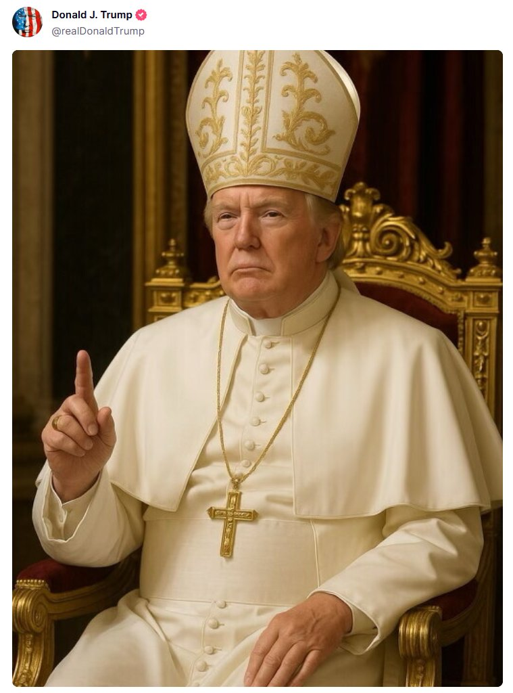

今天是周一，五一黄金周最后一天假期了，我本来以为今天是工作日，后来才知道今天还是法定节假日，于是就又偷懒了一天（哈哈），昨天刷完了美剧《最后生还者》第二季最新的3集，还看了英格玛伯格曼的电影《野草莓》，今天又看了《第七封印》。这两部电影我感觉看第一次不能完全看懂，讲的都是关于人生和生命的意义，这是我的一家之言。看过去就忘了，啥经典台词呀都没记住，不过倒是想起了姜文最近说的一句话，大概意思就是人生其实挺可笑的，不管你活多好或者多坏，最后都得死。关于生命的意义没有人真正说清楚，毕竟意义这东西也是我们人类创造出来的，从自己的生活中找到一些乐趣就已经足够了。啥意义不意义的不重要，活还是要干，饭还是要吃。今天来分享一下最近几天值得关注的一些信息，也算帮大家收收心，不然明天近期综合征要犯了。

---

## 1. 汇率

近日美元走势疲软，离岸人民币、港元、就连新台币也在大涨，由于港元汇率接近联系汇率制度的强方兑换保证（7.75），香港金融管理局（HKMA）于2025年5月3日进行了市场干预，向市场注入了465.4亿港元（约60亿美元），以防止港元进一步升值。根据香港自1983年起开始实施的联系汇率制度，港元兑美元存在正常浮动区间：7.75（强方兑换保证）至7.85（弱方兑换保证）。如果港元汇率触发强方兑换保证，香港金融管理局会买美元、沽港元，将港汇稳定在不高于7.75的水平；如果港元汇率触发了弱方兑换保证，则进行反向操作，将港汇稳定在不低于7.85的水平。

---

## 2. 黄金

今日国际现货黄金价格呈现强劲上涨趋势。受美元走软和市场对美联储即将召开的货币政策会议的关注影响，黄金价格跳涨超过2%。目前，现货黄金价格约为3,327.51美元/盎司，较前一交易日上涨84.21美元，涨幅约2.6%。

---

## 3. 美国非农数据

美国4月非农就业人口增长17.7万人，预期13.8万人，前两个月的增长数据被下调。美国4月失业率为4.2%，与预期和前值的4.2%持平。美国4月平均每小时工资同比增3.8%，环比增0.2%，均低于预期，**非农数据降低6月份降息可能性。**美联储官员们普遍表示，降息可能需要出现失业率上升的明显迹象。由于4月份的就业报告几乎没有显示就业岗位普遍下降，美联储官员在下周的政策会议上很容易保持观望态度，包括几乎不发表任何暗示准备在6月中旬的会议上降息的言论。

---

## 4. 关税

特朗普又要加关税了，声称对所有“外国制作”（produced in Foreign Lands）的电影征收100%关税。2025年5月4日晚，特朗普在Truth Social发文，称美国电影产业“正在迅速衰退”，指责其他国家通过税收优惠等激励措施吸引美国电影制作者，导致好莱坞等地受重创。他将此视为“国家安全威胁”和“宣传工具”，宣布授权商务部和美国贸易代表立即启动程序，对所有“外国制作”（produced in Foreign Lands）的电影征收100%关税，强调“要让电影再次在美国制作”。

---

## 5. Trump

2025年5月2日晚，特朗普在Truth Social平台发布了一张AI生成的教皇图片，不得不说这老头儿精力真旺盛。

