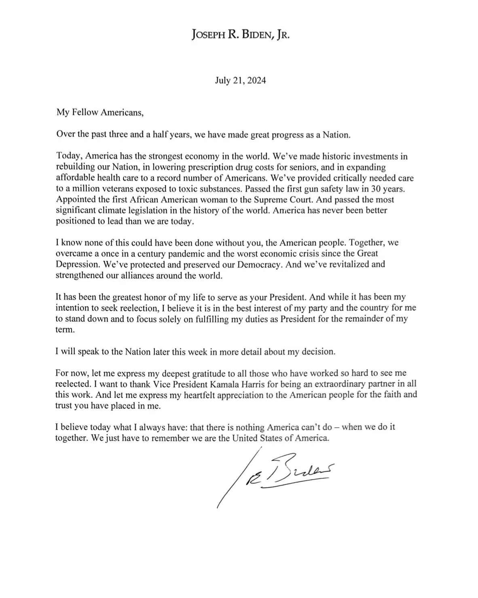
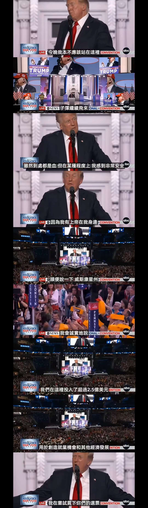

当地时间21日美国总统拜登在社交媒体X上发文宣布退出2024年总统大选，并支持哈里斯获得民主党候选人提名。拜登当天在社交媒体上发表声明说，他原本打算寻求连任，但为了民主党和国家的最佳利益，他决定退出竞选，并专注于履行总统剩余任期内的职责。

特朗普第一时间回应拜登退选，称如果哈里斯获得民主党提名，击败她比击败拜登更加容易。目前，看起来特朗普已经有了很多胜算，但是就像列夫·托尔斯泰说"在重大的历史转折关头，历史总是以意想不到的方式前进。" 也可能会有更大的反转。

特斯拉CEO埃隆·马斯克在社交平台上表示，他的硅谷朋友们已经转投共和党。马斯克在X上写道：“我最聪明的朋友，包括那些住在旧金山湾区的一生支持民主党的人，现在都对特朗普/万斯感到兴奋。”

这是今天的大新闻，那如果特朗普胜选的话，会对大家产生什么影响呢？最直接的就是股市，上周特朗普在《[彭博商业周刊](https://www.bloomberg.com/features/2024-trump-interview-transcript/?embedded-checkout=true)》周二发表的采访中说：“第一点，台湾。我很了解那里的人民，非常尊重他们。他们确实夺走了我们100%的芯片业务。我认为，台湾应该为防卫向我们付费。”受特朗普美国保护主义言论影响，全球芯片股大跌，光刻机巨头阿斯麦的欧股价格大跌10%，美股英伟达也大跌6%，AMD跌了10%。芯片股的崩跌也拖累纳斯达克指数大跌2.7%，创下**2022年12 月以来的最大单日跌幅。**只有英特尔和GlobalFoundries 的股价逆势上涨。

我认为芯片股下跌只是暂时的，科技的发展离不开芯片，美国想扶持他们自己的本地公司，如果美国这样做，那么世界上其他国家的芯片公司从长远来看就不会和他玩了。我自己是在芯片下跌的时候，抄了3次底，每次都抄在了半山腰，不过我相信很快就能涨回来了。这里再说点题外话，很多朋友还没注册港美股账户，就跑来问我，哪家的收费便宜？我的建议是，新手就选老虎，原因很简单，老虎证券没有香港银行卡也可以用新加坡华侨银行（OCBC），之前给大家分享过ocbc注册开户很简单。第二是因为老虎开户审核比较友好；第三点老虎也算是大平台和大品牌了，用起来比较放心。之后可以再去其他平台开户领新用户奖励，可以都体验一下看看哪个平台比较符合自己的使用习惯。这习惯比什么都重要，当你习惯使用这个交易平台的时候，你的交易速度就比别人快，这样你的交易成本就比别人低，因为你节省了时间。关于费率，已经不重要了，存在即合理，有这么多平台存在，并且运营这么多年了，有几百上千万的用户在使用，你怕什么？企业要生存就一定要有利润，这样才能持续给你提供好的服务，并且在市场竞争中，每家收费都不会差太多，如果差太多，用户肯定都去对自己利益最大的平台了。还有就是只要你能在股市获利，用人平台给手续费天经地义，如果你用的很爽，更要给钱了，对吧？白嫖的心态是赚不到钱的。

***“支持加密货币，认为如果不这样做，加密货币的主导地位可能会被其他国家取代。”***

加密货币迎来重大机遇，会有更多的加密货币ETF上市，可以通过券商平台自由交易，并且主流的加密货币肯定会上涨。

