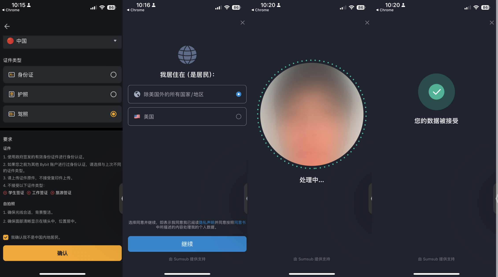

U卡有推荐吗​？最近随着美国大选尘埃落定，Bitcoin直逼10万美金，最近来这个问题被问到的次数也增加了很多倍。今天来为大家推荐一个Crypto神卡“Bybit Card”，现在用国内身份就能注册Bybit，注册可获得20U奖励，本为本将分享注册、Bybit Card申请及奖励领取方法。​​4月份的时候香港的THPay就给我寄了体验卡，一直没机会和大家分享，看着贵圈的孙某某这种小丑，实在不愿去接触贵圈。​如今来看，W3是无法忽视的，学习一下也无妨，也算是补全我身份介绍中的Crypto。

## 什么是U卡？

U卡是专门为数字货币用户设计的银行卡，也是由万事达、VISA和银联这些发卡机构发行的。和银行卡不同的是里面存的是数字货币，而非法币。但是，U卡同样可以用来作为日常消费使用。市场上的U卡非常多，真的是你方唱罢我登场，选择一个靠谱的平台相当重要。今天来为大家推荐Bybit Card，这是一张万事达借记卡，这个和大部分的U卡就不一样，很多U卡都是信用卡形式的。Bybiy Card还支持EUR余额支付，以及ATM取现，免费开卡，无年费，实体卡全球免费配送，这简直太完美了，很多U卡都是需要开卡费的，像THPay实体卡就要150U，PokePay99U，Redotpay Card要100U。

## 如何注册Bybit账户？

由于政策原因，Bybit不对这些国家提供服务，包括中国大陆、新加坡、英国、加拿大、朝鲜、古巴、伊朗、俄罗斯控制的乌克兰地区（目前包括 克里米亚、顿涅茨克和卢甘斯克地区）、乌兹别克斯坦、 叙利亚、香港、法国、塞瓦斯托波尔、苏丹。所以大家在注册的时候，需要有这些国家之外的IP，比如台湾、日本、俄罗斯等。

## Bybit Card用途

绑定Apple Pay/Google play/微信支付/支付宝等，日常消费支付（但有网友反馈系统时不时抽风，会出现交易失败的情况）。

ATM取现按照实时汇率兑换，每个月前100EUR免手续费，之后是0.5%（外汇兑换费） +  0.9%（加密货币兑换费），总计1.4%。

使用Bybit的万事达卡消费还会得到2%-10%的返现（这也是为什么很多人想尽办法申请U卡的原因）

## 准备资料

- 许可国家ip（台湾、日本、俄罗斯等）

- 身份证

- 护照

- 手机号

- 电子邮箱

- 许可国家的地址证明（比如N26或者wise/ifast提供的证明，还没有德国区的账号的话不着急，先准备一个tiptrans德国地址，然后把这个地址改到N26/wise/ifast账单中）

准备好这些我们就可以用这个注册链接开始注册了。

[注册Bybit，领取迎新奖励](https://partner.bybit.com/b/aff_16691_99443)

## 新用户奖励（2选1）

注册成功可会的20USDT的迎新福利（充值100U以上到账）；**邀请码：99443**

### 迎新奖励，如下图充值返现

注册很简单，用国内的身份证和护照就能注册并且成功完成基础身份认证。难度在后面的​进阶身份认证，也就是需要提供许可国家的地址证明，比如德国，很多朋友都用的德国N26账单顺利认证，我今天用wise英区账单改了个德国的地址，上传之后竟然通过了，毕竟他们也需要用户，只是迫于国家政策要求，该提供的材料还是要提供。

到这一步，如果审核通过，你就已经可以领取奖励了。

为了帮大家测试申请Bybit Card，我就用wise账单做了进阶身份认证，没想到​2小时左右就通过了。

接下来我们就去申请Bybit Card，请确认你已经上传了地址证明并且通过了认证，否则没有权限​到下面这一步。我们找到Card，点进去，提交申请，​然后还是等着审核就行了。只要账户有钱，很快就通过了。
如果你需要实体卡的话，可以通过Tiptrans​转运回国。

来免费自己注册一个“德国/香港/英国/捷克地址”吧，转运Bybit Card，wise等回国。

## 关于Bybit

Bybit现在是全球第二大crypto交易所，成立于2018年，全球用戶超過 4000 万。

## 手续费

也如果你在中国境内刷卡或使用的话，他的费用手续费是0.5%（外汇兑换费） +  0.9%（加密货币兑换费），总计1.4%

pending状态下会多收你3%的垫资用于实时汇率变换，最后会退回。
