# 嘉信理财港卡/wise/ifast无损入金教程

前几天OCBC停止了境外居民开户，很多香港券商都慌了，因为现在对普通人来说想要玩港美股的门槛越来越高了，首先是银行账户国内远程见证开户，最低门槛是50W。其次，就是本人赴港开户了，相对来说比较容易，新加坡就别想walk in了。现在国内能够极地成本上车境外账户的只剩下ifast、wise（不属于银行，但是可以入金新加坡和美国券商）、杜高斯贝和瑞讯银行了。美国券商中大家可以选择嘉信理财、IBKR，新加坡有moomoo、盈立、longbridge等都支持用以上银行出入金，今天主要来和大家分享一下如何无损入金嘉信理财。

嘉信理财是美国最大的在线券商，剩下几家是富达、美林、盈透、Robinhood（散户义和团）。嘉信理财最大的优势就可以0佣金交易美股、美债，ETF和期权。

- **富达投资**和**嘉信理财**通常排在前两位，这两家公司在资产管理规模、客户数、服务内容和市场影响力方面都非常强大。
- **美林证券**作为一个高端财富管理平台，虽然市场规模较大，但更多面向高净值客户群体。
- **盈透证券**（Interactive Brokers）则在专业交易和全球市场服务中占有重要地位。
- **Robinhood**虽然在资产管理方面相对较小，但凭借零佣金模式吸引了大量年轻投资者，逐渐成为市场的重要力量。

还没有账户的，看文章结尾注册攻略。

# 入金方式：

## 一、美国银行账户入金

如果你有任何美国银行账户的话，入金非常简单，可以关联银行账户直接转入，或者使用电汇到嘉信的美国花旗银行账户就可以了。

### 添加美元银行账户

- 操作路径：资金转移-外部账户

第一步：新增账户，点击新增账户，点击继续，输入你的银行账户信息

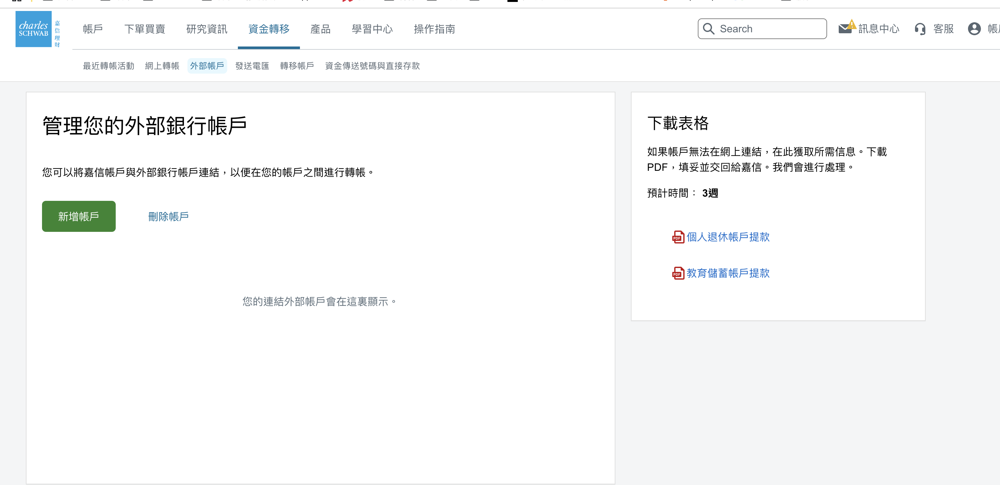

如果你有美卡的话，下面这些信息在你的手机银行中都能看到，如果你没有就不用看这种方式了，也不用搞清楚什么是routing number。

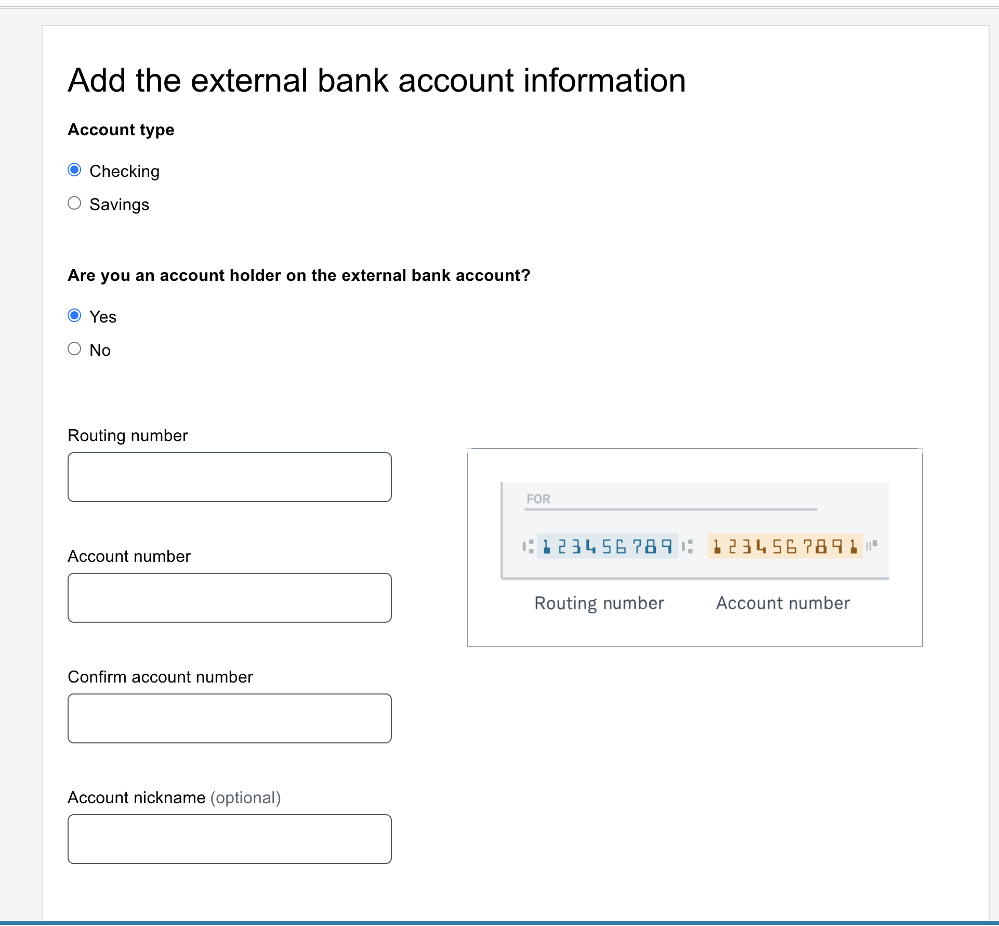

- wise的个人美元账户也可以添加，注意你的wise美元账户中是有routing number的

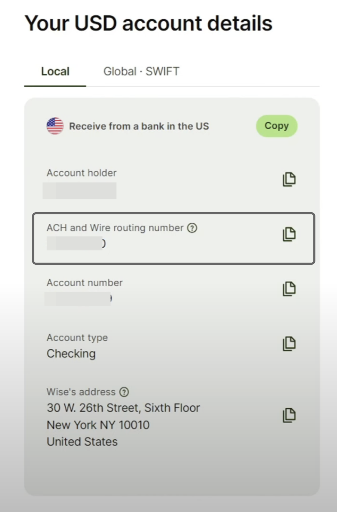

添加银行卡后，嘉信会先验证你的账户，给你的账户进行2笔小额打款验证（2-4天），请留意在银行收到打款后，我们就去“核实试验存款” 输入你收到的打款金额，完成添加。然后，就能在嘉信和外部账户之间进行转入和转出了。

### wire国内电汇

在嘉信顶部导航菜单中点击“资金转移——资金传送号码与直接存款”，然后给嘉信的花旗银行汇款，记住最终收款人写你的姓名和嘉信8位账号。

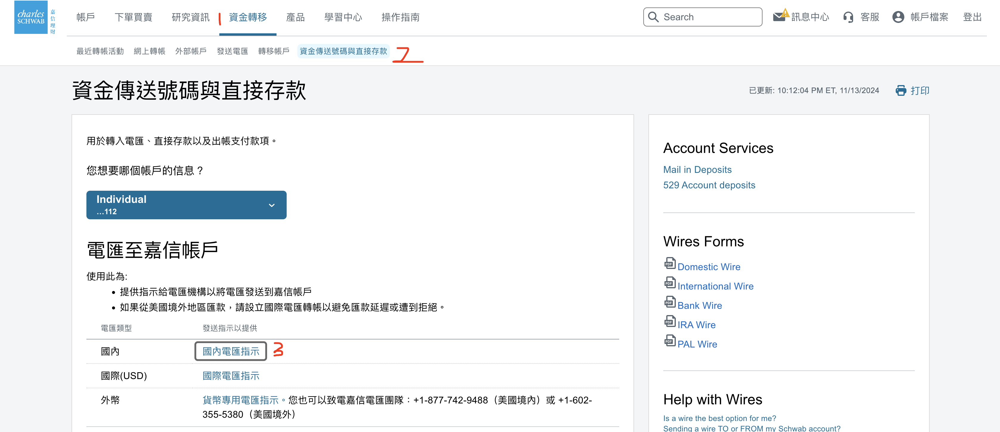

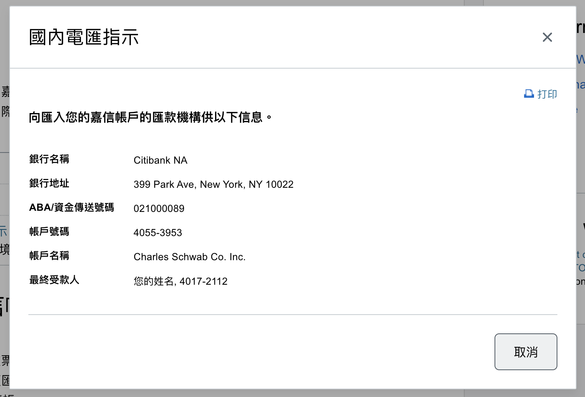

## 二、非美元账户免手续费入金

首先我们先做个准备工作，登录嘉信理财账户之后找到外币电汇指示，如下图，打开的是一个PDF文件，这个文件中有各个其他国家的嘉信银行账户，和盈透证券一样，入金外币后会自动兑换成美金。

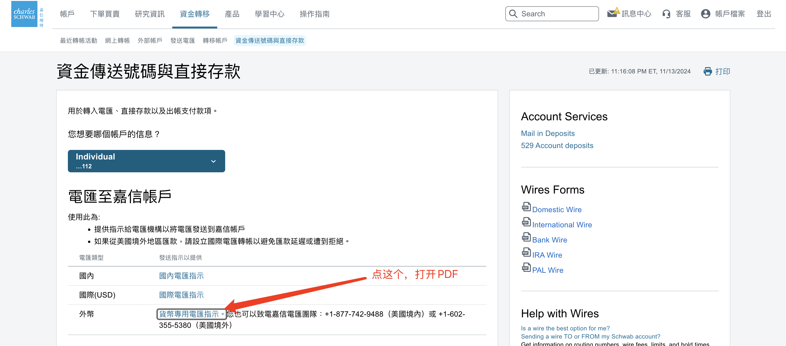

### 1、「港卡」免手续费入金嘉信理财

我们拿到嘉信理财外币账户后，就可以使用你的当地货币进行入金了。港币入金可以使用FPS进行转账。账号信息如下，需要注意的是在备注中一定要输入自己的姓名拼音和嘉信账号。

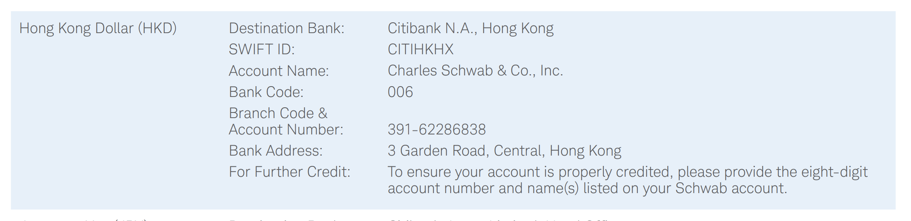

## 2、wise入金

wise我这边给大家一个英镑的入金示范，我们先找到嘉信的英国账户，这是英国伦敦的花旗银行。

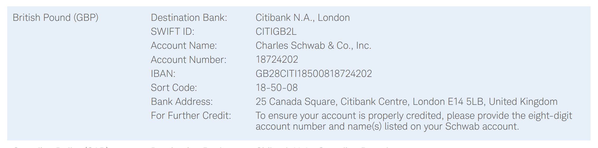

然后打开wise，打开英镑余额，点击“发送”，进行转帐。

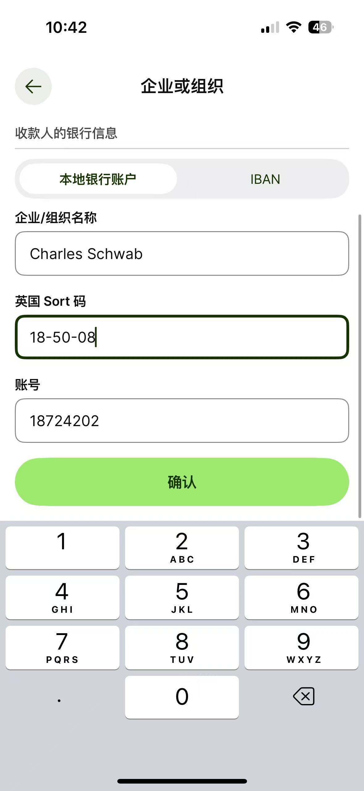

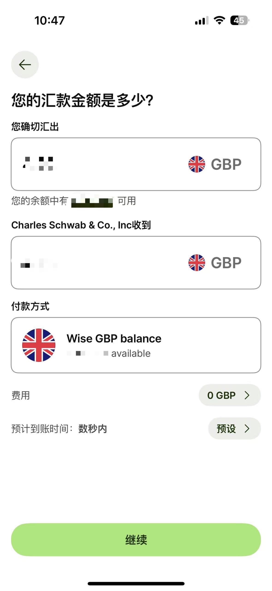

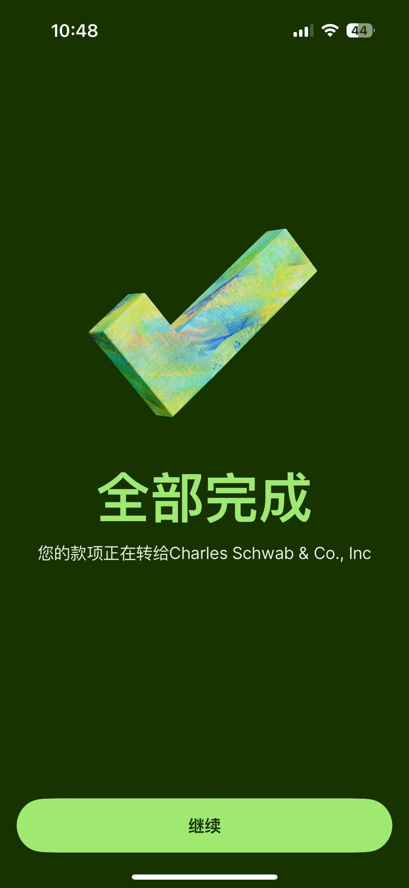

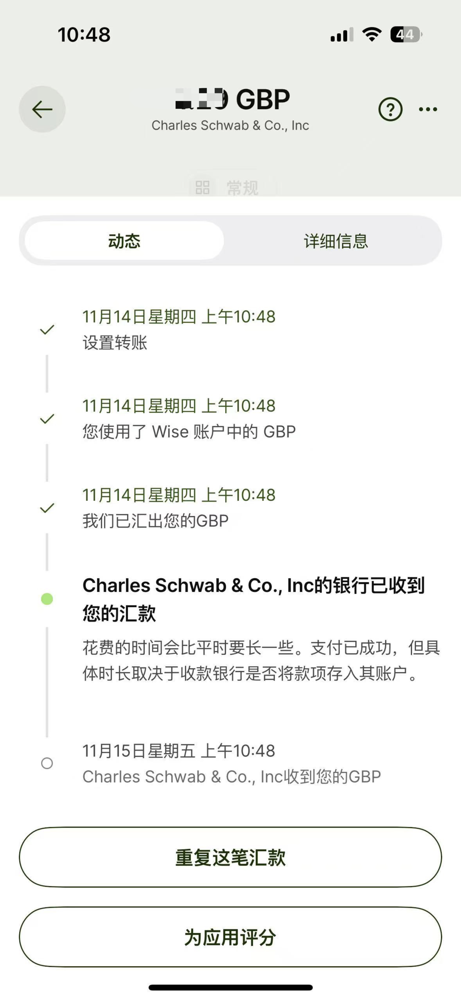

## 3、ifast入金

用ifast要无损入金，我们需要选择英国境内付款，同样使用嘉信英国账户，我们能用到的就是Sort Code、Account name和Account Number，付款金额输入自己想入金的金额就可以了。需要注意的是转账的时候会出现一个无法提供服务的提示（wise也有），忽略继续付款就OK了。账号类型的话要选择商业。

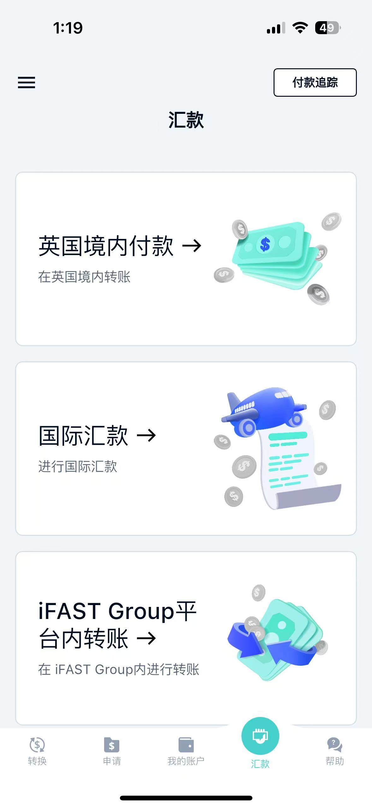

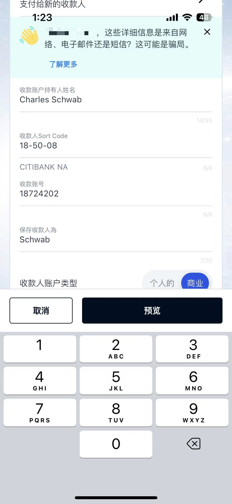

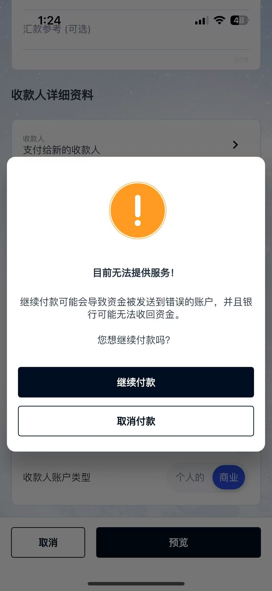

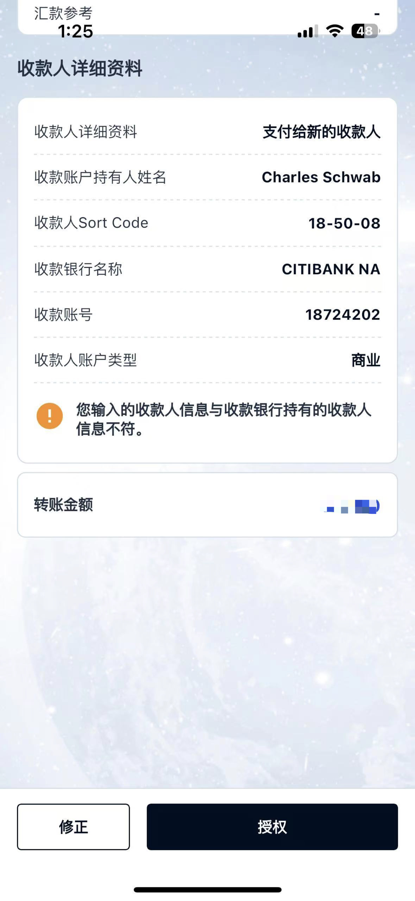

## 4、熊猫速汇入金

在熊猫速汇中先添加收款人，收款人信息同样在嘉信中看这个摩根大通的账户，添加好之后，直接汇出就好了。用熊猫速汇可以来领10元手续费优惠券。

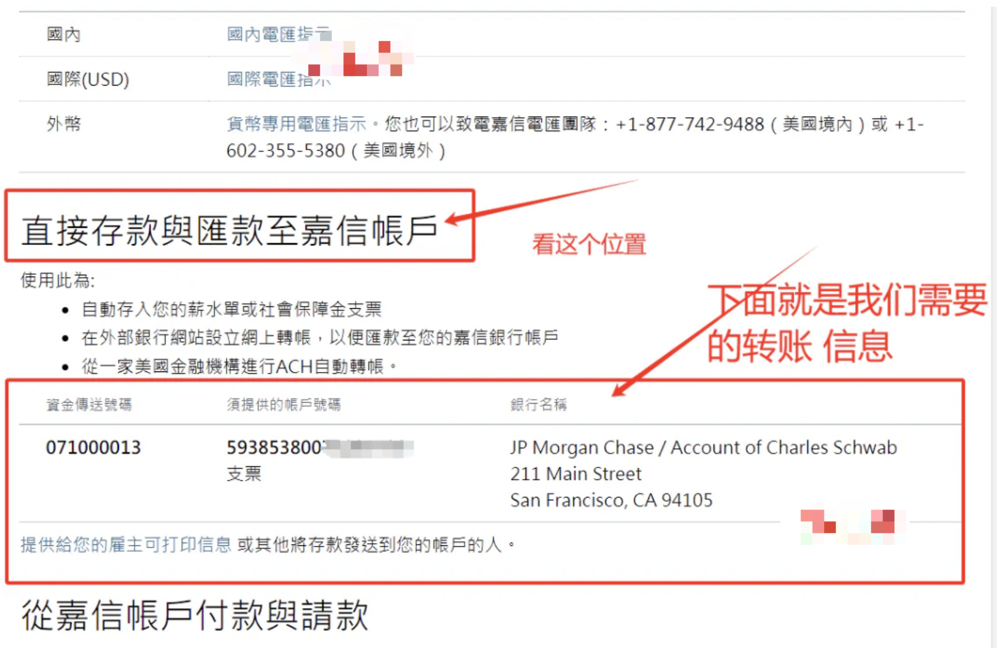

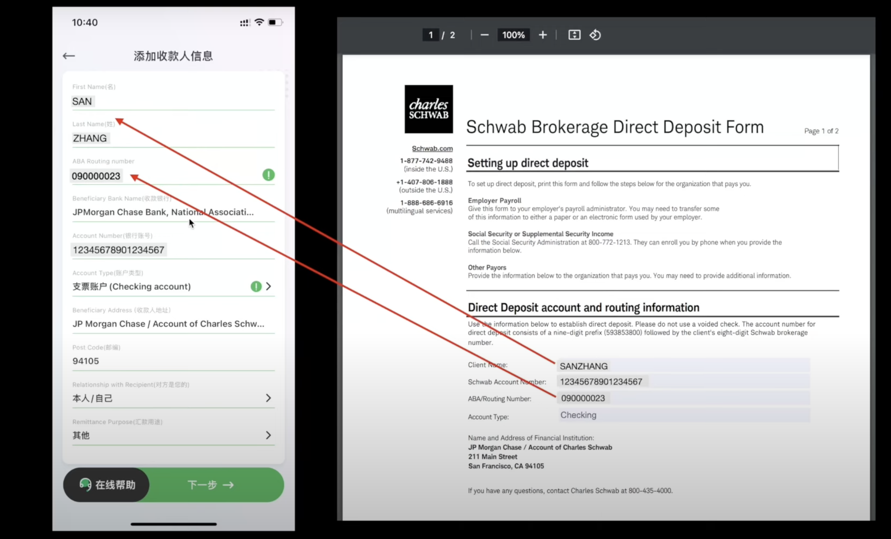