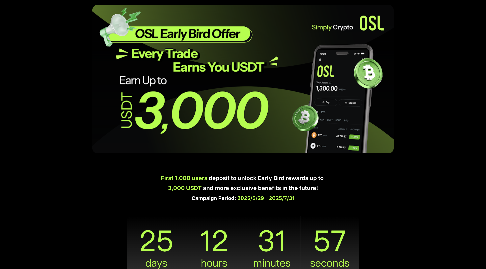

OSL注册的方法和注意事项，因为有人在问我了，但是又不能讲太多。  

我最近尝试注册了一下 **OSL 香港站**，前几次用了英国的地址，老是不给我通过，后来改用香港地址就顺利过了。  

香港站注册需要准备：
- 护照 + 人脸识别
- 海外地址证明（如海外工作证明、居住证明或银行账单）
- 科学上网节点（注册时会检测 IP，显示非内地即可）

要注意，香港的地址证明 **不接受数字银行账单**，我尝试了 ZABank 结单被拒了。注册流程中还需要做风评（风险评估）和 crypto 知识问卷。
[OSL香港注册](https://trade-hk.osl.com/invite/activities?invitationCode=NWwIe)

**OSL 国际站**我一直拖到今天才注册，目前还在审核中。国际站注册只需要准备护照并进行人脸识别，**没要求地址证明**，流程简单很多，比香港站快很多。

如果需要邀请，欢迎私聊！

---

昨天晚上听说很多日本居民和海外网友都在熬夜看日本强震直播，结果我半夜也醒来看了一下，好在世界和平无事。  

顺便想到那本漫画《我所看见的未来》，它曾成功预言过日本 1995 年和 2011 年的地震，这次看起来“失灵”了。确实挺神奇，连续两次预言成功很难用巧合解释，但也并不是完全没有概率发生，这可以用 **选择性注意** 或 **自我验证偏差** 来解释。

---

另一方面，Musk 最近在社交媒体上发起调查，询问网友是否应该成立美国的第三党（“美国党”）。与此同时，Trump 爆料 Musk 吸食大麻，目前投票支持成立的人占了很大一部分。

---

一个追求完美的人，总是想掌控一切，否则觉得世界都是破碎的。

今天看到上次抽奖的朋友，已经收到了 Xesim 的最新产品，在群里发图引起了不小的嫉妒，最后这位朋友还发了红包平息众怒。中奖就应该多分享，突然想起一句歌词：「满天钞票少了分享就不叫财富」。这句来自信的歌《越清醒越孤独》，我觉得挺好听的。

---

> 喜欢就去做，少点顾虑，多点分享。

