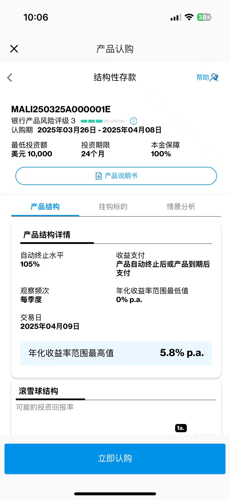
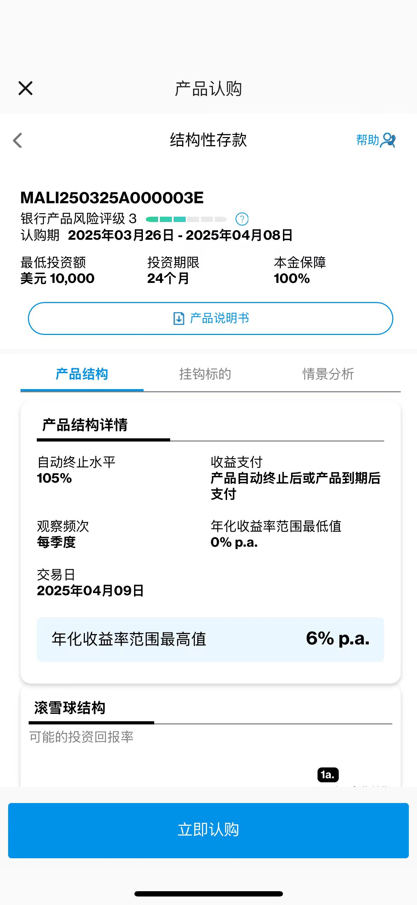
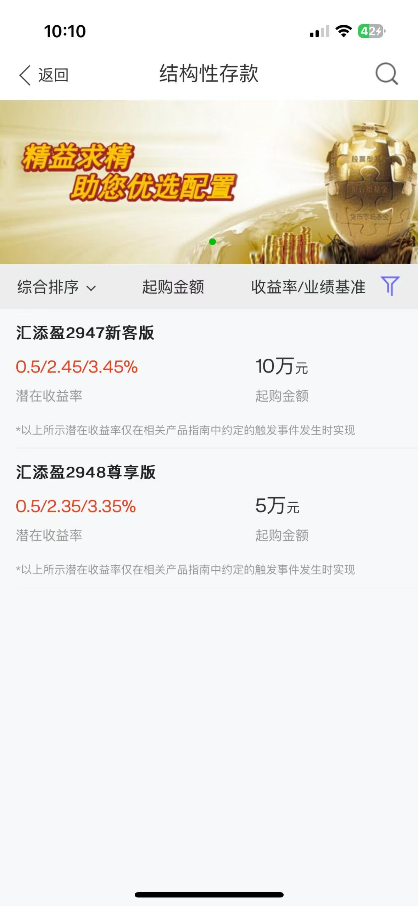
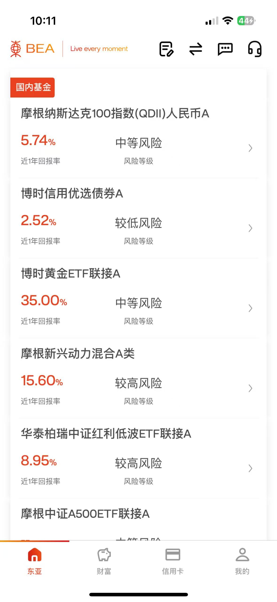
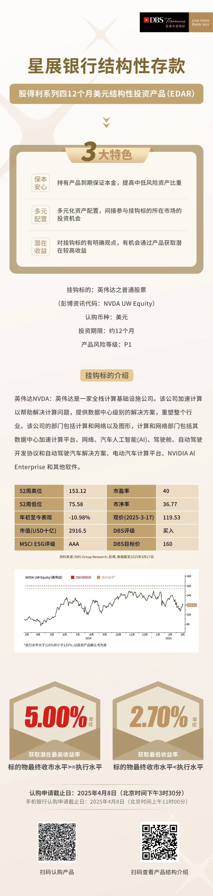
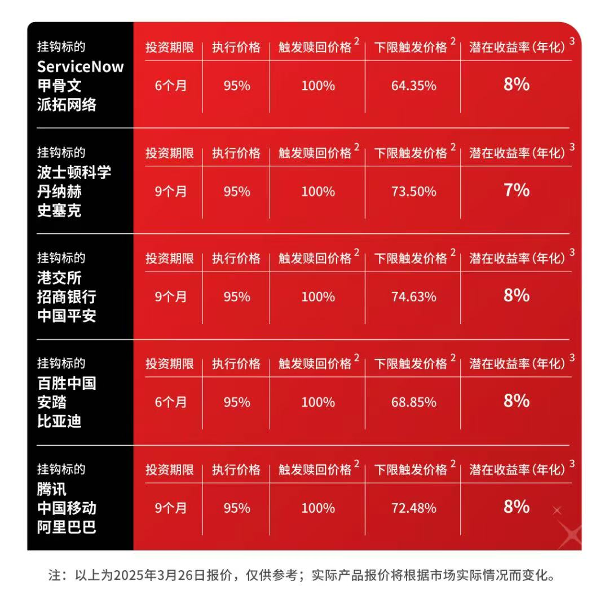

现在人听到“理财”总感觉有一种从你兜里掏钱的感觉，但其实对于有理财习惯和理财常识的朋友来说，寻找稳健的有保障的理财产品不仅可以获得更高的回报，而且还能让生活多一份意外之喜。今天帮大家整理了一下渣打、星展和东亚的结构性存款产品，因为各大行定期的利息以及不足以让你的存款保值了，或者说政策就是不让你存钱，听明白了嘛。当然了，对于习惯做定存的朋友我们也不去劝，踏实安全感最重要。但是，我要帮这些有个八瓜七枣的朋友提供一个更优的解决方案，优在哪儿呢？

- 第一、我们要安全有保障，也就是保本；
- 第二、能赚到更高回报，也就是大于定存的回报（人民币大于2%，美金大于3.5%）
这样可以吧，那有没有这样的产品呢？当然，这就是银行的结构性存款，和定存不一样的地方是 ，结构性存款的收益不固定，用下面的产品举个例子。起购额度是：5W，期限24个月年化收益范围0%-3.4%，请问人民币做到3.4%以上的概率是多少，虽然不敢肯定，但是我们就算50%的概率，请问值不值得做呢？

## 渣打银行

在看这个美金的，0%-5.8%，我去年做的是7%，标的是美股，在元旦前后提前敲出，拿到7%。今年美股由于特没谱新政的影响，目前很多机构已经下调了美股的回报，我年初买的时候是6%，现在已经降到5.8%了。以美元结算的结构性存款，挂钩的标的也大多都是美股，比如英伟达、微软、Meta、台积电、亚马逊、Apple等等，每个产品都有不同的标的，可以选择自己看好的板块，我选择的就是科技。

下面这个6%是私行用户专属的。

## 东亚银行

下面来看看东亚的，东亚的产品特点就是简单直给，汇添盈人民币直接给到2.45%，我做了好几期了。

还有QDII，这个风险就高点了，因为不保本。

## 星展银行

标的是英伟达，2.7%-5%，这个也轻松跑赢定存，不过起购门槛比较高。

还有证券挂钩非保本型结构性存（FCI），比如说收益是8%，优势就是固定每月派息，收益比其他的都高，但是风险也高。不过可以放心的就是，一旦在观察日发生下限触发机制，最终可以拿到标的实物，比如说你买的标的是甲骨文，这个好处就是短暂的下跌造成的损失只是暂时的，等标的物涨起来你还是会拿到实物收益，而且没有任何认购费用。

和其他银行不一样的是，星展的门槛比较高，属于高端玩家的游戏。有需要详细了解的可以加我微信。

结构性存款是一种结合存款和金融衍生品的理财产品。部分资金享受存款的固定收益，另一部分挂钩金融市场（如股票指数、汇率、黄金价格），收益会随之浮动。比较适合愿意承担一定收益波动、希望在保本基础上争取更高回报的人。
