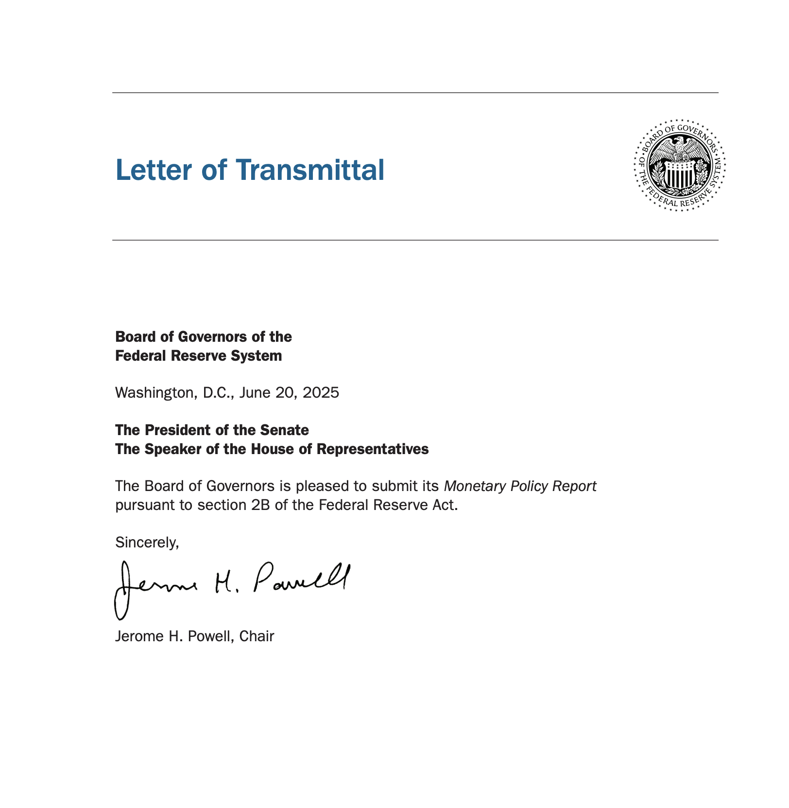
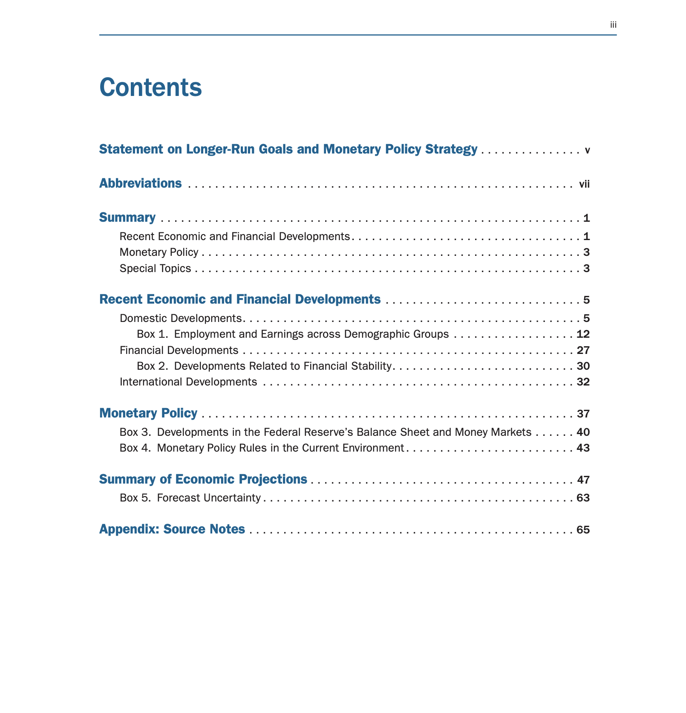

当地时间 6 月 20 日，美联储理事会发布了《半年度货币政策报告》（Semiannual Monetary Policy Report），**这是影响美联储后续利率决策和市场预期最重要的政策文件之一。**

预计在下周，Powell 将出席国会听证会，接受质询并解释美联储的货币政策目标、经济前景、通胀、就业与金融稳定问题。

---

### 听证会制度背景

美国《半年度货币政策报告》的听证会制度基于《1978年充分就业与平衡增长法案》（也称“亨弗雷-霍金斯法案”），要求美联储主席每半年向国会提交报告，并接受两场听证会：

- 众议院金融服务委员会（House Financial Services Committee）
- 参议院银行、住房与城市事务委员会（Senate Banking Committee）

美联储虽为独立机构，但需向民选国会汇报，防止“技术独裁”。

这个听证会看场面就很窒息，同情一下 Powell，不仅要扛住总统的压力，还得面对国会“车轮战式”审问。

---

### Trump对Powell的炮火

在 6 月 18 日利率决议后，Trump 在采访中说：

> “坦率地说，我们在美联储有一个愚蠢的人……也许我应该去美联储。我可以在美联储任命自己吗？”

Trump 为了促成降息，多次公开吐槽 Powell：

- Mr. Too Late
- major loser
- fool
- dummy

甚至在 4 月催了 Powell 四次降息。虽然他曾扬言要开除 Powell，后来却打脸自己。好在目前仍未架空美联储的独立性。

---

### 报告主要内容（共 81 页）

报告共分为三大部分：

1. **经济与金融发展**
2. **货币政策**
3. **经济预测摘要**

#### ✅ 经济状况

- 美国经济**持续扩张但增长放缓**
  - 2025 年第四季度 GDP 预期：**1.4%**（3 月为 1.7%）
  - 原因：贸易政策（如 Trump 关税）带来不确定性

- 通胀仍高于 2% 目标
  - 核心 PCE 通胀率为 **3.1%**
  - 名义工资增长约 **2%**
  - 关税或推高物价

- 劳动力市场稳健
  - 失业率维持在 **4%**
  - 但移民放缓，劳动力供给增长减弱

#### ✅ 金融系统

- 具备**韧性**
- 但股票、企业债券和市政债市场**流动性恶化**
- 市场对**贸易政策新闻极度敏感**

#### ✅ 利率政策

- FOMC 维持联邦基金利率在 **4.25%-4.5%**
- **预计 2025 年将降息两次**
  - 9 月、12 月各 **25 个基点**
  - 年底利率预测为 **3.9%**
- 坚持“**数据依赖策略**”

#### ✅ 政策目标与风险应对

- 平衡 **2% 通胀目标** 与 **最大化就业**
- 特别关注**关税等外部风险**

---

### CPI 与库存策略：通胀拐点要来了？

面对关税政策，美国企业采用两大策略：

1. **提前囤货**
2. **使用保税仓库**

这些短期策略减缓了 CPI 上升的速度。但一旦库存耗尽：

- **CPI 或将在 6–7 月开始明显上升**
- 年底 CPI 有可能达到 **3%**

美银、花旗等机构预期：随着“廉价库存”消耗殆尽、企业开始销售更贵的进口商品，将直接反映为消费者物价的上涨。

---

### Powell 的最新表态

鲍威尔在报告发布时强调：

- 降息需满足两个条件：
  1. **PCE 降至 2.5% 以下**
  2. **关税影响已明朗化（预计夏季）**

同时强调政策**灵活性**与**渐进性**，为未来“调头”留足空间。

---

后续我们将继续跟踪听证会实况及对市场的影响，欢迎关注更新。
