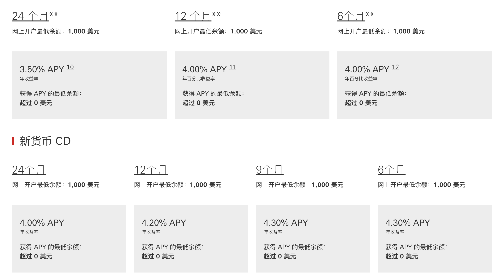

最近又开始剪视频了，所以在没分享文章的时候，我都在写脚本、剪视频和录音。有很多人给我留言，看了几个朋友对美国银行卡还是非常执着，我今天集中分享回复一下大家遇到的问题，首先很多人不知道开户门槛比较盲目，汇丰US开户后不达标可是要收取50USD的管理费的，而且180天内关户还要扣25USD费用。另外，大家很多不会科学上的朋友在申请的时候验证码这一关都关不了，实在是费心，今天把大家关心的问题统一解答一下。

# 为什么要开美国汇丰银行？
开美卡的朋友有三种，第一种人是为了拿到银行的开户奖励，这部分人数也是占绝大多数的。第二种是为了申请信用卡，还有极少数是为了得到一张境外银行卡收藏卡面。对于后一种人来说，美国汇丰不是一个好的选择，因为美国汇丰最低级别的户口是Premier，维护成本还是相对比较高的，除了奖励，没有其他可圈可点对的优势，下面会细说。

# 开户奖励

现金奖励存款100,000 美元 - 249,999.99 美元 -可返 1,500 美元奖励
存款250,000 美元以上 -可返 2,500 美元奖励
活动时间：2024 年 7 月 1 日 - 2024年11 月 21 ，汇丰会时不时的做一些活动。
满足奖励条件：在开设新账户后的 20 个日历日内，存款和/或合格投资账户中的新资金达到或超过 100,000 美元的合格余额；（如果达不到这个条件就可以忍一下了）并且在新帐户开立月份之后的连续 3 个完整日历月内维持所需的合格余额。开设新的汇丰卓越理财优惠期内的支票账户（“新账户”）你看吧，很多人都不清楚开户要求，以为天下到处都是可以白嫖呢。华美银行还是一个很好的选择，没有这么高的要求，我们联系美国当地华美银行的客户经理，提交资料后一周后就能约到视频免签，会有2位银行客户经理视频，视频看你签完开户文件之后，将你的开户资料寄到美国，然后就等着下户和收卡就行了。
存款利率说实话，这个存款利率不如国内东亚、星展银行和渣打以及汇丰。

[查看全文，请移步我的微信公众号，一步直达](https://mp.weixin.qq.com/s/c9U9JonQ7ii_-ViiHb9udg)