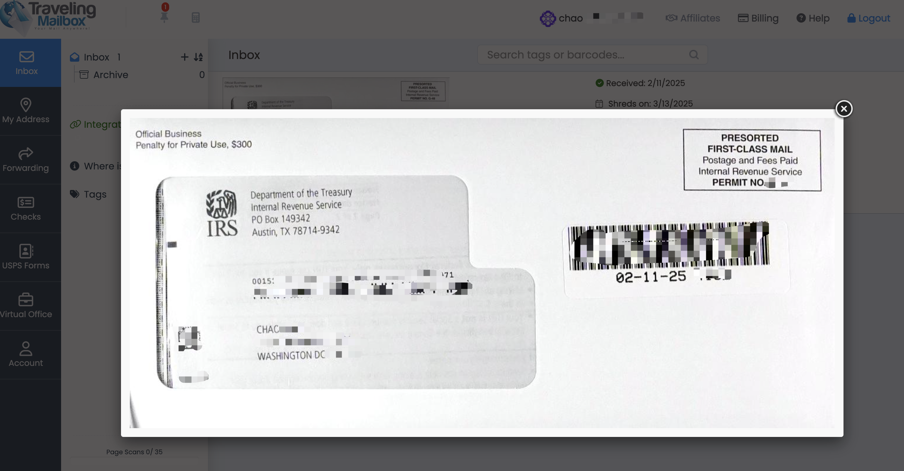
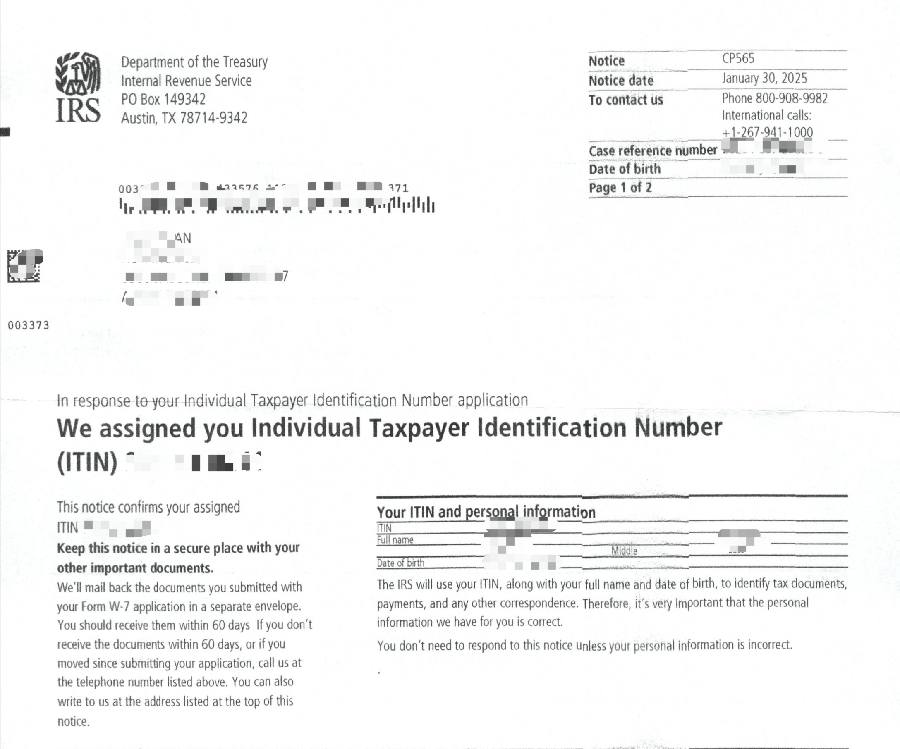
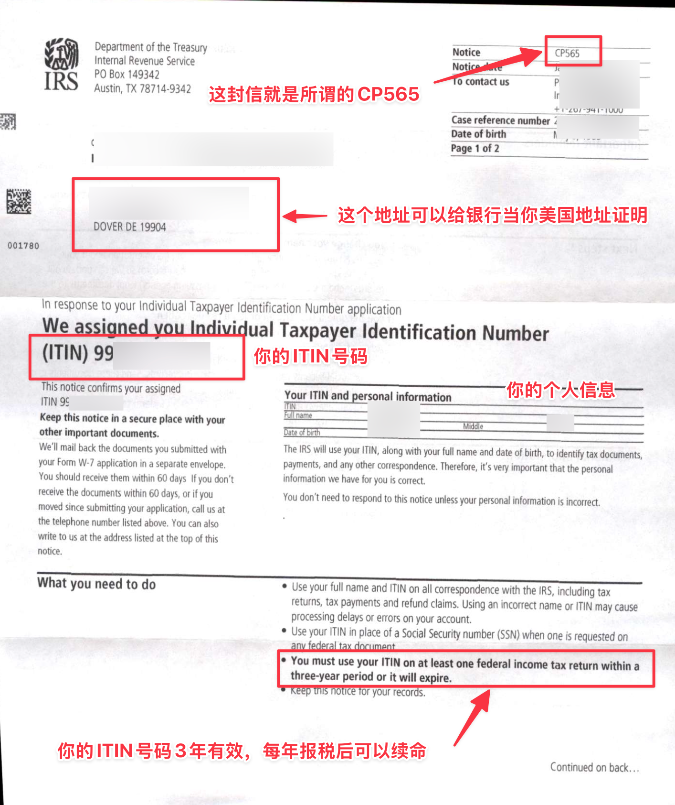

昨天算是正式开工了，拆了很多快递，把之前大家申请的IGM投资意向书都签了字，准备带到香港去。把华美银行的开户资料寄到了美国去，快递费是真的贵，一个文件联邦快递要7百多，DHL用了折扣要3百多。这里更新一个信息，美国华美银行（实体银行）远程视频面签开户（和当地人去分行开的账户是一样的），账户余额只要大于1500美元，就可以免管理费。另外，有美国的地址就可以申请华美银行的信用卡。

跟大家分享一个好消息，今天收到了美国国税局寄的ITIN letter，虽然前几天就已经拿到了ITIN确认信，但是等ITIN letter美国地址也是用了差不多一周的时间，国内地址的话可能会更慢。从我提交申请到拿到收到ITIN letter一共用了40天的时间。

# 时间线
2014年12月24日提交ITIN申请

2025年1月2日从香港通过DHL寄资料发往美国国税局

2025年2月6日收到ITIN确认信

2025年2月12日美国地址收到了IRS发给我的ITIN letter

# ITIN有什么用？
- 申请信用卡：像目前比较受欢迎的 Capital-One、Discover Bank、Citi、GO2Bank、Bank-of-Hawaii 都是可以通过 ITIN 去开设 credit 或者 secured card 的。

- 股息退税：之前看到有人给我留言说自己被盈透扣了30%的税，这种情况作为中国居民可以合理申请退税。股息分红一般会扣掉 30% 的预扣税，根据中美之间的税务协定，你可以拿着券商发的 1042S 税表向 IRS 要求退税 20%。

- 注册美国 Paypal 以及 Stripe 账户。

- 在美国有房产的朋友，把房子出租或者卖出去，不论是收房租或者卖掉房产赚差价，都会被预扣税，投资人必须要有ITIN才能合规报税来拿回预扣税款。

- 税务津贴和税务抵扣：这两项作为生活在美国以外的居民是用不到的，所以就细说了。

# ITIN申请需要哪些资料？
1. 护照扫描件（未过期）

2. 最好有美国地址，收信比较快，当然这一项不是绝对必须的。

# ITIN的申请流程
## 提供申请资料；

## 申请人签字；（电子签名远程操作即可）

## 寄出申请资料（CAA来寄出，不需要你参与了，等着收ITIN letter就行）

我之前给大家分享过个人申请INIT的流程是非常繁琐的，不仅要去做护照认证（费用50 刀），还要填好几份表格寄到美国国税局。（如果你敢寄护照原件到 IRS 的话，可以不做认证。若你担心快递丢了，还是老老实实拿着护照，去美使领馆做认证吧。）

无论是申请ITIN还是更新ITIN，都可以找IRS官方认证过的ITIN代理人，Certified Acceptance Agent 简称CAA。CAA代表税务局对申请人的护照和其他证件进行认证，并帮助申请人完成ITIN的申请工作。我们拥有IRS认证的多家CAA申请资格，可以帮助大家申请ITIN，不论你在美国有没有收入，但都可以申请，而且成功率是99.99%。现在正是美国的纳税季，如果在现在申请，有报税需求的话，在明年开始报税就可以了。

# ITIN有效期是多久？
办理成功后有效期是3年，需要每年在纳税季（1 月15 日至4 月30 日进行申报。如果您的 ITIN 已经过期，您可以在报税的时候更新。

# 怎么看懂ITIN确认信？

在我们收到ITIN确认信（CP565文件）后，就以正式使用ITIN号码了。

在收到IRS发出的ITIN letter之后，我们就可以来申请美国的信用卡和银行卡了，为什么说建议用美国地址来收这封letter呢？因为这个letter上的收件地址，可以作为我们日后申请美国信用卡的美国地址证明文件。关于美国地址，大家可以参考之前给大家分享的travelingmailbox。

今天注册了一个「美国私人地址」，真的大有用处！Travelingmailbox注册攻略，这么多事竟然都要用它。

「USPS表格1583」免费视频认证攻略：3分钟通过，注册美国地址一定要做，travelingmailbox竟然有免费服务！

美国ITIN有哪些申请方式？「华美银行」中国身份远程视频面签3周成功下户全过程分享！

电报群：立即加入  https://t.me/laosjigifts

「福利」：以下都是本人测试过的一些App，新用户注册可领奖励。可查我的历史文章，或自助领取：https://fl.laosji.net/

「laosji网址导航」：https://dh.laosji.net/

「油管频道」：https://www.youtube.com/@laosji

