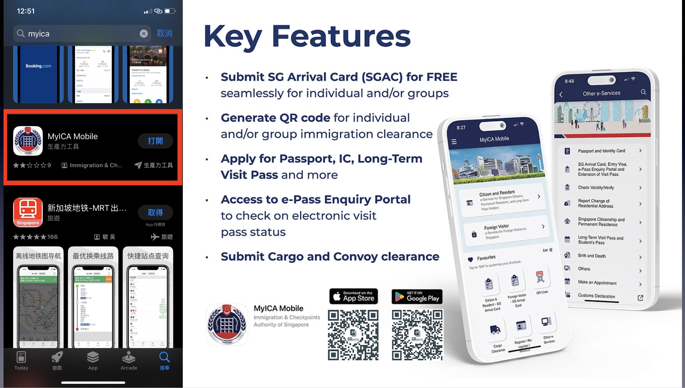
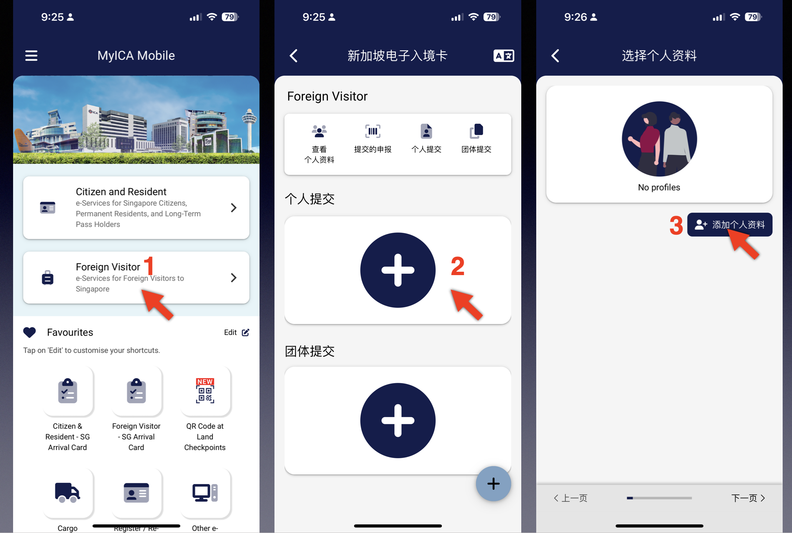
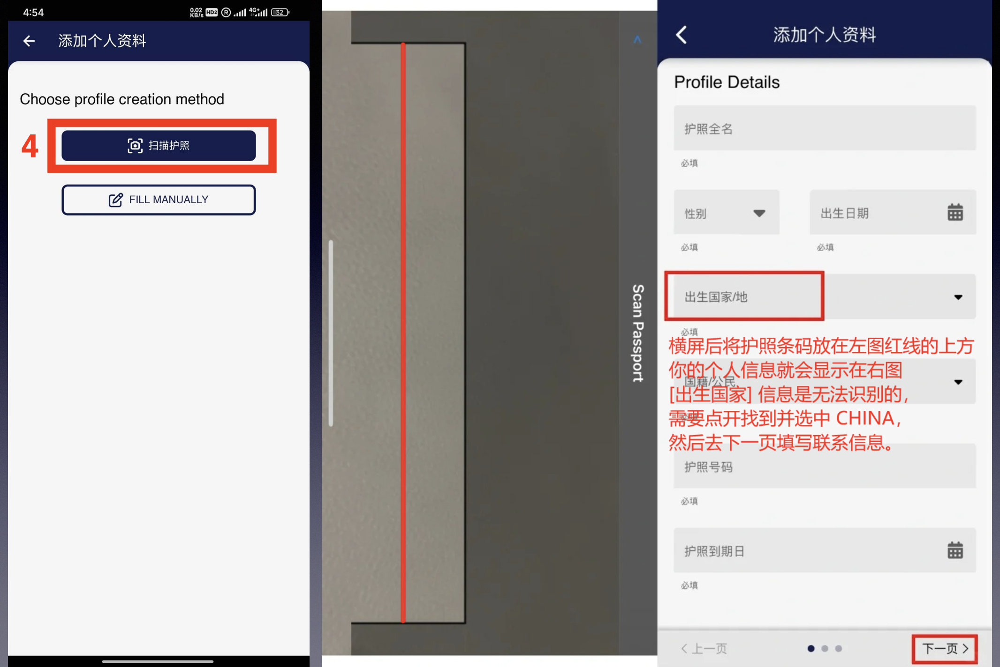
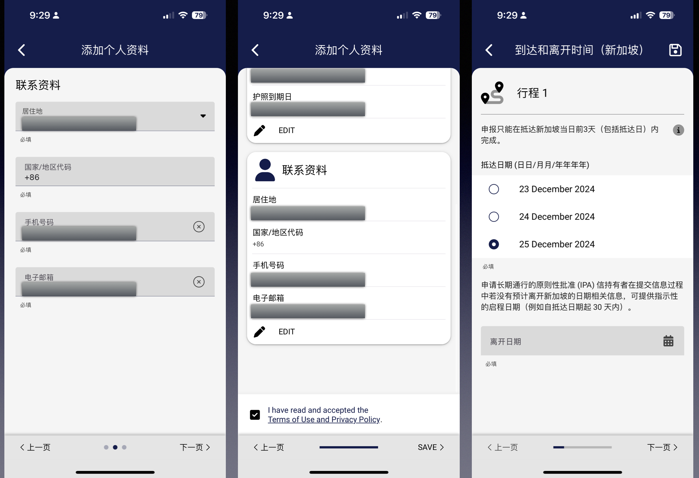
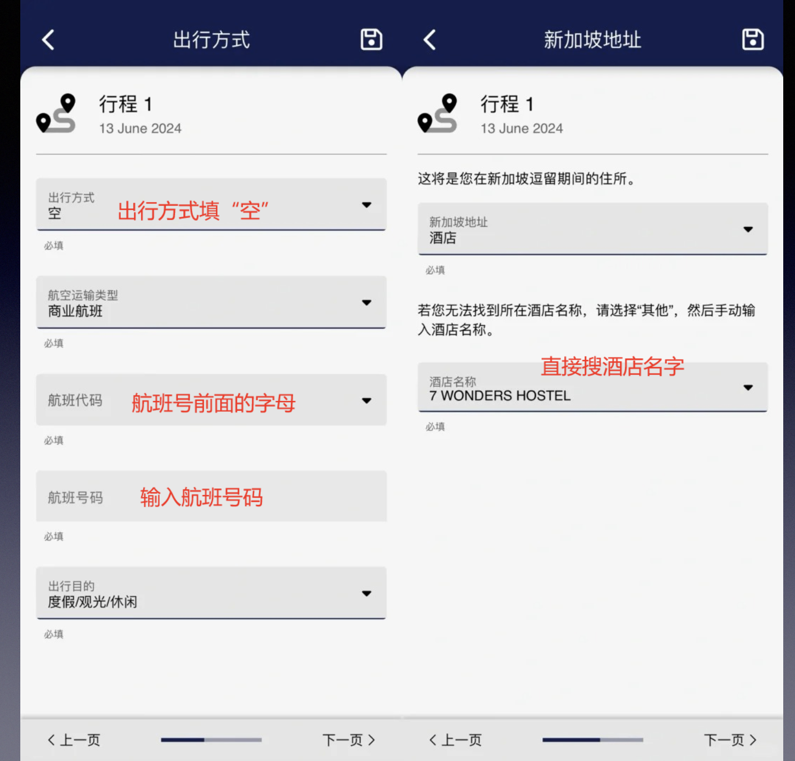
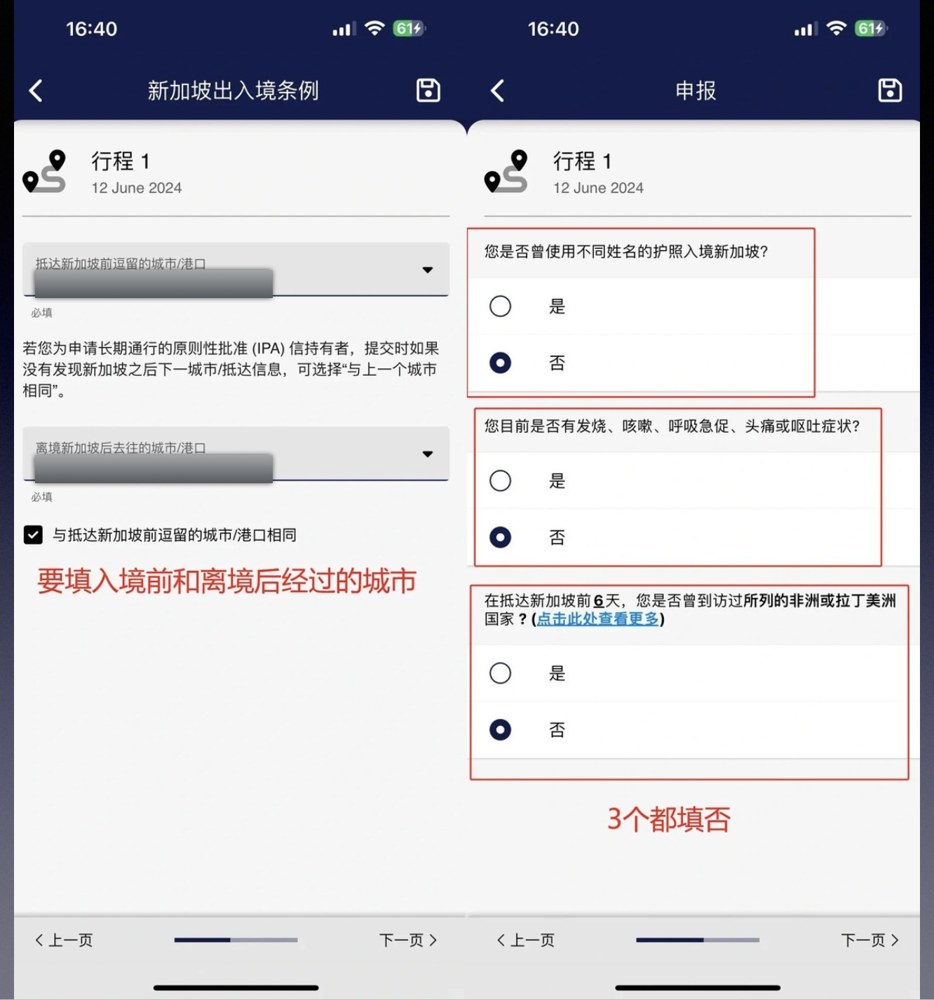
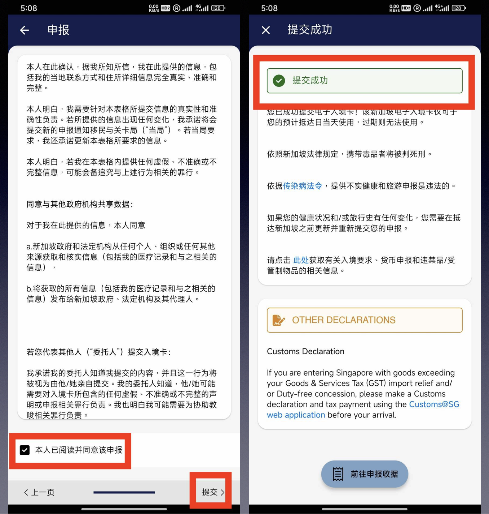
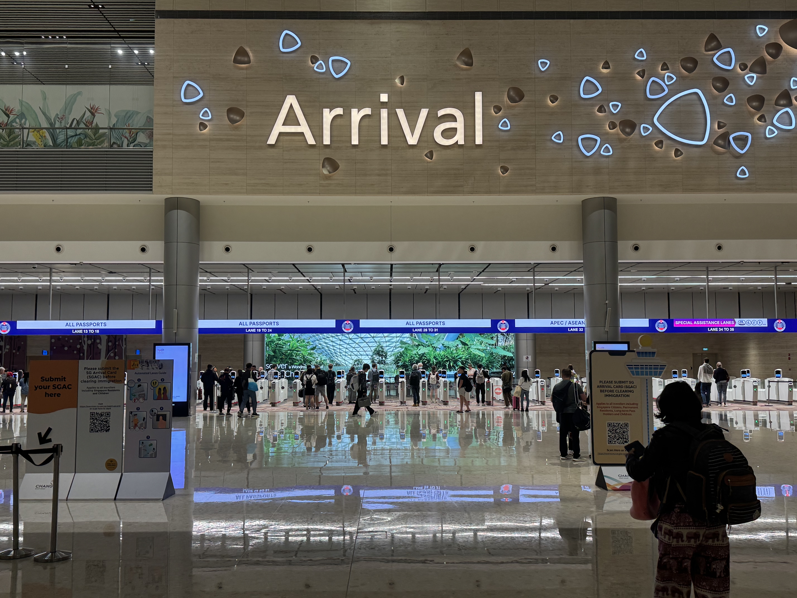

放假啦！春节你都有什么出行计划呀，泰国估计很多人不敢去了，实际上并没有那么夸张，但是很多人可能会选择去更贵的新加坡。毕竟去新加坡安全方面完全不用担心，而且现在免签，只要填电子入境卡，就能自助通关，非常方便。
还有去新加坡真的就跟跨省旅游一样，讲普通话的人比香港还多，语言方面也完全不用担心。大多数新加坡当地人从小就是双语教学，普通话多多少少都会说的，除了当地的印度人。不过，我上次在新加坡去moomoo办公室的时候，一楼大厅需要登记才能进，前台有几个小哥和小姐姐都是印度人，我去找的那个小哥竟然中文也很好，他问我是不是来开会，我说是的，然后登记了我的证件和手机号，给我手机发了二维码通行证。新加坡的安保真的很严，这个大楼上去的时候，电梯里面根本没有楼层的按钮，访客在通道刷了二维码，会自动呼梯到你去的楼层。言归正传，今天来跟大家分享一下，如何填写新加坡的电子入境卡（SGAC）。

# 填写电子入境卡（SGAC）注意事项

- 已购往返机票
- 已订新加坡酒店
- 护照有效期大于6个月
- 提前3天提交
- 填写电子入境卡完全免费，一切让你付费的都是骗子

## 1. 下载“ MyICA Mobile ” APP

## 2. 添加个人信息

在首页选择选择“foreign visitor”，然后点击个人提交添加个人资料，可以直接扫描护照个人信息页底部的条那一长串看不懂的字符，扫描完成后确认一下自己的个人信息，护照号一定不能错。

如果带家人过去，可以用团队提交。

## 3. 添加联系方式

可以填国内的地址、手机号和邮箱，然后保存个人信息。

## 4. 添加行程

注意在MyICA Mobile APP上只能提前3天添加行程，个人资料可以提前填好。

填写行程信息出行方式分海陆空三种，应该都是坐飞机去的吧，不过从马来西亚可以做大巴到新加坡。大家根据自己的情况选择合适的多出行方式，坐飞机的飞机在出行方式这一栏就选“空”。

航班代码，航班号前面的字母就是航班代码。

航班号码大家机票定好之后就有了，完整填入。然后填住宿信息，选择地址为酒店，然后搜酒店名字就可以，住朋友家可以填朋友家地址。

## 5. 入境前和离境后经过的城市

抵达新加坡前的城市：从哪里飞新加坡就填哪里

离境新加坡去往的城市：就是离开新加坡后你去的地方

最后三个单选都选否，然后提交就完成了。

到达新加坡之后，根据机场标识，找到入境自助通道关口(下飞机后一直跟着Arrival走就能找到)。

## 自助通关步骤

看到那些机器人了吗？那些就是自助入境快速通关通道，共有两道门，第一道门刷护照+刷脸，第二道门录指纹+刷脸。

到自助通关通道之后，需要把护照个人信息页朝下，插入闸机（如果你护照带保护壳要摘下来才行），验证成功后取出；
闸机门开后记得拿上护照！往前走到第二个闸机门口，再次插入护照；
根据提示扫描面部，录入指纹。成功入境，同时会收到一封入境邮件通知。
入境之后就可以去找公共交通前往市区了，如果你到的比较早，也可以选择去星耀樟宜玩一下。星耀樟宜肯定绝对是要去的，不是来的时候去，就是回去的时候去，或者来回都都去，哈哈哈。

电报群：立即加入  <https://t.me/laosjigifts>

「福利」：以下都是本人测试过的一些App，新用户注册可领奖励。可查我的历史文章，或自助领取：<https://fl.laosji.net/>
「laosji网址导航」：<https://dh.laosji.net/>
「油管频道」：<https://www.youtube.com/@laosji>
