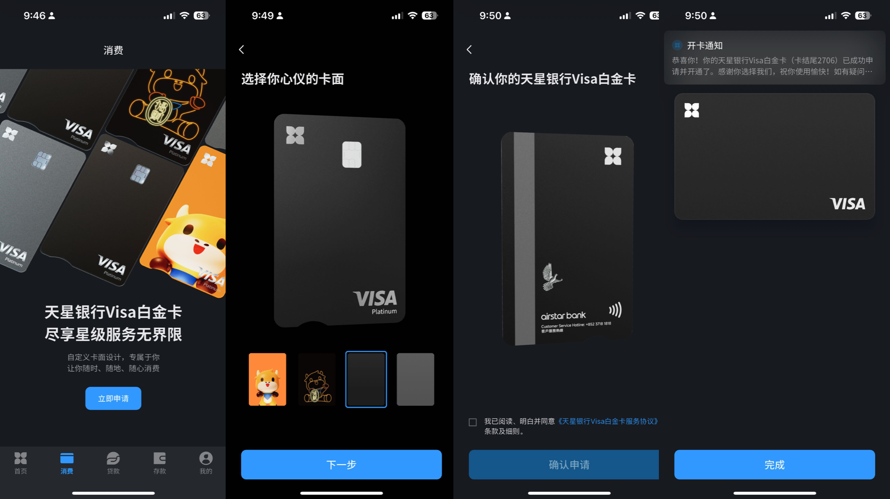
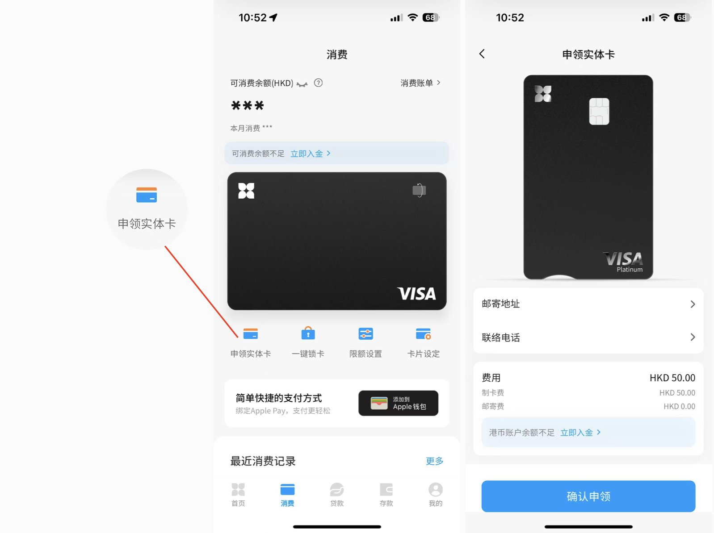
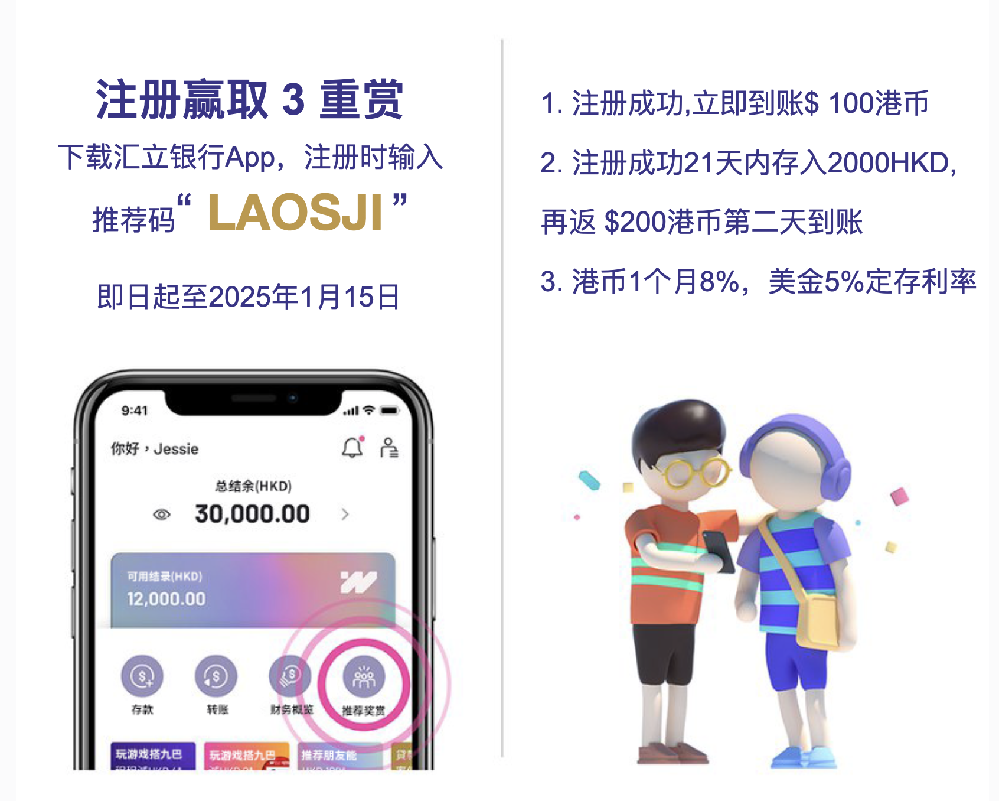

昨天香港数字银行天星App中上线了Visa白金实体卡申请功能，有4种定制卡面可选。

# 申请visa白金卡步骤
更新天星银行App为最新版
登录后选择“消费“，就能看到申请Visa白金卡入口
点击“立即申请“，然后选择卡面，完成卡片申请。

# 怎么申请实体卡
先申请好虚拟卡，然后通过申请实体卡功能进行申请实体卡。我对卡片没兴趣，也没精力去管理这么多银行账户，纯粹为了使用体验后给大家做教程，截几张图，仅此而已。有需要的朋友，可以去申请了。

需要注意的是“申请实体卡需要支付50HKD的制卡费，就能包邮到家，支持内地地址邮寄。

# 天星银行有什么优势？
目前体验下来，和ZABank以及WeLab相比，优惠活动比较少。唯一一个比较方便的功能就是可以在天星APP中汇款给内地的微信收款人，汇款货币可以选美金、港币和人民币，单笔汇款不超过5万人民币，手续费只要30HKD。这个手续费比熊猫要便宜点了，当然了天星也是用的微信微汇款的服务，如果你是有香港身份就可以在微信中直接通过微汇款小程序进行汇款，这这服务仅支持境外汇入。

另外现在注册天星银行输入邀请码“xiaomi”可以获得香港小米商城的200HKD优惠券（2张 100 元小米香港）。

# 有什么不好的地方？
如果你在内地使用天星APP的话可能会出现登录不上的问题。我想这可能是由于他们软件服务器放在香港的原因，会经常出现网络连接问题，这个频率很高，登录的时候常常发不了验证码，或者刷脸登录的时候提示网络环境较差。当然，我也会给天星的朋友去反馈，尽快帮大家解决这个问题。这类问题其实还挺普遍的在香港的各大银行APP上都有遇到过，不过天星的体验是最致命的多，登录不了，会失去用户的信任。

# 天星银行简介
天星银行最初是由小米集团投资的一家数字银行，在今年6月份富途集团斥资4.4亿港元成为天星第二大股东。同样天星也是存款保障计划的成员，最高保障额为每名存款人HK$800,000。

最后再通知一下，汇立银行的活动正在进行，我已经关掉群组扫码入群功能，现想要领取福利，先加我微信，然后拉你进群。

香港汇立银行（WeLab）这次真心交内地的朋友，注册领300HKD，一个月内再拿$656HKD，一年后最高可拿2w！

电报群：立即加入  https://t.me/laosjigifts

「福利」：以下都是本人测试过的一些App，新用户注册可领奖励。可查我的历史文章，或自助领取：https://fl.laosji.net/
「常用网址导航」：https://dh.laosji.net/
