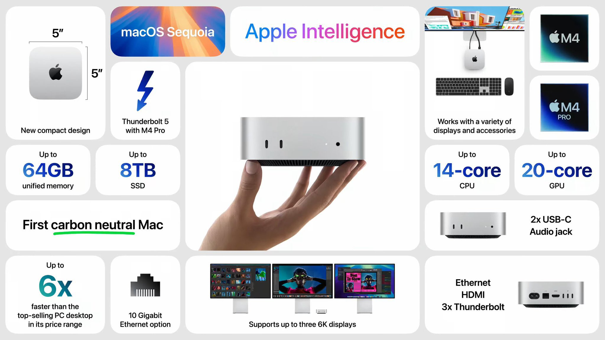
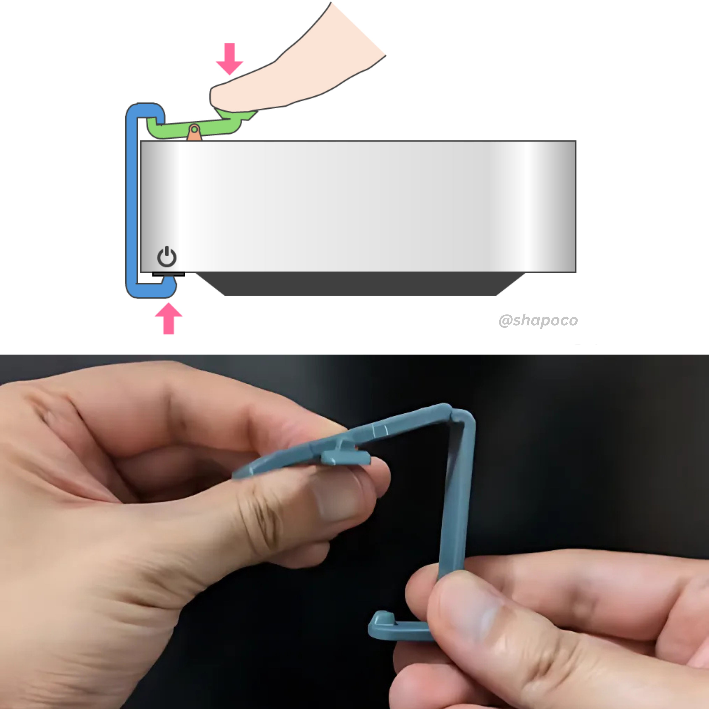

上周苹果发布了配备了M4芯片的iMac、Mac mini以及最新款的MacBook Pro。在M4的加持下，新款Mac的性能得到了巨大提升，MacBook Pro的续航竟然可以达到24小时，这简直太牛X了。虽然，没有人会连续工作24小时，但是如果在出差或者度假的时候，完全不用担心电脑没电，就连停电也不怕。

# 时间轴

10月28日发布iMac
10月29日发布Mac mini
10月30日发布了MacBook Pro

# iMac– M4主要改进

- 配置内存16GB 起步
- USB-C配件
- 12MP Center Stage camera with Desk View，摄像头可以拍桌面视角，也就是在视频的时候，不用电脑放倒，或者举起你要展示的物品，也能让对方看到你的“桌面”上的一切。

# Mac mini也太反人性了

新款Mac mini搭载 M4 和最新的 M4 Pro 芯片，配置内存 16GB 起步，尺寸相比前代设计缩小一半以上，M4 Pro 机型更是首次配备雷雳 5 端口。但是它的开机键却被吐槽反人类设计。这一切都是因为它的电源键竟然放在了机身底部，不论是开机还是重启，都需要用手把整个机身一侧抬起来，才能准确的找到电源键，有网友已经用3D打印DIY了一个开机装置，这个装置非常简单，只要垂直卡在机身电源位置，当装置按钮按下时，就会向上拉伸另外一端，进而按下位置不便的开机键，真的可以永远相信用户为自己的解决方案所做出的努力。

还有国外的大神给Mac mini加了一个壳子，可以将iPad，AirPods Max组合成一个工作台，看起来像是一台复古的长屁股电脑。这简直太酷了，给大家看下这个视频。

<iframe width="560" height="315" src="https://www.youtube.com/embed/JqxwRKL9raM" frameborder="0" allowfullscreen></iframe>

# MacBook Pro

售价12999起，本来我是打算换，但是看到这个电脑厚度，我直接奔溃。还有就是我不喜欢苹果现在给电脑开这么多口，太奇怪了。我相信大部分用户都用不到这么多，甚至在用的时候发现自己根本就没有连接线。Mac老用户基本都已经准备了扩展坞，莫名其妙的开这么多口，简直是“狮子大开口”啊。不仅影响整体体的美观性和密封性，有时候看到这个插口难以清理的灰尘，真的挺影响我对Mac的喜欢程度。这么多更新中，我唯一想要的是，减少开口。
