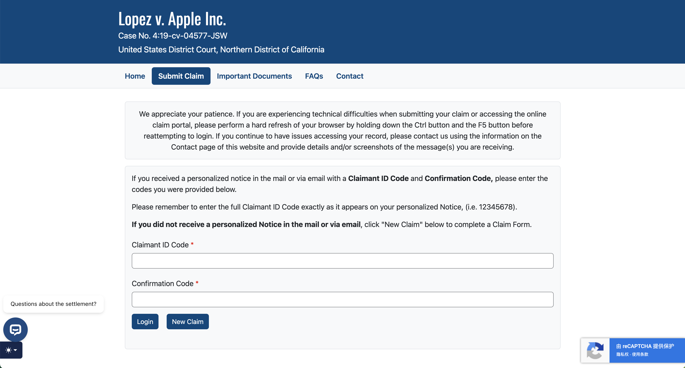
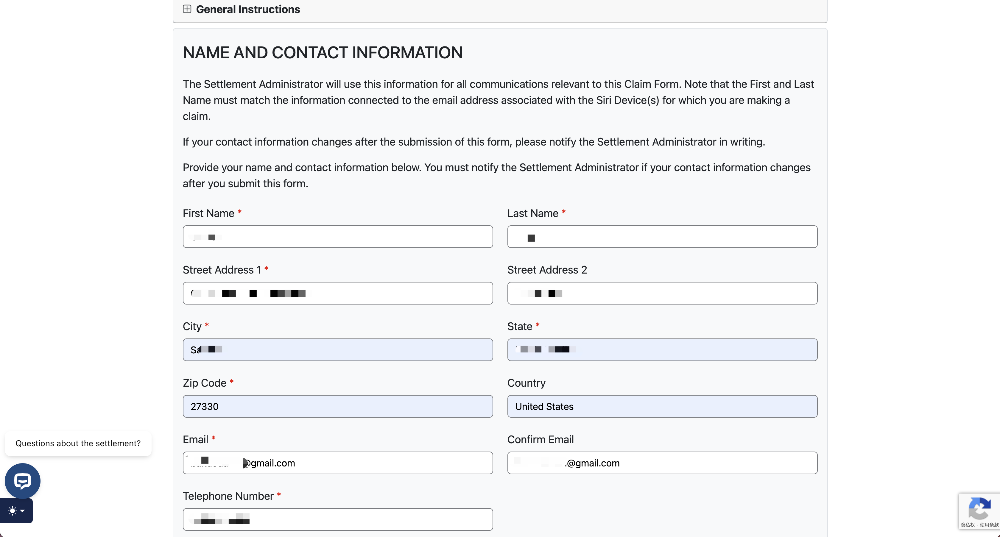
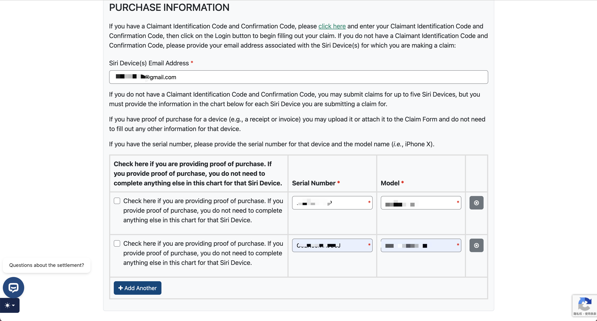

最近，看到网上很多人说Apple语音助手集体诉讼达成和解，可以领赔偿费了。就去邮箱查了一下，果然，在5月14号收到了一封标题为“Lopez Voice Assistant Class Action Settlement”的邮件，这种标题的邮件一般我不去注意。看了一下邮件中有一个 Claim Identification Code 和 Confirmation Code，提示我在Lopez Voice Assistant Settlement的官网提交申请。

邮件中还说苹果公司同意支付 **9500 万美元** 建立和解基金。在扣除法院批准的律师费用、服务奖励金、通知和管理费用（包括税费）后，剩余金额将分配给提交有效索赔的集体成员。每位集体成员最多可为五台 Siri 设备提交索赔，每台设备的赔偿上限为 **20 美元**，即每人最高可获得 **100 美元**。实际赔偿金额取决于申请人数，可能会因申请人数过多而减少。例如，若 100 万用户申请，每人可能获得约 95 美元；若 1 亿用户申请，每台设备可能仅得不到 1 美元

## 哪些人可以申请？

Siri 意外激活而导致机密或私人对话被苹果收集和/或与第三方共享，您就属于本次和解集体。但是，地区要求在美国，申请人需要有美国手机号，美国地址，美国银行账户或者可以接受电子支票的账户，否则，赔偿无法发放。

## 事件经过

2019 年，苹果被指控通过 Siri 在未被明确唤醒（如未使用“Hey, Siri”）的情况下录制用户私人对话，甚至可能将这些录音用于广告或其他目的。原告称，这侵犯了用户的隐私权。

截至目前，苹果公司尚未在 *Lopez v. Apple Inc.* 集体诉讼案中被法院裁定败诉。然而，苹果已同意支付 9,500 万美元达成和解，以解决原告提出的关于 Siri 意外激活并记录用户私人对话的指控。苹果否认所有指控，并坚称其行为并无不当或违法。

这个集体诉讼的和解协议于 2024 年 11 月 14 日 获得加州北区地方法院的初步批准（Preliminary Approval Order）。这是和解协议正式进入实施阶段的日期，最终批准听证会定于 2025 年 8 月 1 日 举行

## 截止日期

申请赔偿或选择退出和解的截止日期为 2025 年 7 月 2 日。最终批准听证会定于 2025 年 8 月 1 日 举行，赔偿预计在此之后发放。

## 申请方式

1. 打开和解官方网站（Lopez Voice Assistant Settlement）  
2. 输入 Claim Identification Code 和 Confirmation Code，点击 New Claim 提交申请。  
3. 输入个人信息以及设备型号和序列号，以及收款方式。  
4. 提交完成，等待打款。

