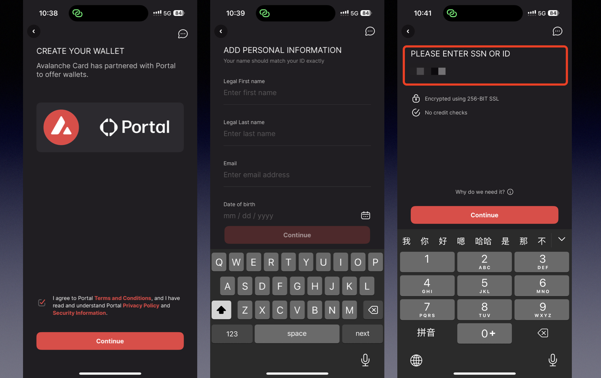
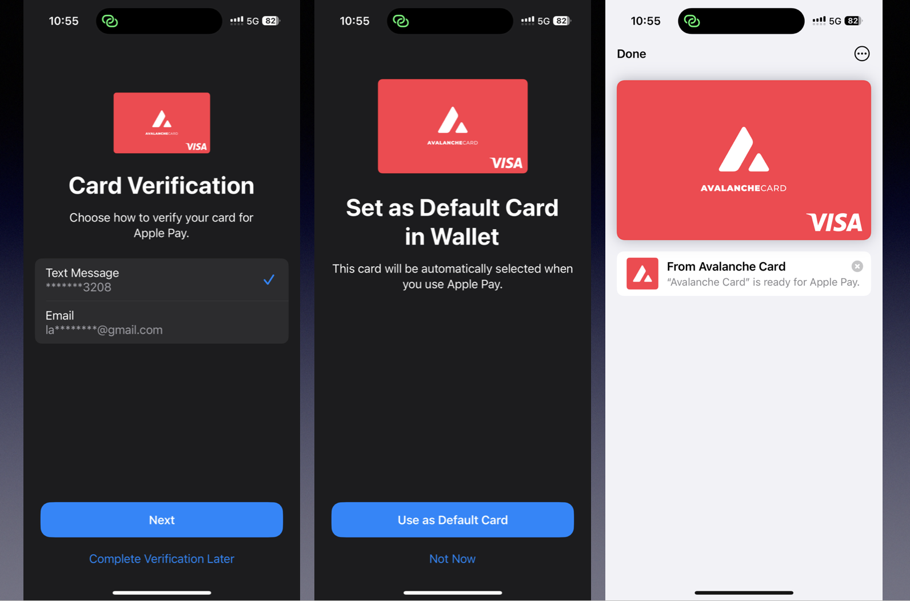

今天A股迎来了一个小高潮，老实说应该是普通人解套的机会，不该多嘴。港股开户现在连尊嘉都开始要提高门槛了，今天刚收到通知，要删掉以前的推文。我可烦删文章了，来来回回删了又发，发了又删，最后干脆不发了，省的以后删的时候再找我。

---

这几天有人问我雪崩卡怎么申请，今天申请了一下，**没想到这么简单就拿到卡了**，我用中国大陆的身份就申请成功了！接下来分享一下这张“雪崩”卡的申请流程。

## 雪崩卡简介

Avalanche Card 是基于 **Avalanche 公链生态** 推出的一张 **VISA 美元信用卡**，支持绑定 USDT、USDC、AVAX、WAVAX 作为消费额度：

- USDT/USDC：按 **100%** 计入额度  
- AVAX/WAVAX：按 **50%** 计入额度

特点如下：

- ✅ **无管理费**
- ✅ **实体卡免费配送**
- ✅ **消费外币手续费 1%**
- ✅ **可绑定 Apple Pay**

## 申请准备

1. 下载 Avalanche Card 应用程序  
2. 一个**海外手机号**（我试了 86 验证码收不到）  
3. **身份证件**：我用的是中国大陆身份证  
4. **地址**：可以填大陆地址，**用拼音写法即可**

## 申请步骤

1. 注册：手机号验证  
2. 填写个人资料  
   - 有一步需要填写 SSN 或 ID，我填写 ITIN 直接通过，身份证/护照大家可以试试看  

3. 居住地址：选 China，地址用拼音填写  
4. 职业与收入信息  
5. 身份认证（上传证件 + 人脸识别）  
6. 认证通过后即可免费领取卡片，**配送也是免费的！**

---

申请后我立即绑定了 Apple Pay，也成功了。目前还没时间实测消费，但总体来说申请体验非常顺畅。

## 延伸推荐：Binpay 卡

如果你觉得雪崩卡支持币种不够多，还可以试试 **Binpay**。虽然开卡有费用，但：

👉 通过我的注册链接注册可获得：

- 💰 3 USD 现金抵扣券  
- 💳 5 USD 开卡金  

注册链接：  
<https://app.binpay.cc/pages/passport/invitation?r=1106548>  
邀请码：`1106548`

---

有问题欢迎留言交流，别忘了趁还开放，早点申请！
