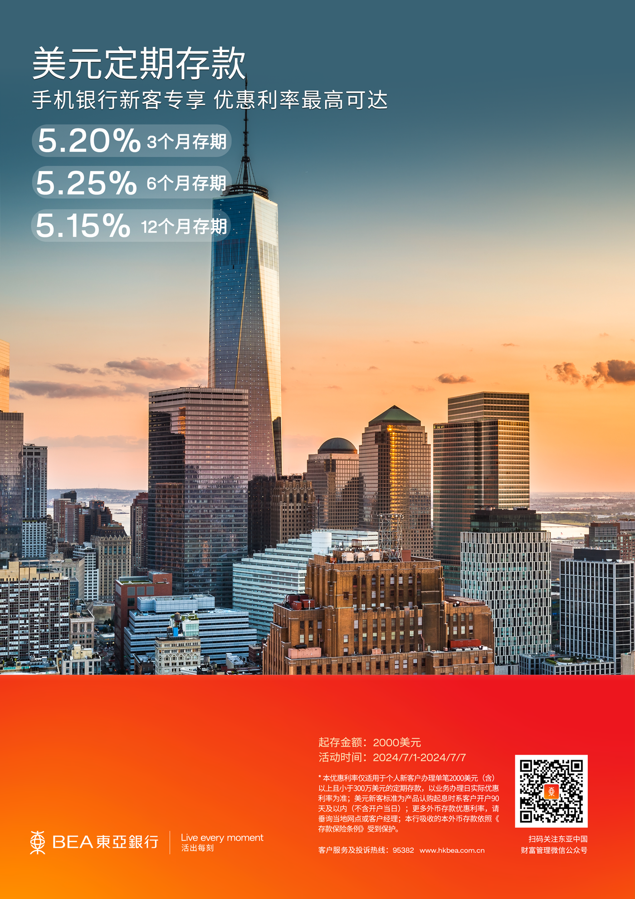

# 星展银行

美元6个月5.40%

# 恒生银行

美金定期
3个月 5.2% (2万美金起，最高7万美金)
6个月4.9%(账户需满足50万人民币)
12个月4.5%(账户需满足50万人民币)

港币(10万港币起，账户满足50万人民币)
3个月 4%
6&12个月 4.1%

# 渣打银行（中国）

渣打中国合格贵宾客户，即可远程视频见证开立境外账户，包括香港、新加坡和迪拜等地个人及公司账户！新开户的贵宾们，7月更可享丰厚新客户资金定期存款利率：

- 💵美金三个月高达 5.2%，六个月 5.2%，一年期 5.1%；

- 💷英镑六个月 4.5%；

- 💶欧元六个月 3.0%；

- 💴澳元六个月 2.8%；

- 人民币两年期定存利率最高可达2.45％，新增三年期人民币定存，年化利率2.55％额度有限欲购从速

# 汇丰银行（中国）

🌟7🈷️定期存款🌟
【美金】
- 3个月 5.0%
- 6个月 4.2%
- 12个月 4.0%
其他汇丰还可以做的外币定期种类：加币，港币，英镑，欧元，澳币

# 东亚银行（中国）

美元定期存款,手机银行新客专享 优惠利率最高可达
- 5.20%3个月存期
- 5.25%6个月存期
- 5.15%12个月存期

[阅读原文](https://mp.weixin.qq.com/s/udBQ9bjP5NNf1LBaEIzAdQ)