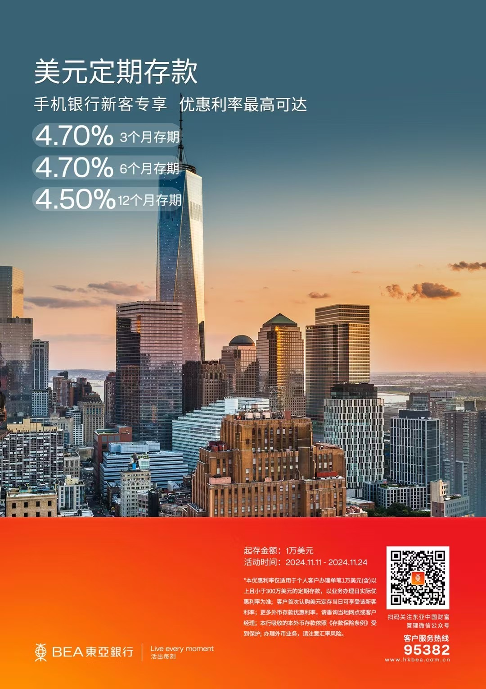
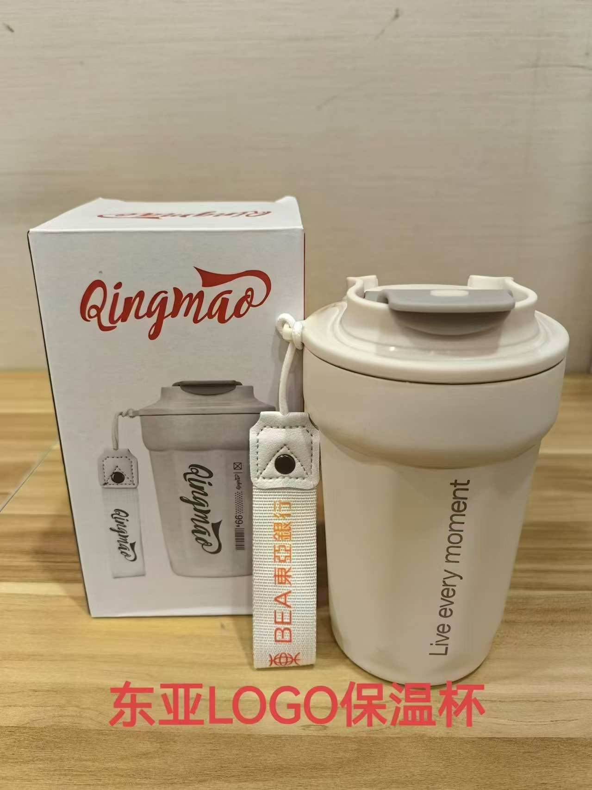
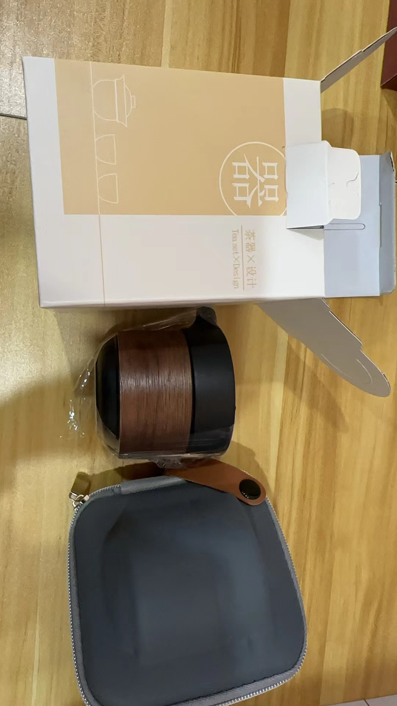

上周看到有些在国外的朋友回来参加进博会，本来想去找他们碰面，一直没有抽出时间，结果进博会已经结束了，他们也各自都回去了。今天抽时间去了趟上海，是昨天晚上十点临时决定的。此行的目的是去开东亚银行的账户，顺便参加星展银行（DBS）企业出海的活动。之所以开东亚银行账户，是因为有一笔放在香港渣打银行的美金定存到期了，闲置了2个月，眼看美金定存年利率一降再降，东亚银行作为银行界美金定存的“扛把子”，4.7%的年利率再没有哪个银行比得过了。原本打算先放在香港星展银行美金定存利率也不错，结果渣打香港不能直接用FPS转美金到香港星展银行，于是果断放弃。也快到年底了，从境外汇入到境内的5万额度还没用完，不如转到内地，放在东亚银行，毕竟东亚银行的老用户定存利率也没低多少，4.6%的年利率比其他银行的新资金定存利率还高，可以长期放在东亚岂不是更好。

一大早匆匆出门，天气还真不错，到东亚银行已经11:15分了，比预约时间晚了15分钟，还好银行这会人不多。进了银行大厅，我预约的客户经理已经在等我，她直接带我去开户的柜台。在开户经理对面坐定之后，要了我的身份证原件，然后拿出已经提前帮我准备好的开户文件，一边给我讲解签署的文件内容，一边让我签字。我握着笔不断的找签字的位置，然后用潇洒的草书写下我的名字。防电信诈骗承诺书和存款保险明白卡等（如果你要开境外卡，还需要填写境外开户申请），然后让我核对开户资料确认签字。5分钟左右就拿到了东亚银行卡，我开的是显卓理财账户，也就是存50w的那种，通过我的预约没50万也可以开，同时也免管理费。（不过要开港卡或者新加坡卡之前需要满足50W）

拿到卡之后，客户经理带我去她的办公室做了风评，然后询问我要不要开投资理财账户，我说要开，开了就可以在东亚银行的App中购买QDII基金、结构性存款等。

到这里开户就完成了，我以为要让她帮助注册网银，在她说开户完成了之后仍然傻等着，几分钟后我问了一下“我自己注册网银就可以了吗？还是需要你帮我操作？”她很耐心的回答我说：”自己注册就行，也可以指导我注册”，我看了一下App store的下载进度，这不争气的网速还要等2分钟，我就起身告别，说我自己注册。然后，她说有什么问题可以随时找她。这时候已经是11:45了，用了30分钟就开好了账户。

外币转账有点麻烦之处是，有些银行必须临柜办理，我的渣打银行就是这样的要求，接下来又要找时间去渣打银行转账了。等我做好了美金定存之后，再和大家分享外币转账的攻略。

下午，要去星展银行总部参加企业出海主题活动，见见星展银行和我一直搭档的朋友。我到星展银行总部大楼时，接到了一个客户咨询，这是一个澳洲籍的大老板，打电话给她做了账户配置方案。因此，我和星展银行的搭档不得不以一种沉默的方式见面，她帮我准备了饮料，等我打完电话，我们终于可以寒暄一下，聊了一会就去参加活动。等到下午茶歇期间，她又帮我点了上海的特产，让我带走，真的太感动了。我是赤手空拳的去，然后满载而归，友谊万岁。

# 东亚银行优势：

- 定存利率高，新美金4.7%，老用户4.65%
- 境外取现每月前5次免费（这个比寰宇人生还要爽）
- QDII额度充足，不用抢（各种海内外基金，保本结构性存款）
- 免管理费（资产不达标也不收费）
- 可以开南向通（开户后就能领300京东卡）
- 可以开境外卡（新加坡、香港、英国）
- 针对外籍人士的薪酬购汇、房产购汇

# 开户准备资料：

1.  身份证原件
2. 本人实名认证手机号等

# 开户福利

1. 现在通过我来预约开通东亚银行账户，只要开户成功就送一个东亚保温杯。（见图1，仅限北上广深珠）
2. 开户成功后，当天存入10万人民币以上的用户，还可以再送一个便携茶杯。（见图2）

活动茶歇期间，我发了个朋友圈，有个刚加我的朋友给我发消息，说“老师，请问您是做什么职业的？”，对于这种问题我之前已经在公众号回应过了，如果你对我分享的内容感兴趣，就多看看，我这边不推荐你买股票、不推荐你买保险、不推荐你做任何投资。咨询问题，可以先付费。另外，需要我帮你，可以给我留言，留言随缘回复，我会优先处理付费咨询的朋友。如果你对我个人感兴趣，完全没必要。

好久没有出远门，今天这点路程够累的，躺着写完这篇文章，该洗洗睡了，好几天没去看书了，明天再说吧。