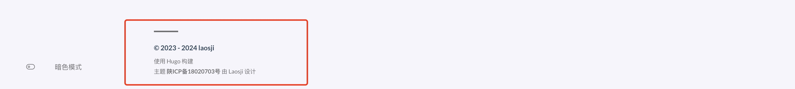

最近由于需要上线小程序，不得不把域名在腾讯云做备案，备案之后按照管局要求，需要在网站中添加备案号，并连接至管局官网。下面是添加备案号的步骤：


# 修改footer.html文件

在文件目录中找到“layouts/partials/footer/footer.html"文件，添加如下代码，复制粘贴进去就可以了。如果没有footer.html文件，首先要新建”footer.html“文件，注意文件夹不要放错。


```
{{- $ThemeVersion := "1.1.0" -}}
<footer class="site-footer">
    <section class="copyright">
        &copy; 
        {{ if and (.Site.Params.footer.since) (ne .Site.Params.footer.since (int (now.Format "2006"))) }}
            {{ .Site.Params.footer.since }} - 
        {{ end }}
        {{ now.Format "2006" }} {{ .Site.Title }}

        {{ with .Site.Params.footer.customText }}
            <br/> {{ . | safeHTML }}
        {{ end }}
    </section>
    <section class="powerby">
        {{- $Generator := `<a href="https://gohugo.io/" target="_blank" rel="noopener">Hugo</a>` -}}
        {{- $Theme := printf `<b><a href="https://beian.miit.gov.cn/" target="_blank" rel="noopener" data-version="%s">陕ICP备*****03号</a></b>` $ThemeVersion -}}
        {{- $DesignedBy := `<a href="https://jimmycai.com" target="_blank" rel="noopener">Jimmy</a>` -}}
        {{ T "footer.builtWith" (dict "Generator" $Generator) | safeHTML }} <br />
        {{ T "footer.designedBy" (dict "Theme" $Theme "DesignedBy" $DesignedBy) | safeHTML }}
    </section>
</footer>
```

# 修改备案号
将这段代码放进footer.html文件后，修改你的备案号就可以显示了。

