中银香港「万事达扣账卡」开放特选用户申请了！中银香港是众多港卡中我们必备的账户之一，不仅因为在内地有众多网点，而且开户没有存款要求及管理费。开了中银香港的朋友现在可以来申请一张扣帐卡了，之前仅限“中银私人理财”和“中银理财”用户申请，现在增加了支持部分特选客户申请。我的中银账户是智盈理财，之前在6月尝试申请的时候，没有权限，今天无意中点开看了一下，居然可以申请了。于是，就立刻申请了万事达扣张卡，但我没有要实体卡，无集卡癖。今天来分享一下，我是如何申请成功这张万事达扣张卡的。

# 非中银理财用户，怎么知道自己是不是特选客户？

打开BOCHK中银香港App，登录成功后，在底部导航中选择“选单”，然后，找到「账户-申请中银卡/扣张卡“直接申请。如果可以申请就说明你是特选用户了，如果你是中银理财账户直接申请就好了。如果非特选用户，建议存点钱进去，过段时间再看看。

我的申请是秒通过的，通过后马上就能得到一张万事达虚拟卡，立即就可以绑定Apple Pay。当然了，也能申请实体卡，申请后可快递到内地。我的实体卡太多了，暂时就没有申请实体卡。我申请到的“中银万事达扣张卡”，就是下面这样的卡面。

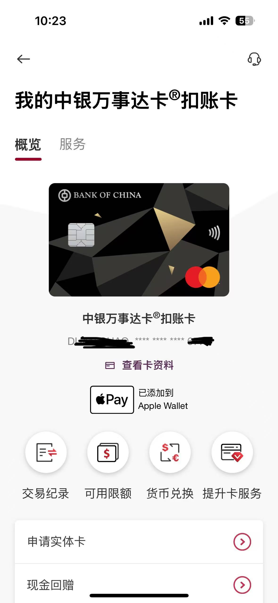

接下来我们先来看下中银香港扣张卡的权益有哪些。
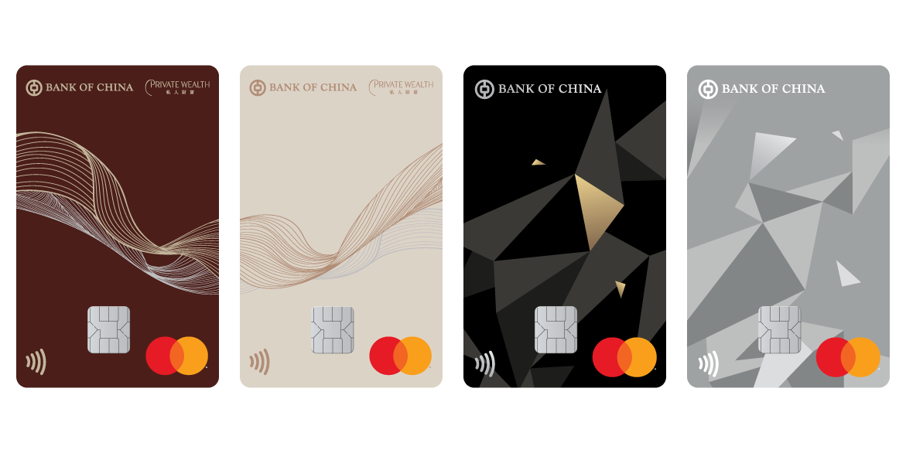

# 中银万事达卡®扣账卡权益

1. 无上限0.5%现金回赠
于任何网上、本地及海外商户作零售签账，均可享0.5%现金回赠，绝无上限，让您尽情消费。

2.免手续费提款
支持12种主要货币于消费及提款时豁免外币交易手续费。

可透过「中银香港」或「银通」网络自动柜员机，以及全球贴有Mastercard标志的自动柜员机提款，豁免手续费。

3. 可申请4张附属卡
可申请高达4张附属卡，给您低至11岁的子女。每张主卡/附属卡更可灵活设定不同限额，具独立消费通知，方便管理。

4. 永久免年费

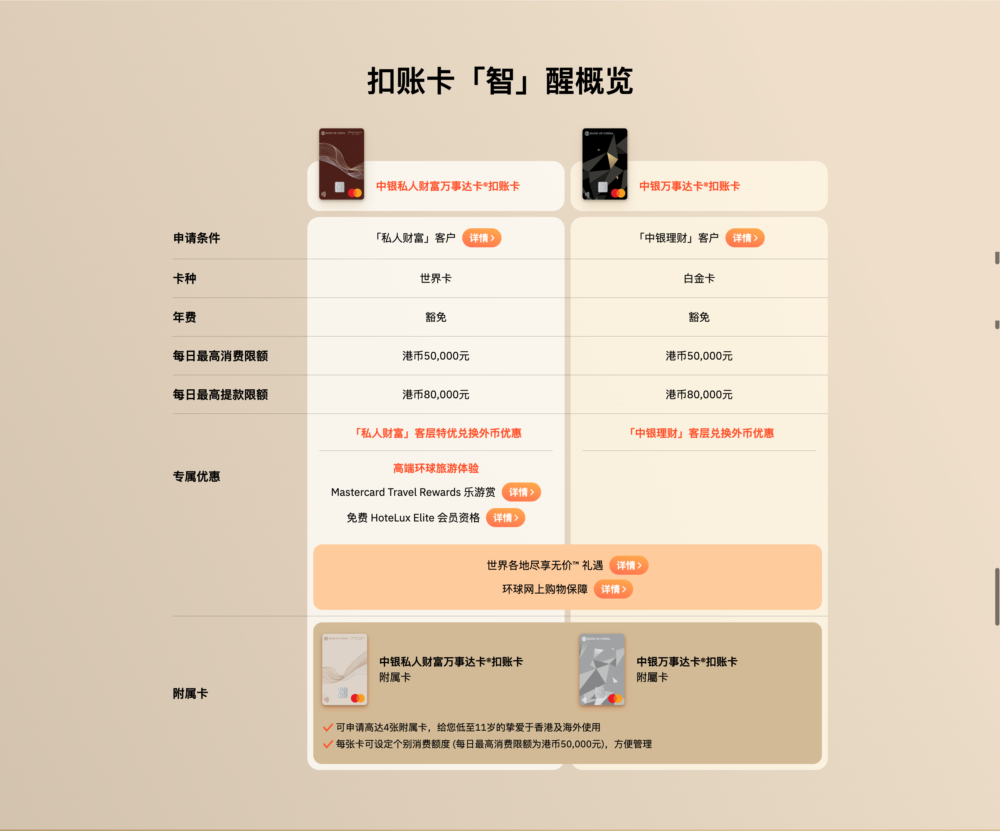

海外提款注意事项
香港银通ATM：香港免手续费，澳门每次20HKD。

中银香港ATM：香港免手续费。

万事达/Cirrus ATM：香港每次25HKD，内地每次50HKD，海外其他国家“免费”。

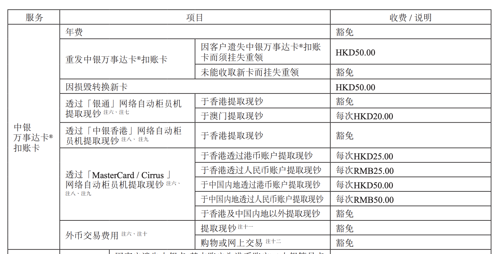

在香港中银和有银通表示的提款机提款免手续费，内地的话取人民币每次会收50人民币。所以，这张卡比较适合在境外旅游或留学时使用。可以和汇丰的蓝狮子配合使用，汇丰蓝狮子扣张卡在内地汇丰或恒生提款机提款是免手续费的。

# 每日限额
中银万事达扣张卡和中银私人财富万事达扣张卡每日最高消费限额为「5万元港币」，每日提款最高限额为「8万元港币」。

# 申请方法

打开”BOCHK中银香港”，在底部导航点击「选单-账户-申请中银卡/扣张卡」
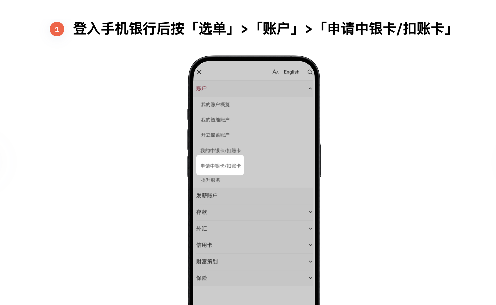

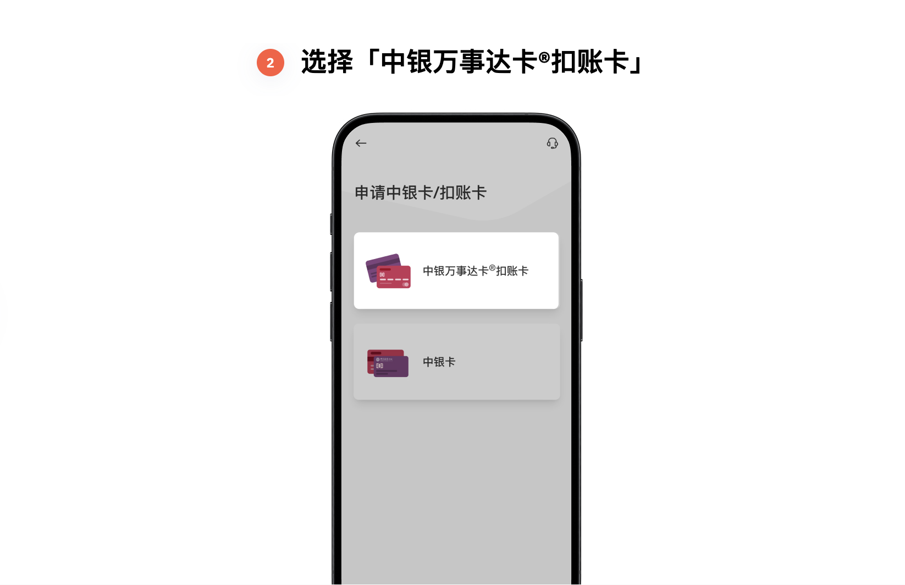

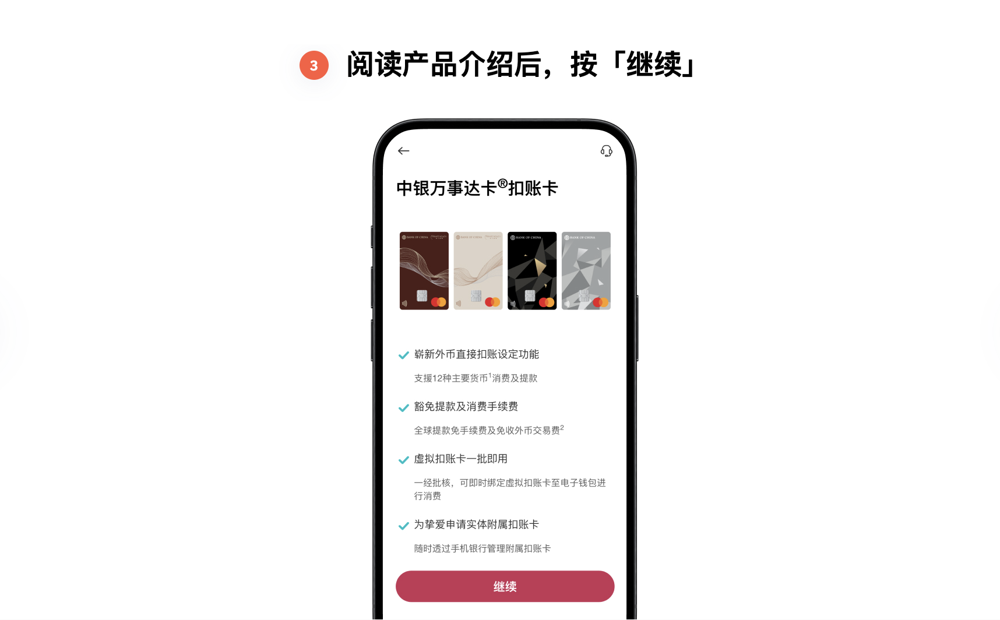

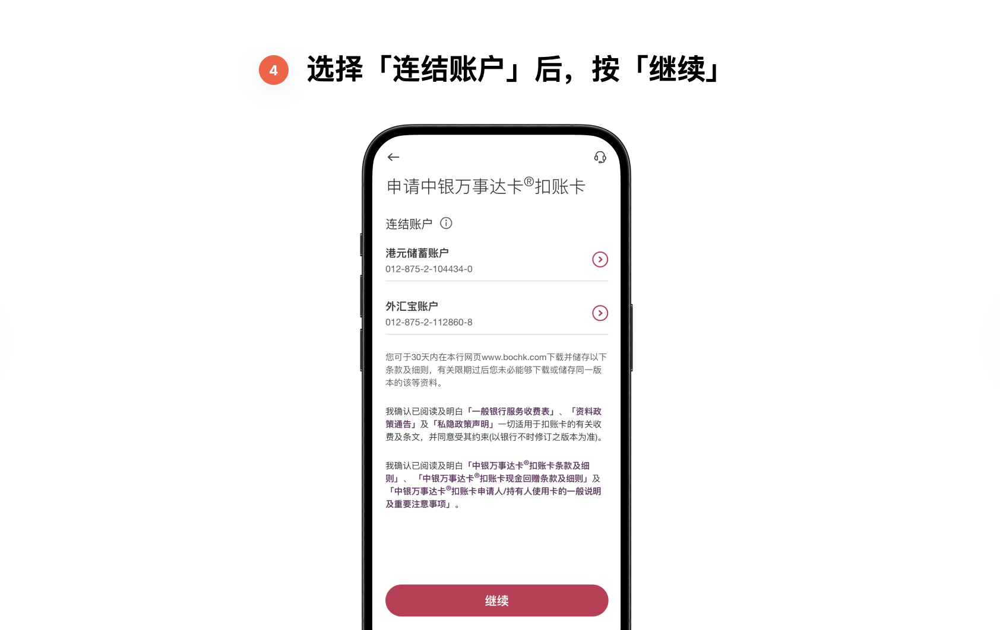

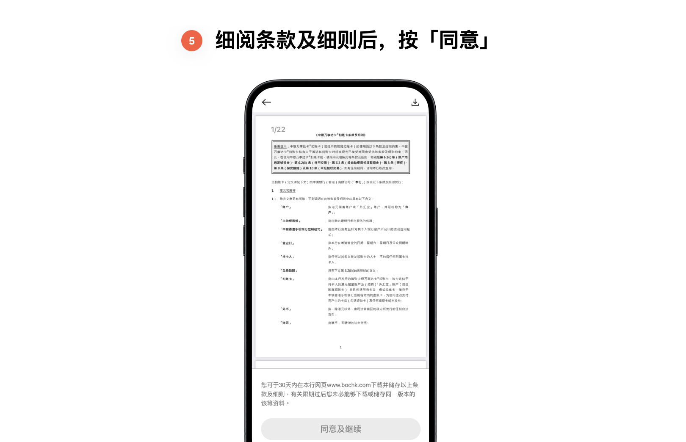

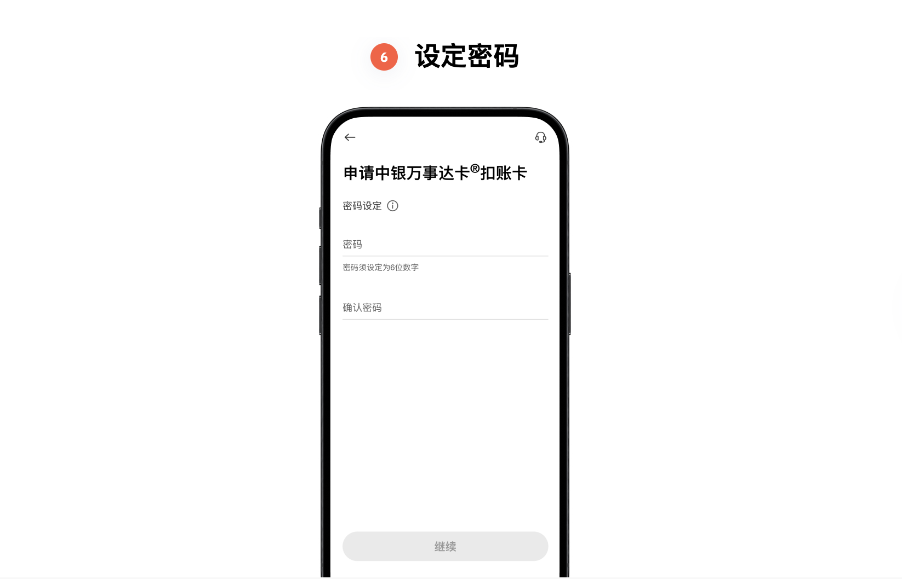

这里设置的事口张卡的密码，收到卡后，就能用这个密码在ATM取款

# 申请实体卡
如果你需要申请实体卡的话，在申请扣张卡成功之后，打开“账户-我的中银卡/扣张卡”选择中因万事达卡扣张卡进行申请。

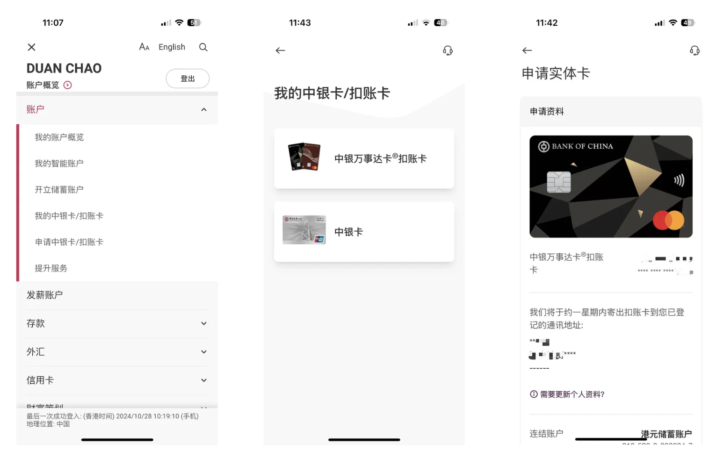

如果你的通讯地址需要更新，在设定-更改个人资料中输入新地址，等新地址审核通过后就可以用来申请实体卡了。如果你个人资料中的地址是正确的，就可以直接申请了。

