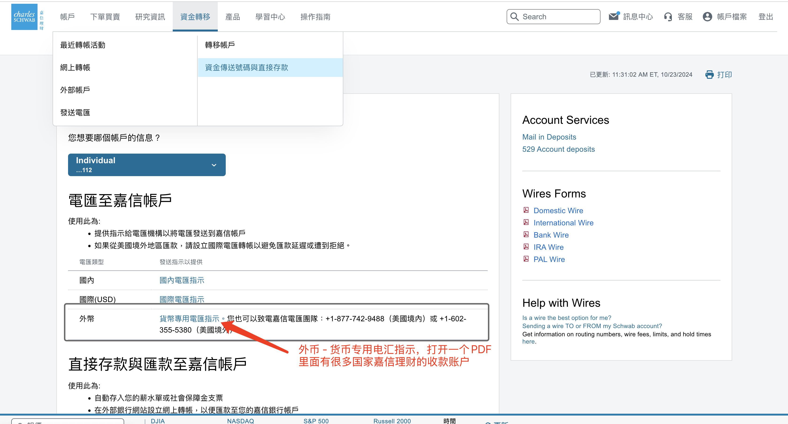
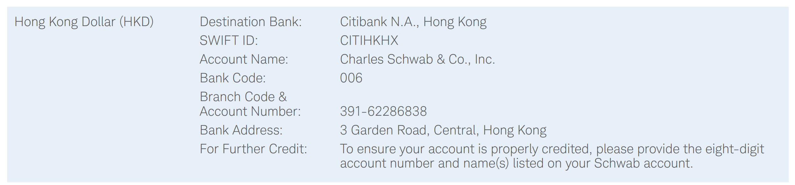
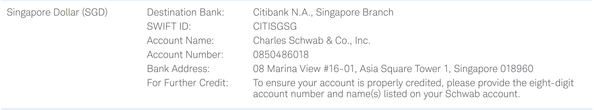
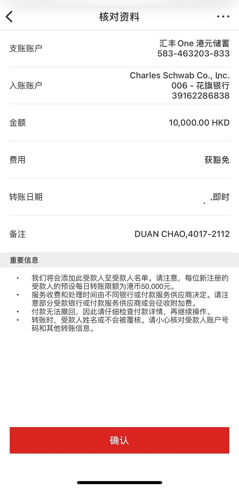

上周帮大家测试嘉信理财的入金方法，发现很多人都不知道，嘉信理财也可以直接用FPS无损入金港币。虽然说，直接电汇美金嘉信也不收费，但是会产生一些中间行手续费，但是直接电汇美金速度会快一些。用港币或者新币入金，需要转成美金，才能到你的嘉信账户。今天晚上，在和嘉信一个甜妹客服电话聊天的时候，她告诉我最近嘉信取消了2.5W的入金门槛，0资金也能开户。但是借记卡已经不是2.5W就能申请了，好几个客服跟我说要100万才能申请。我最近，还在测试其他方法，有结果了和大家继续分享，言归正传，今天和大家分享一下怎么通过FPS无损入金港币到嘉信理财。

# 找到嘉信港币账户

登录嘉信理财账户后，在顶部菜单点击“资金转移—资金传送号码直接存款—电汇至嘉信账户—外币”，如图所示，打开PDF页面。

找到香港Charles Schwab的收款账户，是香港花旗银行，记住这个Account Number，和Bank Code转账的时候会用到。

如果你想转入新加坡元，在这个文档中都可以轻松的找到，还有日元、欧元等，根据自己的需要，可以找一下。

为了方便大家查看，我把链接贴出来，在你登录嘉信账户之后，直接打开这个网址也行https://www.schwab.com/public/file/P-10740369，请大家在打开任何链接之前都看一下，网址是不是官方的，防止被钓鱼。虽然我不会钓鱼，但是，我提醒你养成良好的安全上网习惯。包括以上的账户，当然是真实的，但是我还是希望你自己动手查一下，这样就让你能更远离电诈。

# FPS无损入金

找到嘉信理财的本地账户之后，我们就能够使用当地银行账户以及当地货币进行转账。我们就以香港汇丰为例，打开并登录HSBC手机APP，选择转账至本地收款人/转数快—新增收款人，转账方式选择“账户号码”，然后选择收款银行，输入银行编号006，然后再输入账户“391-62286838”。再接着输入持有人姓名“Charles Schwab Co. lnc”。然后点击继续，不要忘记在备注中输入你的姓名拼音和你的嘉信8位账号。

完成转账后，需要等3个工作日才能到账，所以别着急，等着就行了。如果第三个工作日没有到账，一般肯定是被退回了。可以打400-1206217，然后按2键选择国语服务，咨询客服。

无损入金问题解决了，但是出金又难搞了。

# 出金

1. 出金每笔嘉信收取15美金电汇费用，如果没有美卡就承担wire费用吧，不仅快而且安全，太少就别玩了。
2. 不建议出金内地账户，银行会问很多问题甚至要求提供证明文件，可以直接到香港。
3. 有人说可以连接外部账户，绑定IB进行出金，我劝你别这么玩，等账户被封后悔就来不及了。

# 注意事项

所有来自美国境外的汇入款项，必须提供以下资讯：

- 汇款人资料：交易金额、交易日期、姓名、地址（至少要有汇款人国家）
- 受益人/收款人资料：姓名、帐户号码
- 汇款金融机构相关资料：
    
    两者择其一：汇出款项的金融机构名称与国家，或汇出款项的金融机构由数字与字母组成的识别代码（银行识别代码／BIC）
    

**某些第三方中介银行可能对电汇转帐收取费用，请与您的汇款银行联络索取详情。**