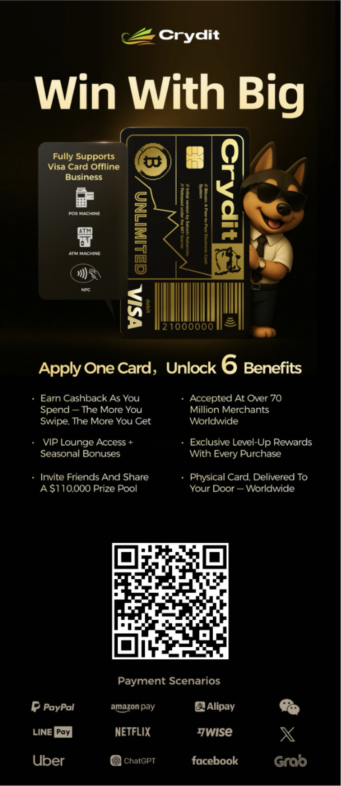

美国的《天才法案》通过之后，很多人开始关注稳定币，有人问有没有什么机会。今天来给大家继续分享一下稳定币的功能以及如何使用吧。

稳定币也是基于区块链技术发行和运行的，是一种部署在**区块链智能合约**上的数字货币，智能合约的好处就是**条件满足自动执行，不可更改、不可篡改、公开透明**。从技术层面讲还有一个核心优势就是到账速度快，基本上是秒到账。从经济学角度来说，稳定币具有抵抗通胀的功能。有一些发展中国家的货币（如阿根廷比索、土耳其里拉）存在高通胀，因为他们信不过本国的货币，但又没美元账户，所以**稳定币就是最方便的美元替代品，**也是他们用来做资产保值的配置工具**。**

## 如何消费稳定币？

1. 在支持稳定币支付平台使用稳定币支付，或通过数字钱包转账。
2. 存入Crypto借记卡（Visa/Master），绑定Apple pay / Google pay / 微信 / 支付宝，或者直接刷实体卡。
3. 兑换法币存入银行卡消费。

## U卡推荐

从去年开始就陆续收到一些U卡，今天为大家把我使用的这些卡片做个对比。

- **Bybit Card（已废）**
- **Avalanche card：**

       优势：免费领取。不足：只支持自家avalanche C- chain。

- **Binpay**

       价格相对适中高级卡只要25USD，注册有8USD奖励，所以等于卡费只要17USD。充值手续费至少1%。

邀请链接（可领取8USD）：<https://app.binpay.cc/pages/passport/invitation?r=1106548>

- **Xapo Bank**

       金属卡消费有1%返现，充值无手续费，兑换汇率好，有储蓄利息。缺点：年费太贵1000USD，通过我的邀请可以获得504USD的返现，每月42USD。

邀请链接: <https://application.xapo.com/membership-application?ref=ZKK-KFF-UN>

邀请码: 「ZKK-KFF-UN」

- **Crydit Card**

       消费不限额，卡面好看，Master card消费无手续费。master card卡费199USD（之前是249USD），visa 179usd，Visa卡资金托管在星展银行（全球最安全的银行之一）。

邀请注册链接：<https://h5.company.crydit.com/register?invite_code=9F6266VY>

## Crydit手续费

- VISA卡充值费用1%，消费手续费1%。
- MASTER卡充值手续费1.5%+12U，无消费手续费。

前4个卡之前都给大家介绍过了，只有Crydit Card是最近才使用的。除了赛博朋克风的卡片设计，最大的特点就是稳定，不论多大的消费都巨稳。这个卡就是为数字货币用户设计，不仅限于个人用户。他们针对企业还推出了工资卡及财务管理系统，以及联名卡和为其他交易所提供发卡能力。

## 注册攻略

注册很快，只需要邮箱，但是一旦你要申请卡片，就需要提交KYC资料，Visa卡的KYC是相对容易的。需要提供手机号和身份证等个人信息，支持中国大陆KYC，可绑定支付宝/微信消费。

## 关于Crydit

Crydit是一家注册于英国的Web3金融科技公司，持有多项金融牌照，包括香港MSO、欧洲VASP和丹麦银行开户证明。Crydit Card 致力于为数字资产用户提供便捷的支付和资产管理服务，接受全球主要支付方式，包括PayPal、Apple Pay、Google Pay和AliPay等。其战略合作伙伴包括COBO、MASTERCARD、VISA、BINANCE和Danske Bank。Master card的资金托管于丹麦银行。

