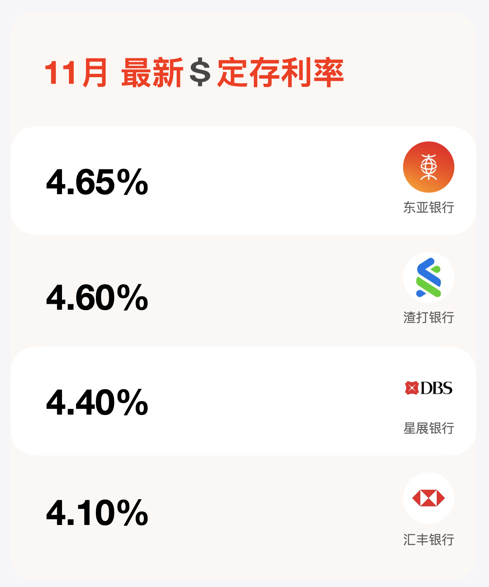
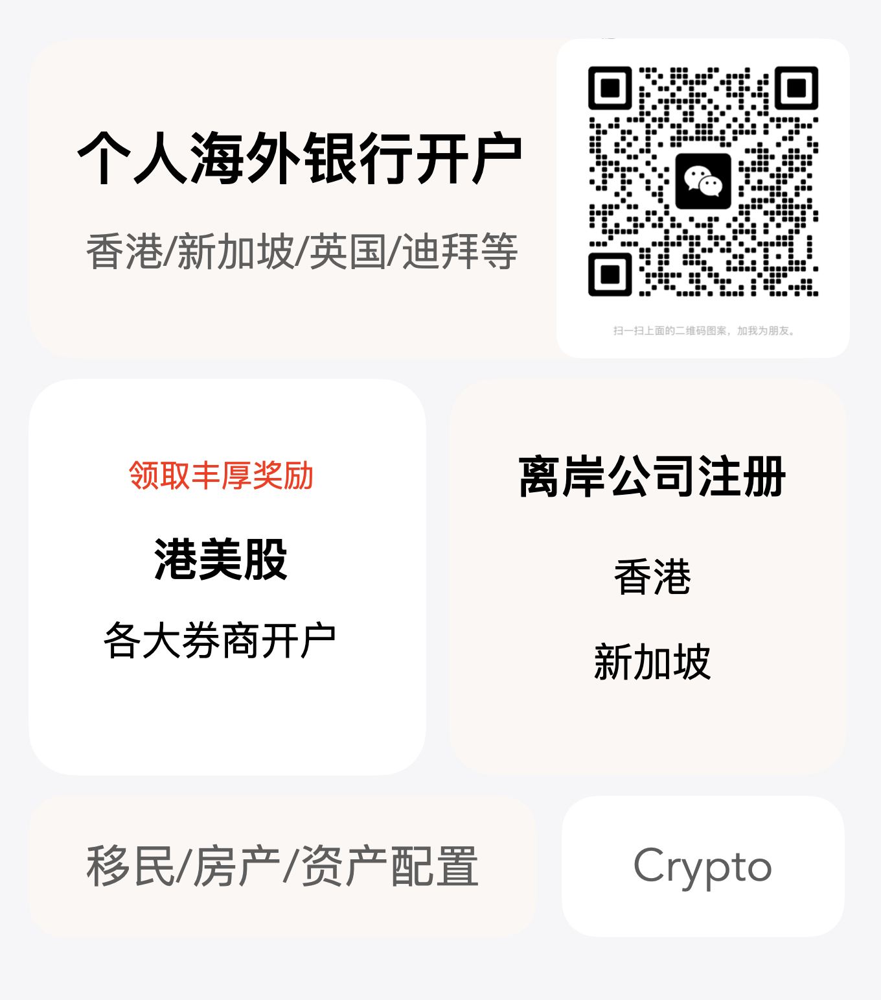

全香港远程见证开户门槛最低的银行来了，不用到香港，最低只要4万存款就能开。这个绝对是目前远程见证开户中门槛最低的银行了，大新银行之前做对公业务比较多，现在随着内地同胞对海外资产兴趣日益增长，大新银行也推出了远程见证个人开户服务。不论你是用于港美股出入金、移民保证金、留学学费、保险保费缴纳等用途，别再错过。

# 大新银行港卡优势
- 永久免管理费。
- 无最低存款要求，只要余额大于0即可。
- 远程见证开户门槛低，国内大新开户成为显赫理财（20W一次性存入，或每年4W连续存入5年）这里推荐每年存4w的方案，这个等于是一个储蓄分红险，5年后可一次性取出来，等于是给自己存钱了。

# 缺点
只有电子账户，没有实体卡，如果需要实体卡要到香港去领取，对于想要一个境外账户，进行出入金的用户老说，已经完全足够。而且账户受到《存款保险条例》的保护，可以完全放心的用。

# 大新简介
大新银行集团有限公司（Dah Sing Banking Group Limited）是香港本土的三大家族银行之一，另外两家分别是东亚银行和永亨银行（被ocbc收购）。于1947年5月1日在香港设立，1987年大新银行收购香港工商银行，并以大新金融集团有限公司（大新金融）名义于香港联合交易所上市。分别在香港、澳门及中国内地设有分公司和银行网点。

# 账户类型
普通综合账户：无管理费，无最低存款要求，无客户经理

显赫理财（VIP账户）：国内20w人民币就能开（如果过港开户需要100W，并且资产不足每月需要200HKD管理费）
# 准备资料
1. 要提供护照，且护照要有未过期的大于90天的第三国签证（这个我们来搞定）
2. 身份证
3. 准备好资料后，提前3天预约开户。国内可以远程见证开户的城市：广州、佛山、深圳、上海、南昌。目前见证开户的帐户默认都是普通账户（I-Account），无管理费的这种；如果想选择香港的vip banking,我们会专门安排香港客户经理做一个电话录音的确认，即可提升账户等级。

# 办理流程
1. 准备好护照和签证、身份证，然后发资料给我；
2. 开户资格初审：
   - 需要满足20W人民币存款要求，并且开户后可以存入国内大新银行。
   - 或者可以购买大新银行的储蓄保险，每年存4W，存5年，利息3%。
3. 满足以上条件后，预约开通国内大新银行账户，开户当天可以签署香港见证开户文件。后续1-2周可以完成香港开户。

# 办理费用
800元全包，请加我的时候，备注好姓名、城市、手机号。谢谢！

# 注意事项
目前大新中国提供的见证服务开出的香港账户都属于电子银行账户，如需要实体的银行卡， 开户成功后可以在工作日到香港任意分行填写申请表领取，无需提供额外资料申请。

「东亚银行」显卓理财免管理费，不强制存50w，每月前5次境外取现免手续费，还能远程见证境外3国账户！

「星展银行」见证开户攻略：在国内如何拿到新加坡和香港星展银行银行卡？台湾｜香港｜加拿大也支持远程见证开户！

「境外银行开户，总有一个适合你」香港/新加坡/英国及国内远程见证开户要求

电报群：立即加入  https://t.me/laosjigifts

「福利」：以下都是本人测试过的一些App，新用户注册可领奖励。可查我的历史文章，或自助领取：https://fl.laosji.net/
「常用网址导航」：https://dh.laosji.net/

