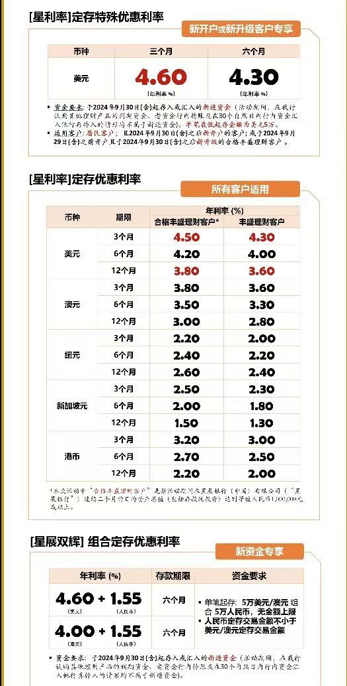
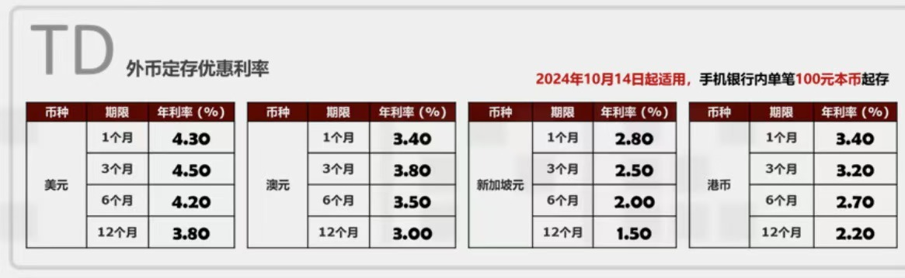
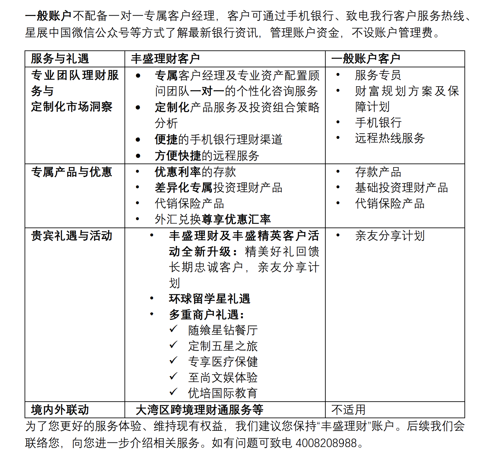

近日中国星展银行发布了一条通知，据介绍在2025年星展中国将推出差异化账户服务。丰盛理财账户未满足最低资金留存要求，将被收取300元/月的账户管理费。如果你不想被收取账户管理费，可以选择将账户降级为一般银行账户。这个要求和渣打银行、汇丰银行等都是一样了，只不过星展银行丰盛理财账户门槛更高。我比较喜欢星展银行每个季度的投资展望直播活动，有专门的策略师包括星展银行集团内部的，以及可能会邀请如贝莱德、安联等机构的投资策略师，分析每个季度的投资方向。每个策略师都有自己比较有经验的方向，是一个很好的学习机会让自己了解不同行业的投资策略。有句老话叫“不听老人言，吃亏在眼前”，在投资方面，更应该去多听一下他们对一些行的投资看法，但不构成投资建议（入市需谨慎）。

作为丰盛理财客户，在星展享有一对一的客户经理及有经验的团队为您提供理财服 务，还享有专属的市场洞察、差异化的产品和丰盛理财专属产品，并能获得差异化的费率、优惠汇率和丰盛理财专属的客户权益（比如旅游出行，医疗健康，教育培训， 美食优惠等）优惠的服务，还为丰盛理财客户不定期推出各项专属的客户活动 （如积分回馈活动）等等。

另外，星展银行的存款利率还相对比较高，因为他们的门槛比较高，所以高净值的客户比较多。

2025年，星展银行将多设一个一般账户，这个一般账户的目的是用来接受丰盛理财淘汰下来的客户，并不会去开放给分行。目前的星展银行中国只有一个账户类型就是“丰盛理财”，而且是免管理费的。各位丰盛理财的贵宾，在2025年就要留意一下自己账户的动态了，要保住丰盛理财的权益，还是要满足账户留存要求的。

# 管理费

「丰盛理财」的账户管理费为每月 300 元，如月日均资产总值达到等值人民币 1,000,000 元或以上，则免于收取。

# 一般账户与丰盛理财账户的区别

[星展银行开户，定期存款利率有多少？](http://mp.weixin.qq.com/s?__biz=MjM5MTM0NTgxNQ==&mid=2648636821&idx=1&sn=8bc69e05dd706f22a11c92e92f539e31&chksm=be9ca06d89eb297bbb99ed97b1b0f9fee6c643d3246a6f215226234bbc8371a845d70631f6bd#rd)

[「星展银行」见证开户攻略：在国内如何拿到新加坡和香港星展银行银行卡？台湾｜香港｜加拿大也支持远程见证开户！](http://mp.weixin.qq.com/s?__biz=MjM5MTM0NTgxNQ==&mid=2648636983&idx=1&sn=248565e52b50f47e8b71070ae0691eca&chksm=be9ca3cf89eb2ad9e9b32c6b99ad743115ed72fe1f5d36be46f63e4574c78bc3dfe3d7eda40f#rd)

[香港星展银行开户：美金定存利率4.6%，外币挂钩投资收益高达7.29%](http://mp.weixin.qq.com/s?__biz=MjM5MTM0NTgxNQ==&mid=2648636600&idx=1&sn=5330ea9d35e8e131ddc319fb40750ffb&chksm=be9ca14089eb2856ae28a893229f0f09cb518e7a71b10774cacddcaab0043dd7d4a3cd0ccf72#rd)

电报群：立即加入「Lao朋友无国境生活方式交流群」

「福利」：以下都是本人测试过的一些App，新用户注册可领奖励。可查我的历史文章，或自助领取：https://fl.laosji.net/

「常用网址导航」：https://dh.laosji.net/