# 抖音美好字体免费商用

抖音体验设计中心与方正字库联合设计开发了一款简洁大方、清晰易读，同时兼具现代气质与人文属性的品牌定制字体——抖音美好体。

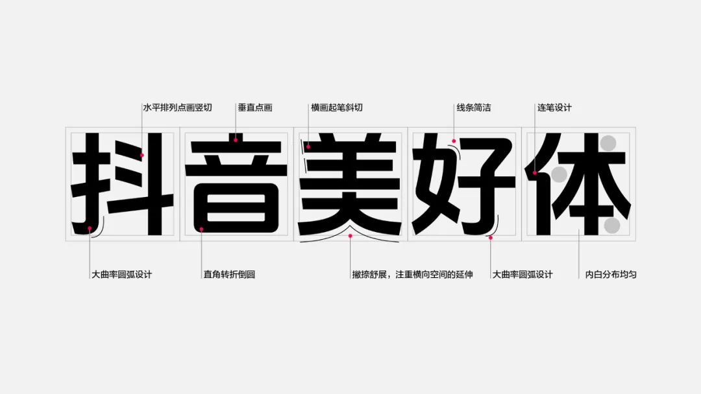 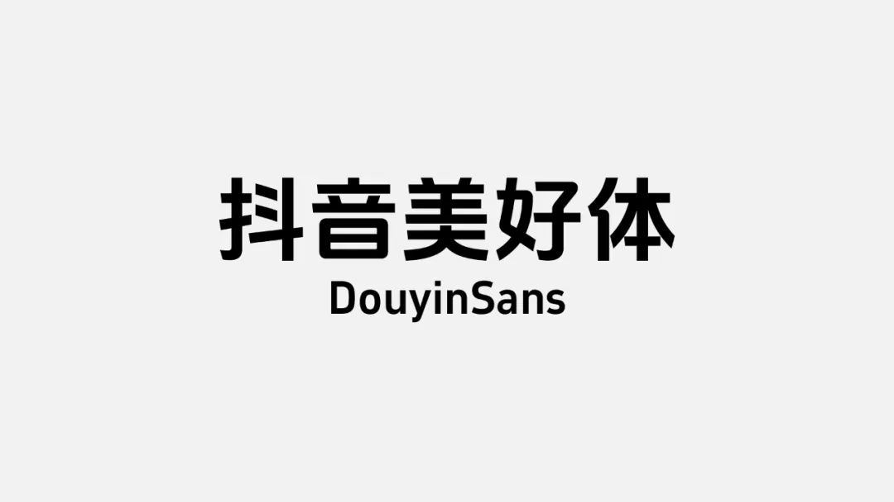 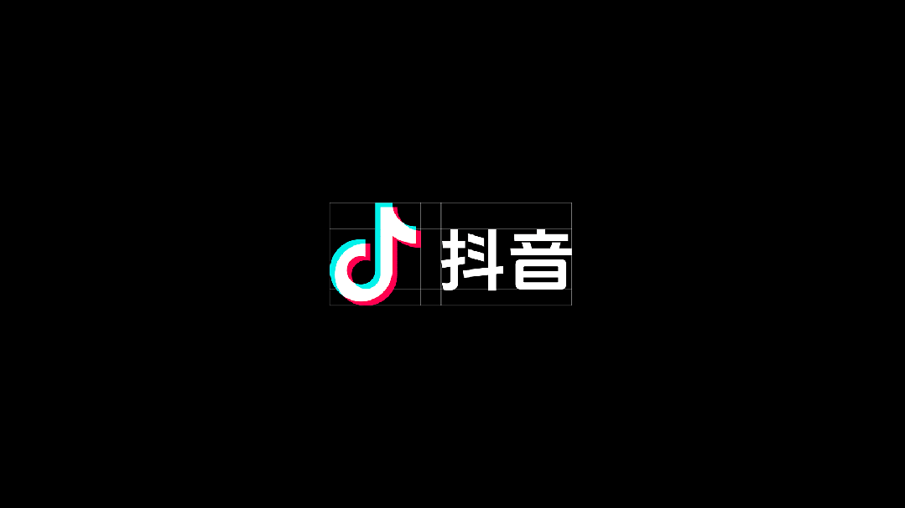

抖音美好体包含6763个中文字符，682个西文及数字符号，执行国家GB2312-80简体中文编码字符标准。作为品牌标准字体，抖音美好体将会率先用于抖音及其子品牌中，助力品牌视觉形象的统一，提升品牌的官方性、权威感。

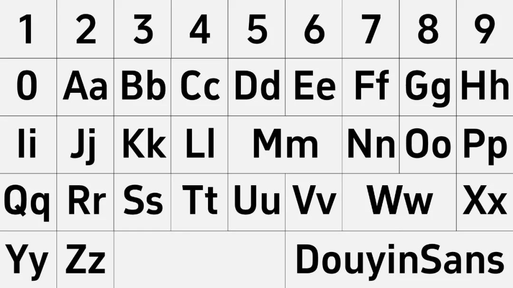 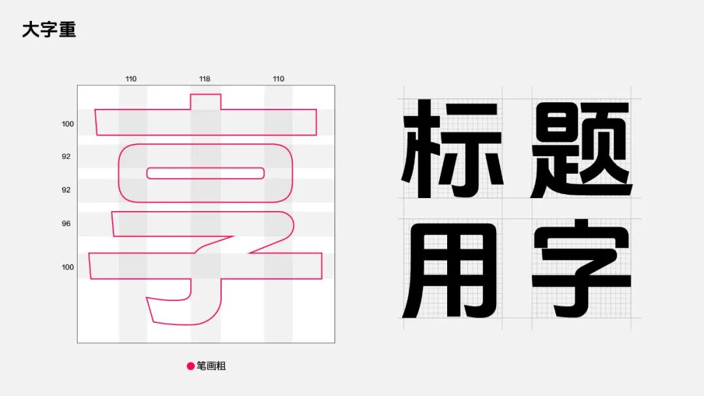 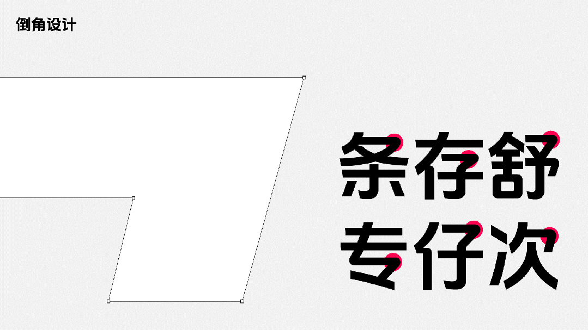 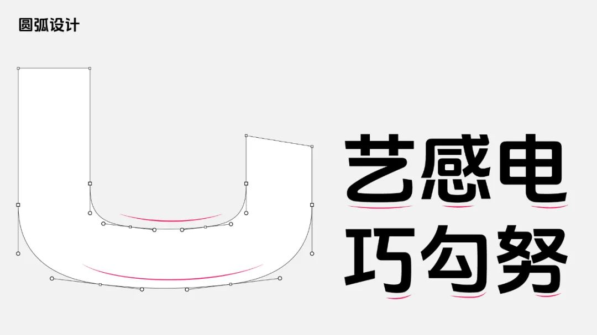  

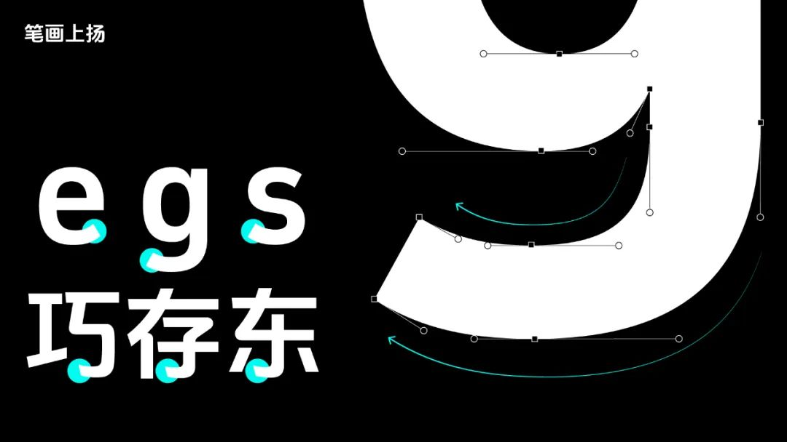 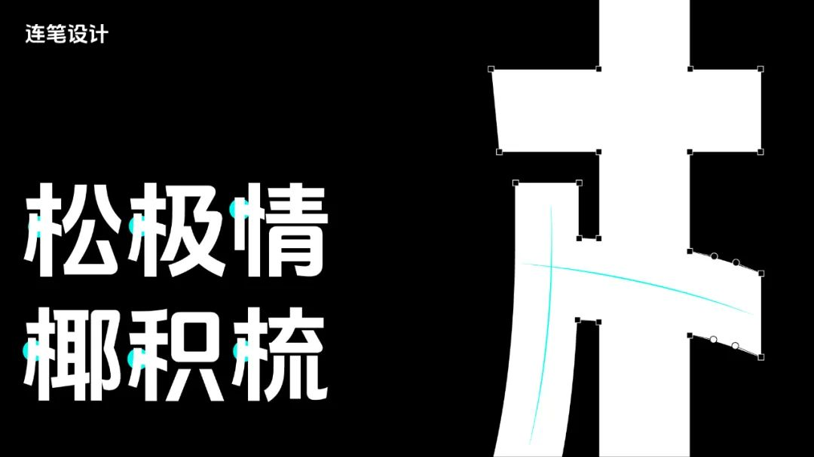 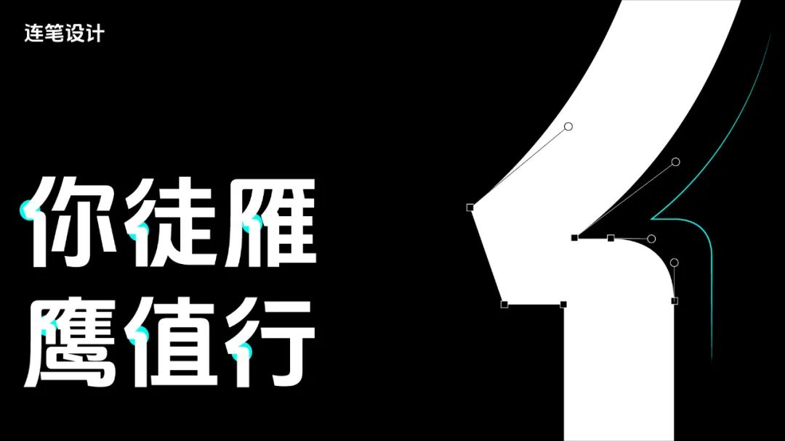

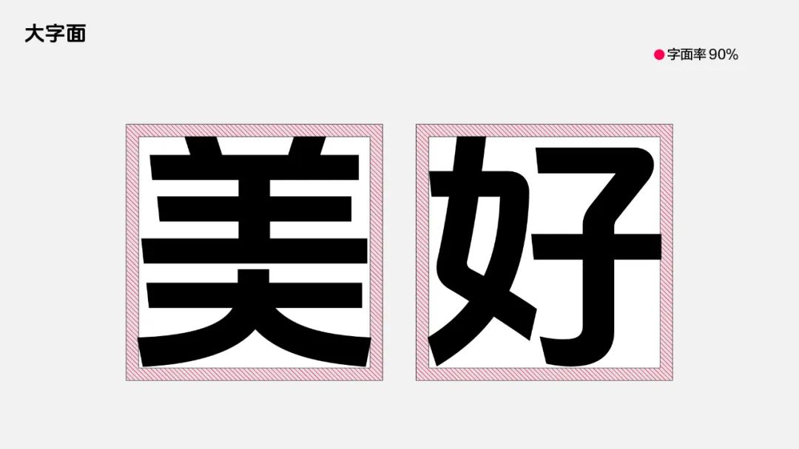 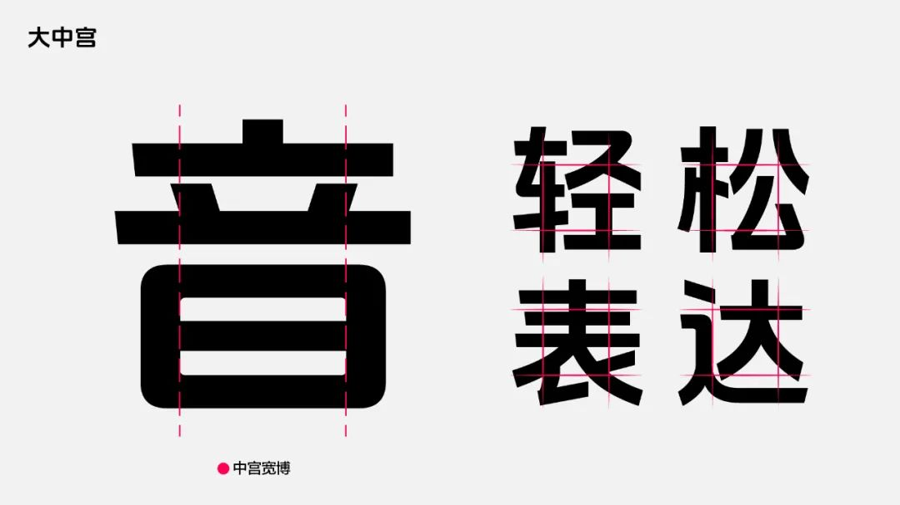 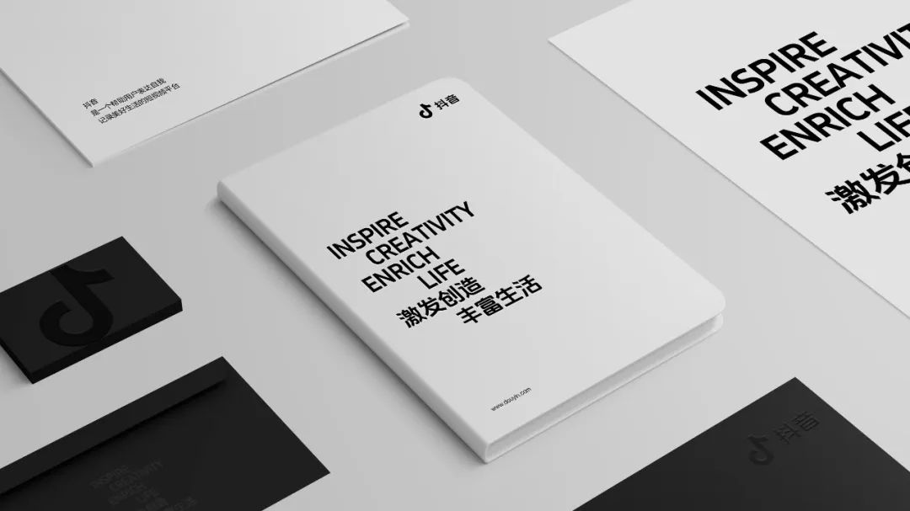

为了更好地以品牌赋能产品与业务，满足抖音端内不同场景的字体应用诉求，抖音体验设计中心团队将西文及数字字符拓展至5种不同粗细、宽窄，提升了字体与产品场景的适配度。除了全量上线抖音端内核心场景以外，抖音美好体已被广泛用于抖音市场传播场景，同时已内嵌于剪映、醒图等产品，抖音美好体将不断地助力业务发展。

