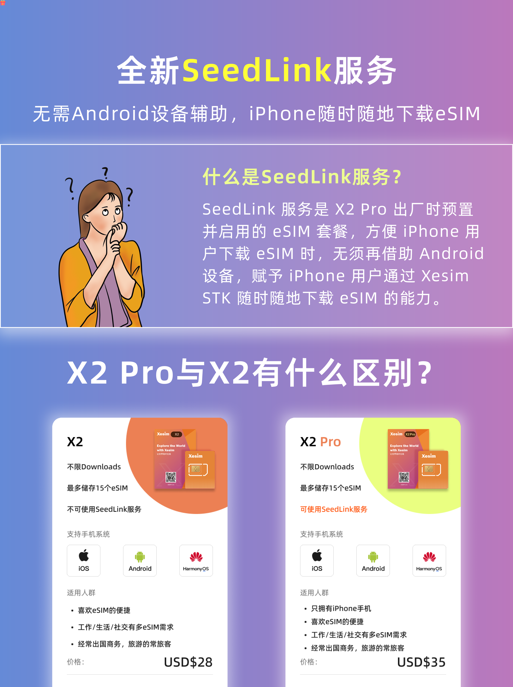

昨天有消息报道，称国内运营商重启已经暂停两年的 eSIM 业务，预计运营商在下半年全面**开放 eSIM**。eSIM 开放之后，国行机用户就会发现特么要换手机才能用上。

今天为大家分享一个可以储存 eSIM 的 SIM 卡，和正常的 SIM 的区别是这张 SIM 卡可以储存最多 15 张 eSIM 配置文件。下面来给大家详细说说，**转发、点赞、评论+喜欢，抽 1 张价值 35 美元的 Xesim 最新推出的 X2pro**。

参与抽奖的朋友，需要将转发截图私信发送给我，**本周日（22号）开奖**。

---

我们接着说这个 X2pro 吧，不知道上次给大家分享过的内容还记得不，全文阅读链接放在文末。

简单回顾一下，Xesim 是出自之前 5Ber 团队之手，iPhone 和华为用户在首次使用时，需要借助其他安卓手机来安装 eSIM 文件。

现在最新的 **X2pro 自带流量**，所以不用借助安卓设备了，**直接在 iPhone 和华为手机上使用 X2pro 自带的流量下载安装你的 eSIM 文件**。可以说 X2pro 就是专门为 iPhone 和华为用户设计的。

> X2pro 自带的流量只能用于下载 eSIM 文件，不支持其它用途。

**在 6 月 25 日之前属于预售阶段，会赠送一个月的流量**，这张卡本身自带流量的有效期是 5 个月，过期后包月是 1 美元。

这部分流量只会在安装 eSIM 时使用——**如果你有安卓手机，可以用安卓手机来安装 eSIM 文件，那么完全不需要这个流量。**

---

## ✅ 不一样的产品，一样的优惠，9 折下单

[立即购买 X2pro →](https://xesim.cc/?DIST=RkJOFQ%3D%3D)  
**优惠码：`zfWBpM`**

---

Xesim 最大的优势就是 **一卡多号**，多个 eSIM 卡都可以安装在这张卡片中，切换手机号，只需要在 Xesim 的 APP 中轻轻点击切换即可。

---

📢 别忘了：

> **转发、点赞、评论+💗，抽 1 张价值 35 美元的 Xesim 最新推出的 X2pro！**  
> 参与抽奖的朋友，需要将转发截图私信发送给我，**本周日（22号）开奖。**
