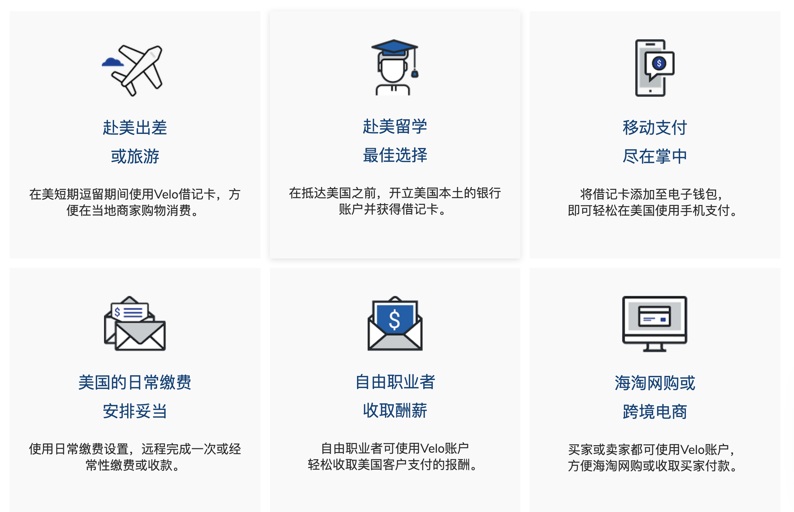
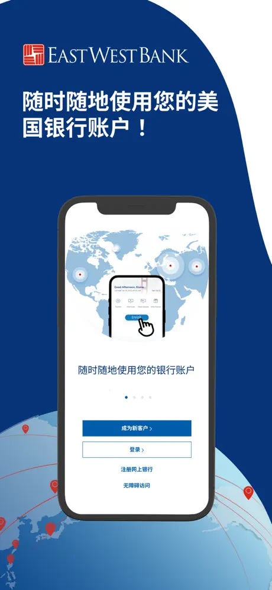
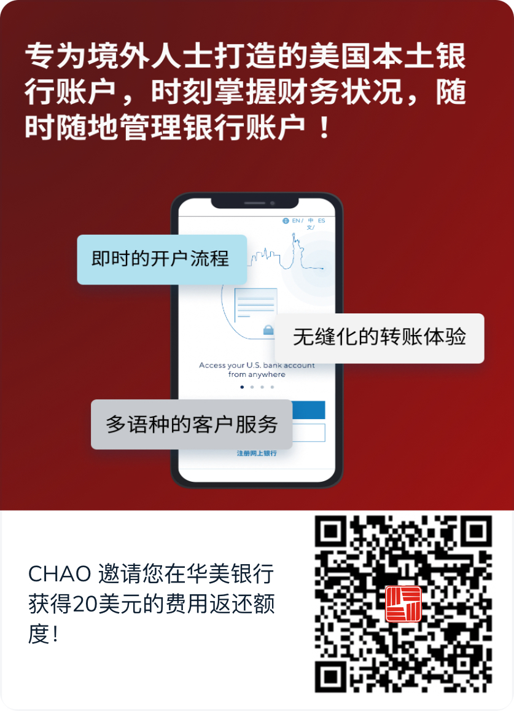
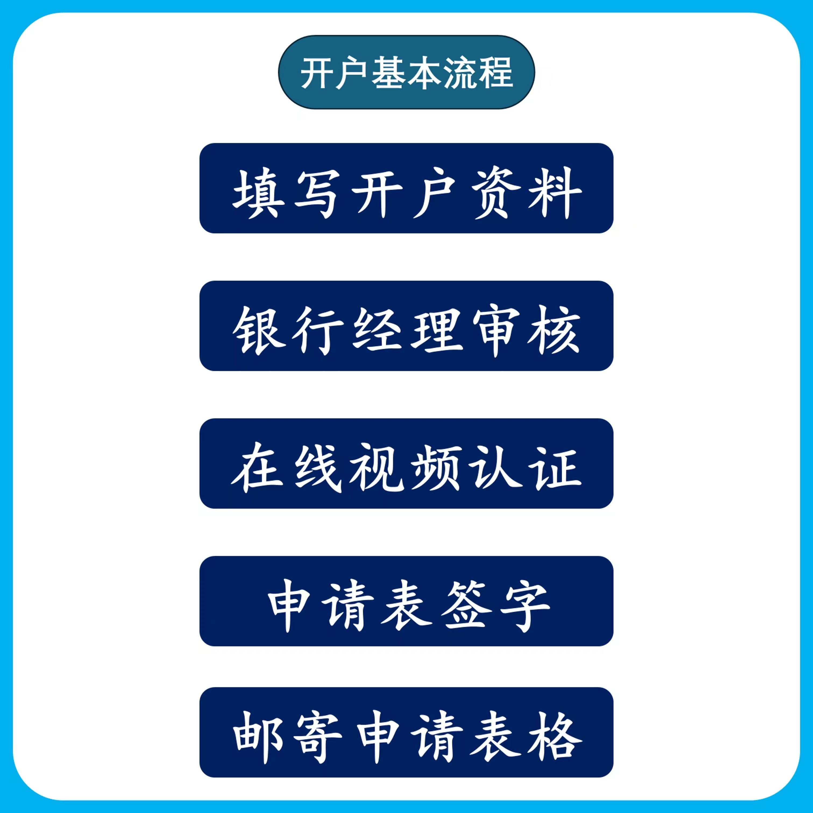

最近，很多人给我发消息说想要开美国账户，我不知道他们干什么用。今天发个美国银行卡的申请攻略，算是统一回复吧。之前，能开的美卡的确还是比较多的，比如券商嘉信、first trade、IBKR等、汇丰US，华美、美国银行（BOA）、富国银行等。现在券商申卡的门槛越来越高了，就连华美开户门槛也提高到$2.5W USD。但是，好在华美银行这个在美国为华人服务的银行还能支持咱们中国地区的用户，用中国护照、身份证、手机号、中国地址申请，算是比较庆幸了，你要知道其他银行起码都需要提供ITIN或SSN、美国手机号、美国地址证明。仅ITIN、美国手机号、和美国地址这三样成本就已经超过2000大洋了。所以，从门槛和成本上华美就已经低不少了。前阵子，网上有很多人吐槽华美被关户，这里也稍微公正的说几句。其一被关户的大部分都是华美旗下的数字银行Velo账户，其二，账户余额没有达到账户激活资金门槛，第三，涉及到不干净的资金来源，币圈是重灾区。有做外贸的朋友在一直在用，除了手续费贵点，其他没毛病。因此啊，咱们自己账户出问题，还是先反省自己。开户的时候当舔狗，开完户装完逼被关户，就开始黑，这不和渣男一样嘛。

# 华美银行&Velo

 华美银行（East West Bank）成立于1973年，总部位于南加州，当时的使命很简单“满足主流银行经常忽视的人们的金融需求”，**主要服务美籍华裔和亚裔人群**。现在已经是美国前30大上市银行，以及美国排名第三的独立商业银行。华美银行还为基汇资本提供贷款，协助他们如愿完成翻新好莱坞罗斯福酒店的梦想。说几个大家听过的电影《影》《道士下山》《绝地逃亡》等华美银行也参与投资其中。

用今天的话说**Velo**是华美银行旗下的一个数字银行，而华美银行主要是做传统银行的业务。Velo的目标用户群体是不在美国境内生活的人，通过Velo手机APP就能申请到一个美国账户，无论是去美国出差、留学还是收取美国客户的资金，有一个美国账户将会非常方便。

# 账户类型

## 普通全球支票账户：

- 激活门槛：$2.5W，开户后60天内必须存入最低为25,000美元（满足这个余额要求可以免管理费），不然可能会被退回你的资金，并且关户。
- **账户开立费：**300美元。
- **月度账户管理费：**25美元（不足2.5w美元时收取），如账户内的最低平均余额未达到最低余额要求，则按每月结单周期收取。

## 全球支票账户（Velo **Gold**）：

- 综合月均余额达到100,000美元，开户12个月内满足这个余额要求，可以退还300元的的开户费。
- 有专门客户经理。
- 借记卡免费邮寄。

# 华美银行的优势

- 不用出国，开户资料简单，无需ITIN、SSN，美国手机号，都不需要。
- 可申请Visa 借记卡，担保信用卡、协助您轻松建立信用记录，（有了信用就能申请其他高端卡）。
- Zelle转账免手续费。
- 可以绑定各大电商平台、入账美国各大券商、验证美区PayPal账户。
- 从法域上来看，非 CRS 成员国，对于高净值的客户来说，应该是利好，因为你们的信息不会自动分享给其他 CRS 成员国。
- FDIC 成员，享受**250,000 美金的存款保险保障。**

# 开户资料

- 身份证、护照（必须属于中国内地、香港和台湾地区）
- 国内手机号
- 邮箱

# 申请方式

## 1、自己申请

下载华美银行App自行提交申请，账户类型只能选全球支票账户。开户费用300美金，从激活资金当中扣除。
> 使用我的邀请码 ** CHAO102818C01 **，注册开户可获得20美金开户奖励。

## 2、代理申请

我来帮你对接华美银行的客户经理申请开户，这个只要求账户有2500美金的余额就能免管理费。可以加我微信，备注华美银行。

## 申请Visa借记卡

Velo账户持有人可根据需求申请签发Visa借记卡，用于全球消费和取现。如果邮寄地址为中国大陆，您将在申请后的3-4周内收到Velo华美银行的Visa借记卡。

在Velo手机应用App中，您可以通过【菜单】栏找到【Velo借记卡】选项，点击后将看到【立即申请】按钮，点击此按钮即可提交借记卡申请。整个过程简单快捷，用户无需前往银行即可完成。

## 担保信用卡（ Secured Card）

华美银行的担保信用卡必须要申请，原因很简单，这张卡可以帮助我们在美国建立宝贵的信用记录，而在美国，信用记录是个人经济生活的核心之一。拥有良好的信用记录后，我便有机会申请到一些高福利的高端信用卡，比如Capital-One、Discover Bank、Citi、GO2Bank、Bank-of-Hawaii 等。

如果你没有护照，一个月就几千块零花钱，就省省吧。（退堂鼓）

