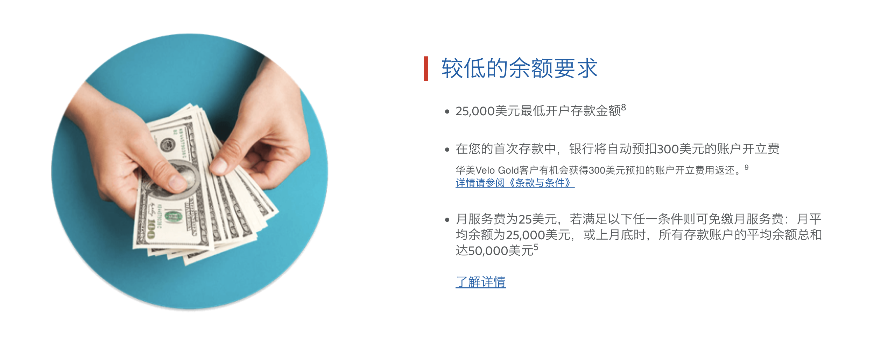
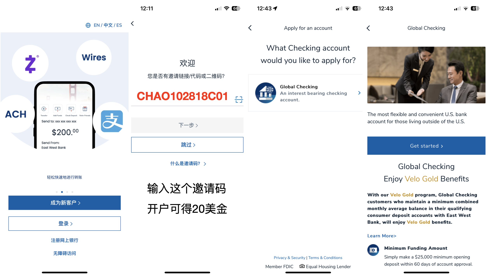
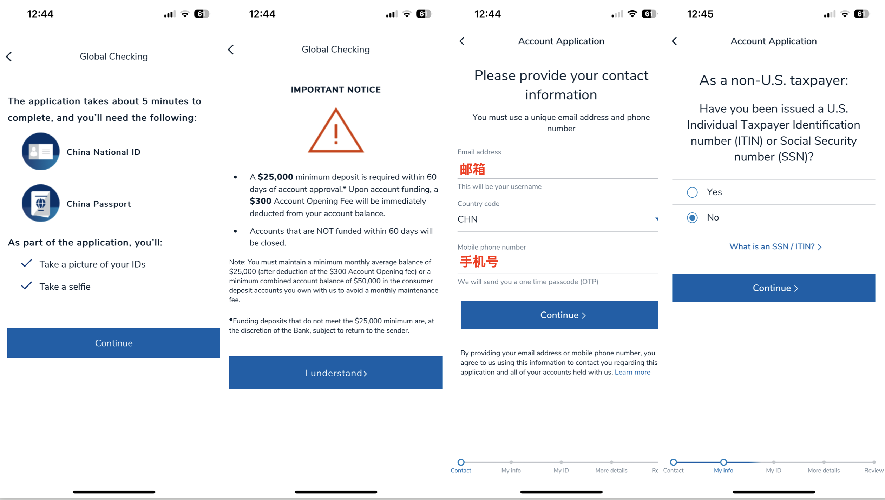
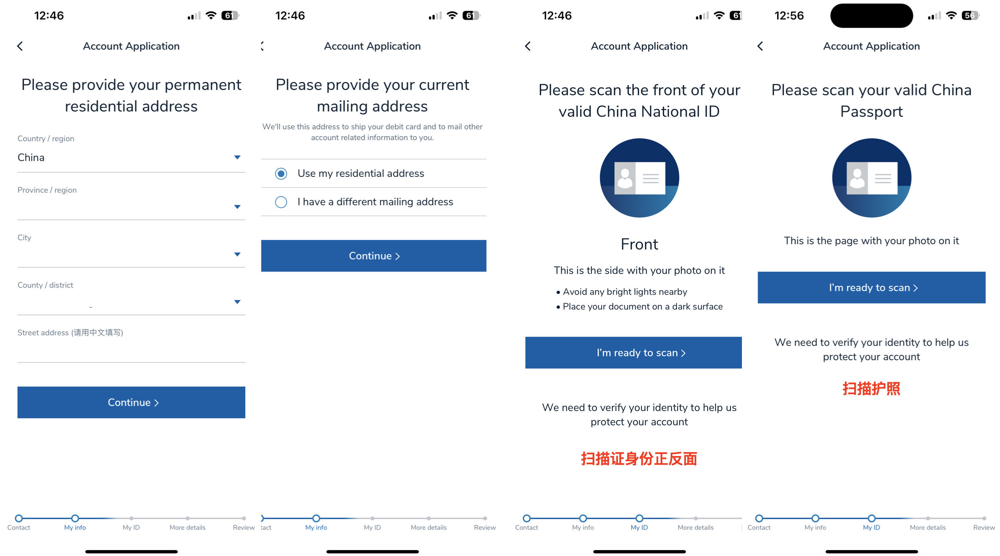
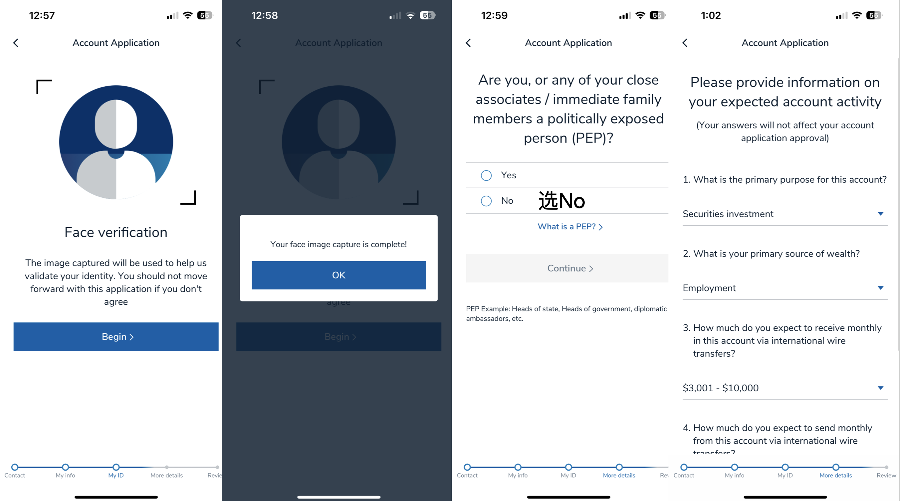
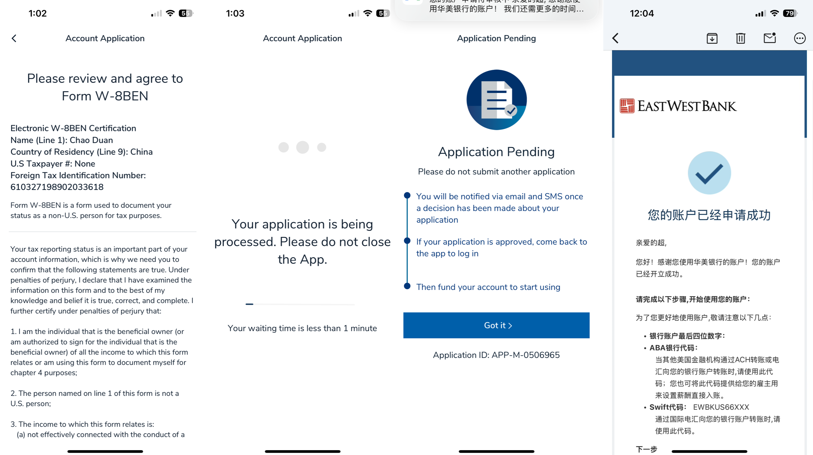
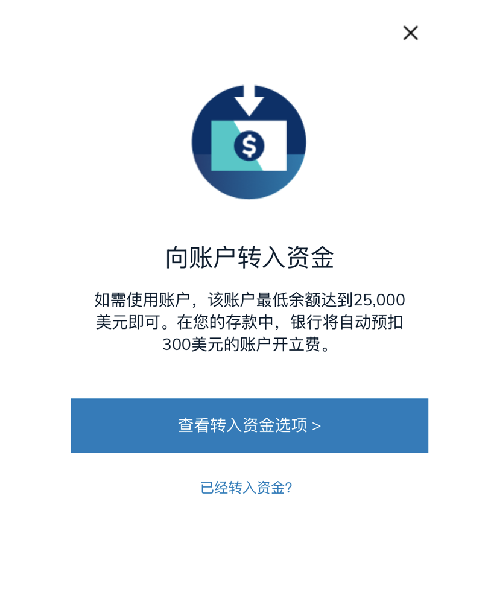

时间太快了，又到周五了。大家有没有领到WeLab的奖励呢？还没有领的记住我们的暗号，推荐码“LAOSJI”。另外，ifast的合作也在推进了，大家一定要关注每天的分享，除了福利，说不定哪天真的能给你提供实实在在的帮助。
还有就是前天分享了关于美国华美银行的开户方式，当天也已经顺利帮几位朋友对接了开户，当然了这个服务是收费的，不然我也是吃太吃饱了撑的，所以想白嫖的朋友可以自己去官网看看。我发现有一些朋友还没搞清楚华美银行的开户政策，自己根本就没更新自己的信息，跑来张嘴就跑火车，大家的时间都很宝贵哈，今天统一回复一下华美银行的开户方法，在华美银行官网的信息大都是公开透明的，大家自己可以查。

我们的开户是直接对接美国的客户经理，等于是线下递交资料开户的，所以和在线申请账户的政策是不一样的。
这是华美银行在线申请官网，或者大家自己下载App也可以看到。
https://www.eastwestbank.com/zh/personal-banking/global-checking
有个客户在填我发给他的开户申请表时，问了我一句：“不是华美银行吗？这怎么是eastwest bank？”这个问题很好，自己查一下华美银行英文名字就知道了（下次不要再这样问了），不过也是很感谢这位朋友对我的信任，还没搞清楚这个银行名字就转账给我了，现在正在走开户流程，预计1个月左右可以拿到卡。今天主要来分享一下华美银行怎么自己在线申请开户，我把注册流程截图下来，给需要的人做参考吧。

开户之后你会有一个ABA代码也就是我们之前说的Routing number，以及账户号码，有了这2个就可以转账了。

# 华美银行在线开户准备资料
- 手机号
- 邮箱
- 身份证
- 护照
没错，准备好这四个就够了，提交的时候要做人脸认证，所以在线开户必须是本人才能申请。

# 开户门槛
自己申请在线开户的话，需要在开户后60天内存入2.5w美金，不然会被关户，还有就是开户后会被扣300美金开户费，开户一年内账户余额大于10万美金开户费会返回给你。还有非常重要的一件事，就是账户管理费25美金/月，你第一次转账的时候记得最少存2.8完美金进去，否则，被扣开户费之后，不足2.5万，会被收管理费，这个管理费蛮高的，所以不建议大家盲目自己申请。我这边帮大家对接华美银行客户经理的话，申请账户是不扣开户费的，而且存款门槛是2500美金就账户免管理费，比在线申请低10倍，相对来说很多人还是可以接受的。

# 注册流程
首先我们要做的是去下载华美银行的APP，在App store或google play搜一下华美银行，下载量还是挺多的。

# 注册账户
打开APP后选择成为新客户，然后输入邀请码“CHAO102818C01”或者直接扫码也可以，用这个邀请码开户后可获得20美元的奖励。
账户类型智能选择全球支票账户，功能都齐全的哈（支持ACH、WIRE、ZELLE转账放心），美国境外人士只能开这个账户。

## 第二步、填写开户资料
会提醒你前面说的开户门槛，知晓这些之后就可以输入邮箱和手机号，然后在美国纳税人选项这里选“NO”。

## 第三步填写住址扫描证件
注意要填拼音，证件扫描我感觉非常丝滑，如果你申请可以体验一下。

## 第四步人脸识别
提交证件后，需要进行人脸识别核验身份是否本人，然后再填一个表格，就大功告成了。

## 第五步提交开户申请
接下来会有一个W-8BEN表格（证明你是非美国税务居民），填一下就可以提交开户申请了。

提交后一般当天就会通过，因为美国和我们有时差的关系，第二天就能收到审核结果通知了。审核通过成功之后，就可以去注册网银了，然后登陆了。

登录成功会提醒你转入资金，到这里就已经完成开户了，转入资金就好了，否则60天之后就会被关户。

