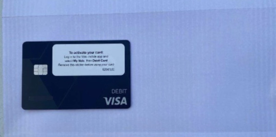
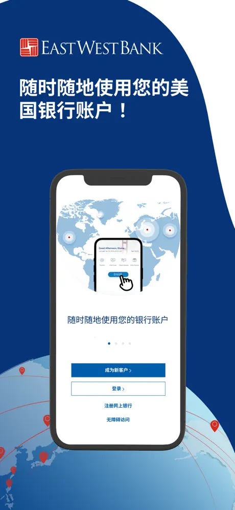
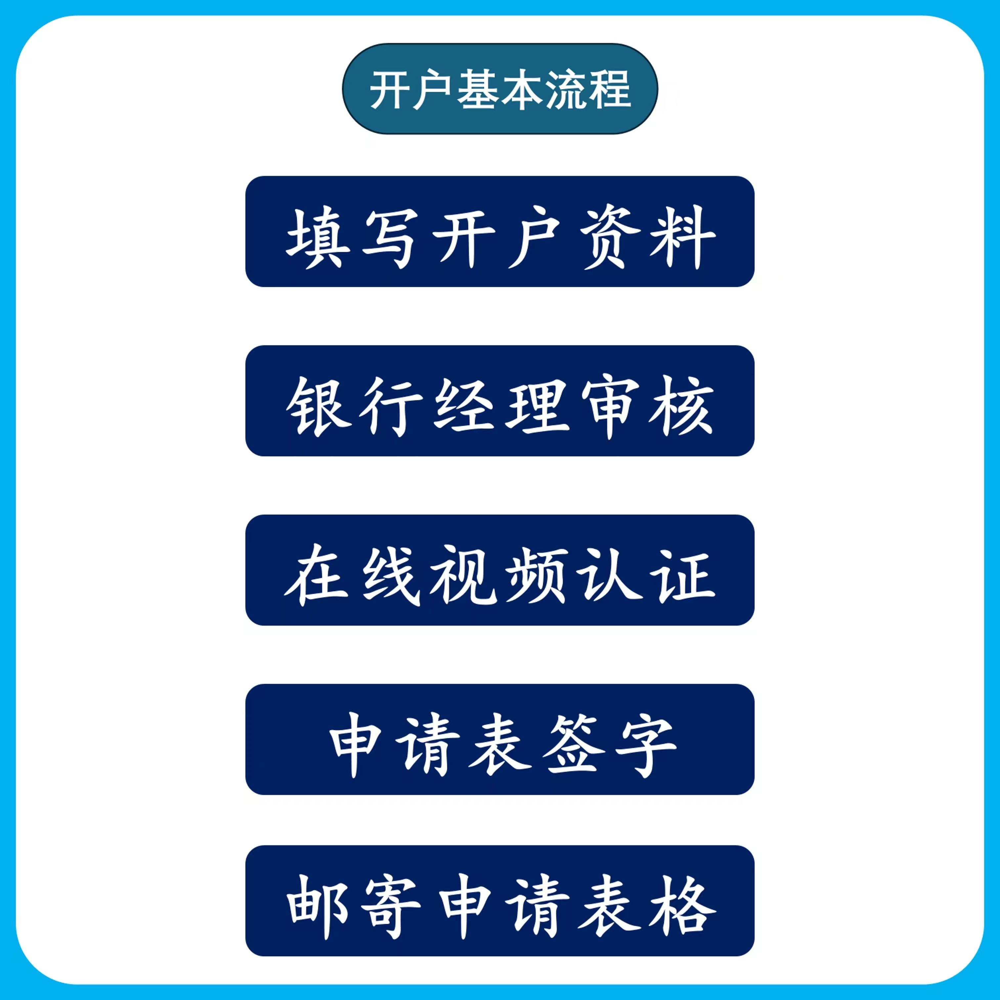

最近，很多人给我发消息说想要开美国账户，我不知道他们干什么用。今天发个美国银行卡的申请攻略，算是统一回复吧。之前，能开的美卡的确还是比较多的，比如券商嘉信、First Trade、IBKR、汇丰US、华美、美国银行（BOA）、富国银行等。现在券商申卡的门槛越来越高，就连华美开户门槛也提高到 $2.5 万美元。

但好在华美银行这个为华人服务的美国银行，**还能支持中国地区用户申请**，用中国护照、身份证、手机号、中国地址就能搞定。你要知道，其他银行起码都需要 ITIN 或 SSN、美国手机号、美国地址证明，这三样加起来成本就超过 2000 元。

---

## 华美银行 & Velo

华美银行（East West Bank）成立于 1973 年，总部位于南加州，最初的使命就是**满足主流银行经常忽视的华裔群体的金融需求**。现在，它已是美国前 30 大上市银行，以及美国第三大独立商业银行。

华美银行旗下的 Velo 是一款数字银行服务，目标用户为**不在美国境内生活的华人用户**。通过 Velo 手机 App 就可以远程申请一个美国账户，方便出差、留学或收款使用。

---

## 账户类型

### 1. 普通全球支票账户

- **激活门槛：** 开户后 60 天内需存入至少 $25,000 美元。
- **开户费用：** $300（从激活资金中扣除）。
- **月度账户管理费：** $25（如未达最低余额则收取）。

### 2. 全球支票账户（Velo Gold）

- **月均余额要求：** $100,000 美元，12 个月内达标可退回 $300 开户费。
- **专属客户经理**
- **免费寄送借记卡**

---

## 华美银行的优势

- 无需 ITIN、SSN、美国手机号、美国地址
- 支持 Visa 借记卡申请、担保信用卡建立信用记录
- 支持 Zelle 转账
- 可绑定电商平台/美区 PayPal/美股券商收款
- 非 CRS 成员国，信息不会自动交换
- FDIC 成员，享有 $250,000 美金存款保障

---

## 开户所需资料

- 中国大陆、香港或台湾的身份证、护照
- 国内手机号
- 邮箱地址

---

## 申请方式

### ✅ 1. 自助申请

下载「华美银行」或「Velo」App，自行提交资料申请，仅支持普通全球支票账户。

> 使用邀请码 **CHAO102818C01** 注册开户，可获得 $20 美金奖励！

  

---

### 🤝 2. 代理协助申请

我可以协助你对接华美银行客户经理开户，仅需账户余额达到 $2,500 即可免除管理费。

加我微信（备注：华美银行），我来帮你对接 ↓  

---

## Visa 借记卡申请方式

在 Velo App 中通过「菜单 > Velo 借记卡 > 立即申请」按钮即可提交申请，卡片将在 3-4 周内寄达中国大陆地址。

---

## 担保信用卡（Secured Card）

强烈建议申请华美担保信用卡，它能帮助你在美国建立信用记录，从而申请更高端信用卡如 Capital One、Discover、Citi 等。

> 没有护照、资金有限的朋友慎重考虑开户。

---
