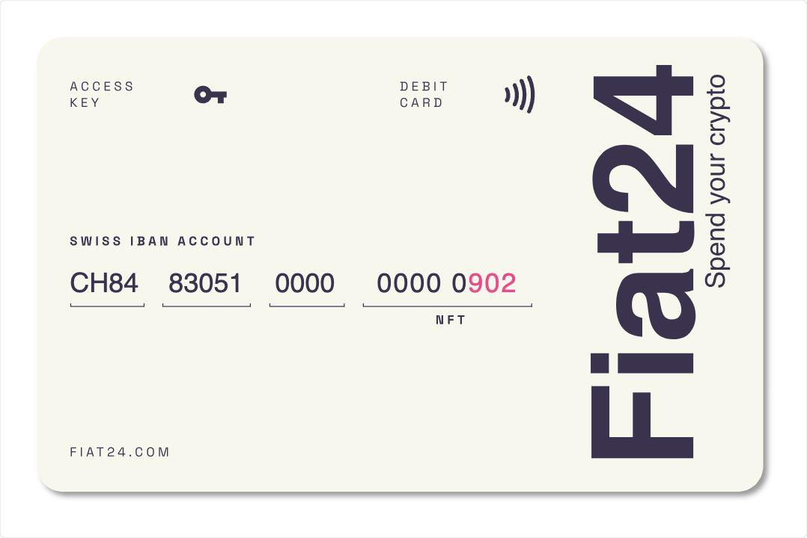
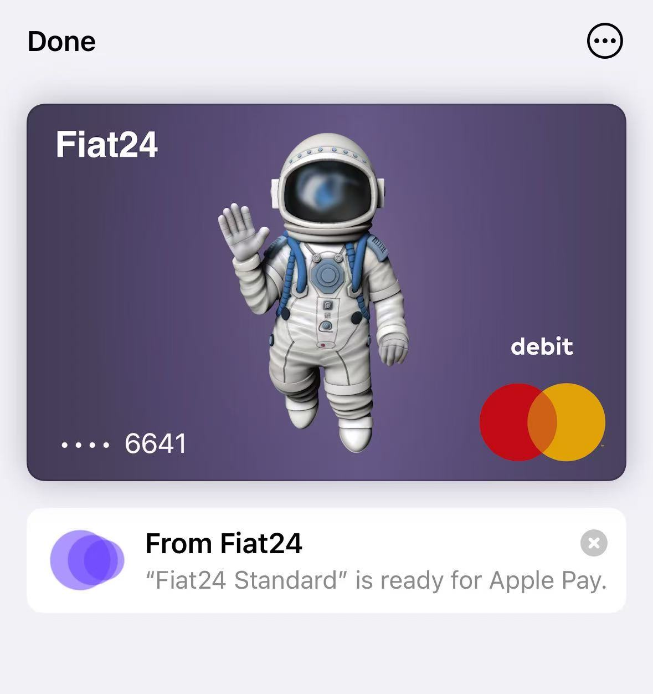
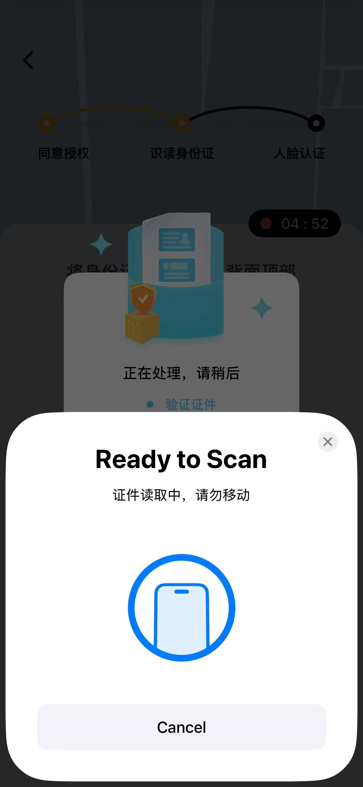

## Fiat24 注册 & 使用教程

不记得是什么时候，有用户让我写关于Fiat24的教程，今天来向这位用户来交作业了。

Fiat24是瑞士一家金融科技公司，并受瑞士金融市场监管局 FINMA 监管。这家公司名字叫SR Saphirstein Limited，总部位于瑞士苏黎世。Fiat24的目标是成为全球首个在以太坊上运行的“虚拟银行” ，凭借其标志性的银行 DApp，提供基于 Web3 技术的瑞士金融服务。作为一款在瑞士全面受监管的 Web3 应用，获得了2022年Accenture最佳银行奖等。

Fiat24特点数字货币友好，支持法币与crypto自由兑换，可直接关联数字钱包。支持盈透证券、嘉信理财、老虎证券、Trading 212等交易所出金。支持大陆手机号、身份证在线注册。提供瑞士个人iban。有万事达虚拟借记卡，支持 Apple Pay、Google Pay、Samsung Pay。去中心化网页应用，运行在以太坊上的银行，账户无传统的密码设计。卡面个人认为很漂亮。

## 注册方式

如果你有Metamask、Safepal等数字钱包的话，可以直接关联注册。使用gmail注册/登录。（我认为大部分人都没有数字钱包，所以用gmail做个教程）

准备资料支持国内手机号注册，GV号码试了一下不行；大陆身份证有这两个就够了，也不要求提供地址证明。不过，不好的一点是没有APP，需要在去中心化网页应用登录或注册。

## 万事达借记卡申请条件

大陆身份注册账户成功之后，会提供一个瑞士的个人Iban。支持四种货币：人民币、美金、欧元及瑞士法郎。申请虚拟万事达借记卡，需要满足美金账户余额大于10，我特意试了一下从wise转了10欧元过来，这时候是不能申请借记卡的。然后，我把欧元兑换成美金，只要美金余额大于10，就可以申请借记卡了。后来看了一下要求，激活账户最新余额：

- 欧元区国家：10欧元  
- 瑞士：10瑞士法郎  
- 世界其他地区：10 美元  

这是我的卡，绑定了Apple pay。

Fiat24的卡分为三个等级：标准卡、高级卡和终极卡，对应的是Fiat24账户等级，等级越高，账户号码越短，最高级的账户只有一位数字的号码。当然这个是付费服务，普通账户也可以满足大部分人的使用场景了。

## 注意事项

iPhone用户申请的时候可以用NFC识别身份证，这个很先进，不需要上传证件照片，只要把身份证国徽面贴近手机背部上方位置，就能读取你的二代身份证信息。（香港的银行真的应该学习一下这个技术）

注册过程非常丝滑，虽然是个网页，但是如果你中途关闭网页，或者退出的话，再回去登录，你的历史数据并不会丢，可以继续注册。

另外，Fiat24还可以直接给neverless入金，neverless我下次给大家分享，感兴趣的可以通过我的邀请注册。

今天的分享，把关键点都和大家说了，详细步骤我知道放图片上去也没有人看，即使看了也会来问我，所以干脆就写简单点，视频我会在明天发到油管上去，大家感兴趣的可以来油管看。

需要一对一咨询的话，也可以加我。
