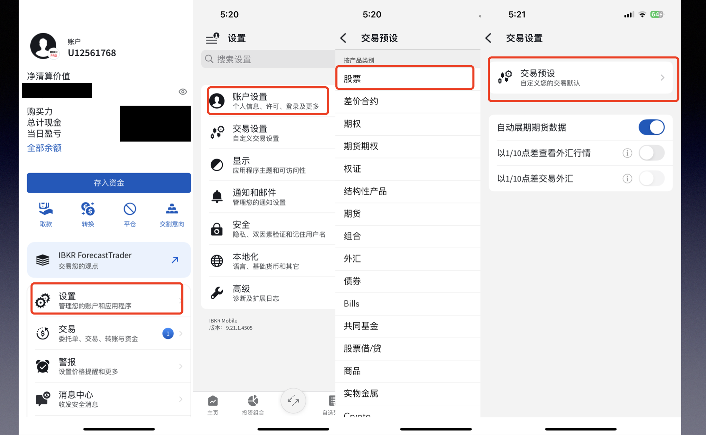
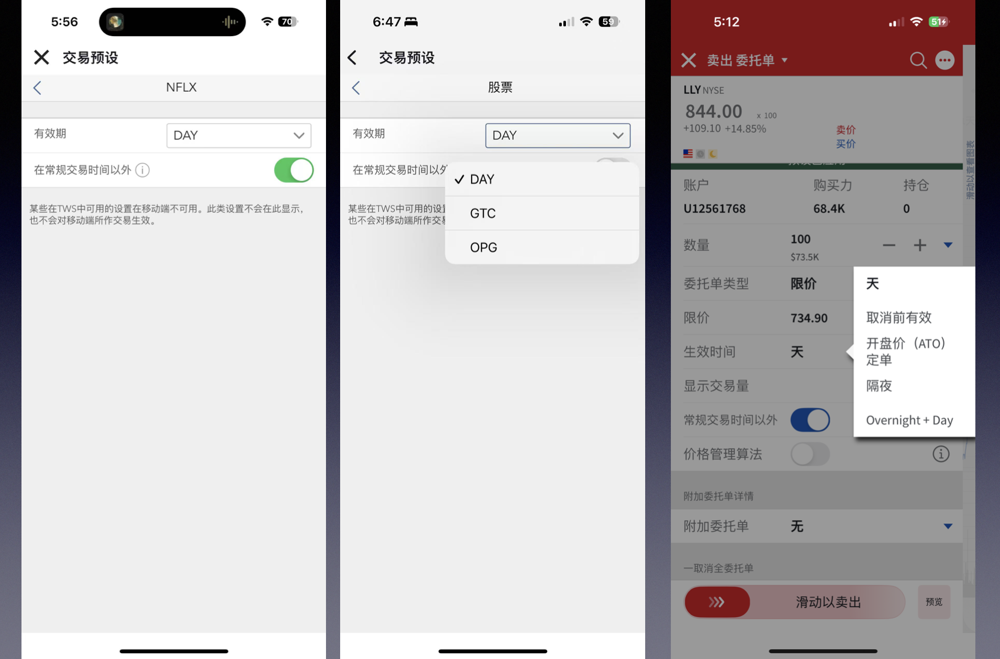

今天是 **Good Friday（耶稣受难日）**，港美股都休市啦👇。按照《圣经·马太福音》和《圣经·马可福音》的记载：耶稣于复活节前的星期五被钉在十字架上受难，并因此死亡，而复活节是庆祝耶稣复活的节日。因此，Good Friday这一天，西方很多国家的教堂都要举行礼拜仪式，以纪念耶稣受难。这个日子太巧了，也不能说是巧合，因为在每个节日都可能会有公司发布财报。昨天，奈飞在盘后发布了2025财年Q1财报，很多交易者都在虎视眈眈，盯着财报数据决定要不要买入。就有人问了，为什么我用盈透不能下单？今天就来分享一下，如何在盈透设置在非常规时段交易。
首先，我们先记住美股的交易时间，现在是夏令时

---

### 📌 今天休市的市场

- 香港交易所（HKEX）  
- 纽交所（NYSE）  
- 纳斯达克（NASDAQ）

---

## 💼 盈透证券无法交易？你可能还没开启「盘前盘后交易」

昨晚，Netflix 发布了 2025 财年 Q1 财报，引发投资者高度关注。

但也有用户困惑：

> 为什么财报发布后我却无法第一时间买入或卖出？

这是因为你可能还没开启盘前盘后交易功能。下面教你怎么设置 👇

---

## ⚙️ 盈透证券开启盘前盘后交易指南

### ✅ 美股交易时间（夏令时）

| 类型       | 时间（ET）      |
|------------|-----------------|
| 盘前交易   | 04:00 – 09:30   |
| 常规交易   | 09:30 – 16:00   |
| 盘后交易   | 16:00 – 20:00   |

### ✅ 设置步骤如下

1. 打开盈透证券客户端  
2. 前往 **设置 > 交易设置 > 股票 > 交易预设**  
3. 打开「**允许在常规交易时间以外提交订单**」选项
然后，打开这个“在常规交易时间以外”的选项。这时候需要点页面左上角第二个返回按钮才能保存，这个页面没有设置保存按钮，体验确实不够好。第一次设置完，很多人就直接点上面的返回了，发现在交易的时候不能操作“在常规交易时间以外”这个选项，原因就在这里。

📌 注意：设置后需点击左上角**返回按钮两次**，系统才会保存！

---

## ⏰ 有效期设置建议

- `DAY`：当日有效，未成交自动取消  
- `GTC`（Good Till Canceled）：一直有效直到成交或手动取消  
- `OPG`（On Opening）：开盘即执行

开启盘前盘后交易后，你的订单可在更多时间段内挂单、成交，非常适合应对突发财报或国际新闻等情况。

---

## 🌍 国际新闻速递：乌美矿产协议达成

> **乌克兰与美国初步达成矿产供应协议**。

此举被外媒解读为稳定地缘局势的重要信号，未来可能影响全球能源、金属及军工板块走势，值得投资者重点关注。

---
