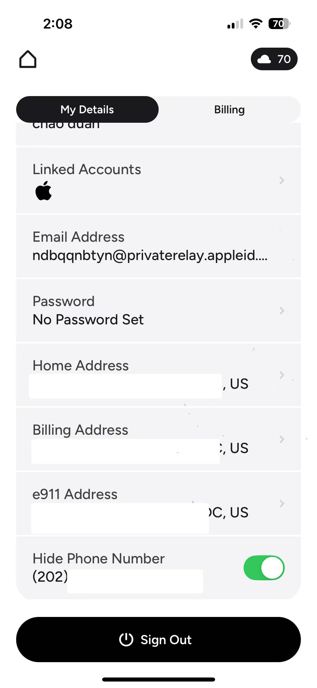
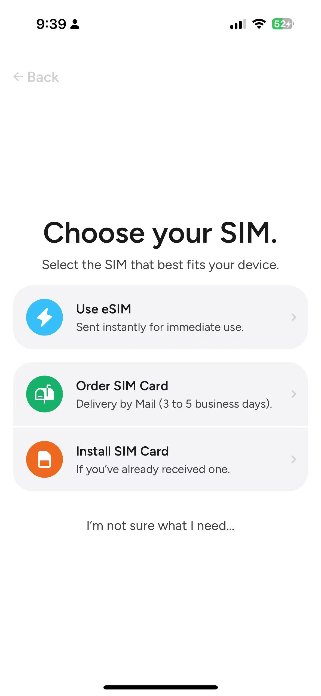
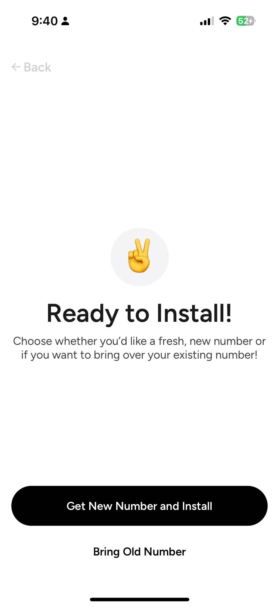
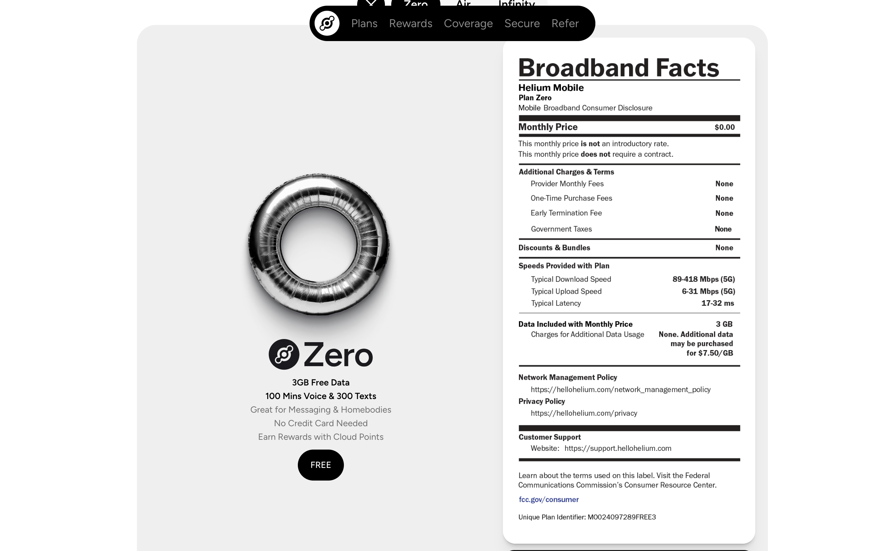
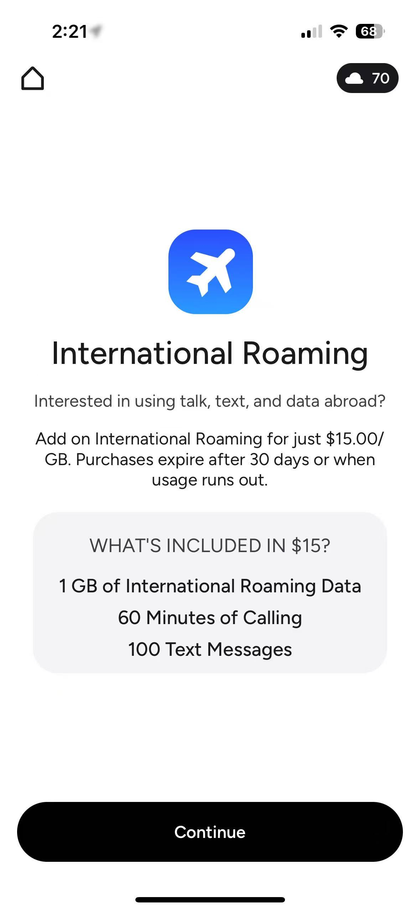
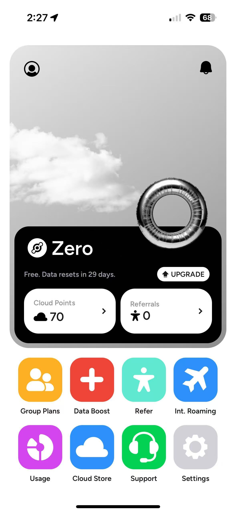
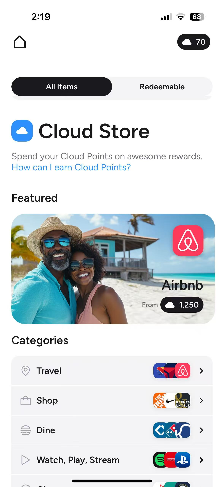

今天是清明节最后一天假期了，很显然我假期还在工作，和大家错峰休假。本来计划今年要跟大家分享很多关于美国的攻略，各种原因导致现在分享的还不够，所以只能假期加更了。回顾一下我们之前分享过华美、ITIN、美国地址注册及认证还有美国的券商，今天来分享一个可以0成本拿到的美国手机号Helium Mobile，但是你的手机必须要支持eSIM，虽然选择物理卡片也可以，但是邮寄物理卡片只能寄到美国。给大家看一下我的号码：

我了解了一下Helium这个公司，成立于 2013年，结合区块链技术和无线网络，创建了Helium Network，非常有趣。Helium Network核心理念是通过社区成员部署小型直放站（Hotspots）来为公众提供网络覆盖。类似于家庭蜂窝网设备，这个设备要接入ISP，也就是自己的comcast，然后Helium给你点分成，类似虚拟币token，这样附近用户靠近就能联网你家的蜂窝网络。如果附近没有Helium的信号站，那么走T-mobile的网络。就这样的一家公司，他们想要做去中心化的无线网络。其实早在2022年就已经正式推出了移动通信服务，不过那时候最低的套餐是5美元。现在有了Zero Plan，完全Free了。我就去注册了，反正不用担心养号的问题。

## Helium Mobile 优势

一直以来美国的手机号因其保号成本比较高，所以大家都不会长期使用，除了有需要做跨境和申请美国银行卡和信用卡的朋友。

- Helium Mobile美国手机卡非常适合长期保号，因为0月租啊，不花钱还不用嘛。
- 可选eSIM或pSIM
- 支持WiFi calling，Wi-Fi环境下免费收发短信、接打电话。
- 可以注册GV、cluade等。
- 新用户可获得1,250 Cloud Points ($25).用来兑换云储存之类的平台服务。

我发现大家对手机号的需求还是非常大的，上次到英国giffgaff已经没货了。关于经常有人问我关于那个手机卡最好的问题，我想说每个人对好的定义是不一样的，所以很难回答什么是好的，就选择符合自己需求的就是最好的。

我直接就去下载了Helium Mobile的手机App，打开就开干，直接使用Apple account登录，然后提示我填一个地址，我就填了我的travellingmailbox租来的美国地址，接着让我选择证件进行身份认证，我选了护照，也可以用身份证。不过需要在输入地址的位置返回重新选择国家为中国，后面就能上传身份证。上传完了护照照片，还需要拍照片做人脸对比验证，我非常顺利秒通过了，今天在写攻略的时候发现很多朋友遇到邮件认证不通过和人脸认证不通过的情况，当然我是没有遇到。
接下来，它需要让我手授权开启手机定位，而且需要始终允许才能进入下一步。我试了允许一次和在APP运行时允许都不行，最后只能始终允许，然后就让我选择eSIM还是order SIM card（只能送美国境内），我选择了eSIM。接下来就是安装eSIM了，安装完成就能使用啦。

## Zero plan

## 套餐包括以下内容

- 3G流量
- 100分钟通话
- 300条短信
不过以上套餐是在美国境内能享受到的，在中国境内的话需要漫游，添加国际漫游服务费用是$15.00，包含1GB国际流量，60分钟通话时间和100条短信，但是没必要，用Wi-Fi calling接短信，接打电话就够了。

这个APP打开之后有点像是云桌面，有群组功能类似于家庭计划，云商店，可以用积分兑换各种优惠券等。还有就是邀请朋友一起加入，邀请名额有限，需要的给我留言。

