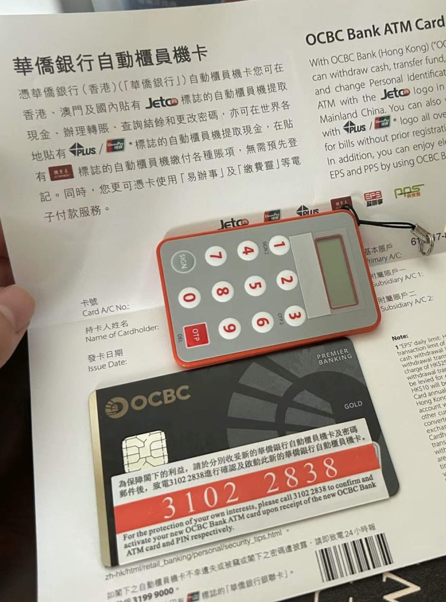

今年5月份香港华侨银行暂停对内地的远程开户，8月份实行新政策，远程开户需要提供内地100W的资产证明，11月份新加坡OCBC也暂停了外籍人士的远程在线开户。现在香港华侨银行在内地远程视频见证开户，需要在开户后用同名账户汇款1w以上激活账户，从提交资料到拿到卡整个过程需要4-6周。那新加坡OCBC也是可以开，只要提供银行要求的文件就可以。今天来跟大家分享一下不出境，OCBC远程开户的方法。

曾经有一个最简单易得的海外银行账户摆在你面前，你没有珍惜，等到失去的时候才追悔莫及。尘世间最痛苦的事莫过于此。如果上天给你一个再来一次的机会，请提供提地址证明。香港和新加坡华侨银行虽然说都可以远程开户，但是新加坡OCBC顺利的话可以在短短10分钟内就拿到账户，但是香港远程开户需要4-6周，而且香港华侨银行远程见证开户是需要去律所，付律师费的。成本相对就高了，但是如果你暂时不能抽时间去香港的话，也唯有此选择成本比较低了。有些人看了之后，说那我还不如去香港呢。除了去香港比较方便的城市之外，去趟香港就算你只住一晚上，机票加酒店加市内交通和吃饭也怎么着也要2000以上了，我也遇到过坐飞机凌晨到天亮就去市区办完卡就走的，这也太累了，既然都去了，不玩个几天就为了开个银行账户，多累呀，没必要，实在没必要。还不如安心的呆在内地，找个离自己近的律所做个远程见证开户。有的朋友说我自己不怎用，偶尔用来炒股入金，这种情况其实开个新加坡的OCBC也够用，不过现在自己做的地址证明提交开户，用着不是很放心，万一哪天要查起来，让你在提供签证什么的，就更麻烦了。不过，有了OCBC就可以用来激活wise、ifast等账户。

# 香港华侨银行【内地律师见证开户流程】 

1、客户先提交料至银行审核（通过客户经理提交资料，审核通过后进行下一步）；

2、客户签署Reverse Solicitation Form，请拍照提供给我们； 

3、审核通过银行寄出开户文件； 

4、客户收到文件后联系内地律师楼见证； 

5、见证后，由客户将所有的见证资料及早前签名的Reverse Solicitation Form一拼寄回来香港（寄到香港3-5天）； 

6、客户经理联系客户做视频确认；

7、等待香港华侨银行下发账户（视频结束后2周）； 

8、下户后同名账户首笔入金激活（激活款需1万港币或人民币以上）

9、收到密码函、编码器、实体卡等文件（快递寄出）； 全程大概4-6周，拿到账户后需要进行同名汇款（1万以上）激活账户。

香港的银行远程见证开户一般都需要律师在场见证，但是新加坡的不要求是律师。美国华美银行的视频面签也是由多位银行人员来完成的。


