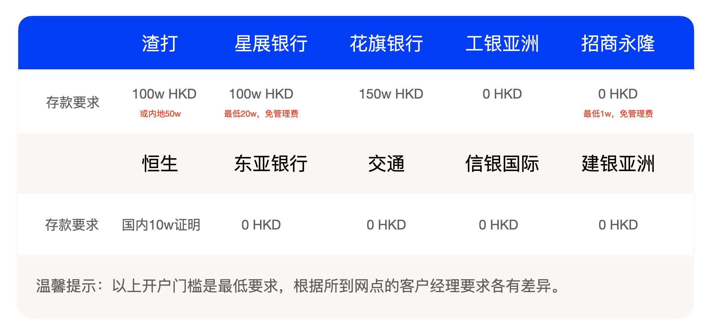

最近去香港开户的朋友又多了起来，我真的来不及一一回复大家，今天做个最新版能免费开户的汇总，不过为了让大家能认真的去看，我会把这篇文章设置成付费，给真正有需要的朋友。当然了，也是为了给洗稿的人制造一些门槛，网上免费的内容很多，你根本就不知道分享者内容的真伪。有个大哥在我群里整天问我开户攻略，结果是个写公众号的，把他收集到的信息，整理了一篇文章发在我的群里，这真的太搞笑了，这种行为不仅low，而且自己根本就不知道信息真假还发出来，真是误人子弟。还有人在群里说港版云闪付必须要香港手机号才能注册，明摆的扯淡，最后看了一下是个卖香港手机卡的。不是王婆卖瓜，我真的算是太良心了，我知道很多人不喜欢看文字，每天都有很多信息问我各种各样的问题，其实都在公众号看一下就清楚了。看来大家都比较懒惰多，那我就只能做付费内容，因为花钱买的才会珍惜，才会主动去看。还有就是如果你花钱买了不看，来问我的时候我也会乐意回复你一下（白嫖我时间的朋友请反思～～）。如果你一定要白嫖，可以点开我的公众号，在公众号主页搜索一下就可以看到你想要的结果。

# 现在香港最好开的银行账户是哪几家？

1. 首选当然是汇丰One，不仅因为汇丰是香港三大发钞行之一，而且没有存款门槛，ATM和网点非常多。只要你去早点排队，基本没问题。开户资料放到后面付费内容中。
2. 中国银行（香港），直接在BOCHK手机App上申请开户是最简单的方式，去线下现在需要准备的资料会比汇丰多一些，相对有点难度。
3. 其他选择：渣打、星展银行、花旗、东亚、恒生、工银亚洲、建银亚洲、信银国际、招商永隆、交通、南洋等。

在我遇到的人当中，开户基本都是用来做港美股、储蓄、或者买港险，还有一部分玩Crypto。根据大家的这些需求，自己去开汇丰one和中银，再加上一两家数字银行就够用了，开多了纯属浪费时间，对80%的人来说用不到。如果你想去香港开户，又担心自己一个人人生地不熟，可以加我微信，我们每天都有专门的教练免费带人到香港开户，前提是要先注册券商账户，开户之后可以入金到券商的，入金券商是为了给你拿到开户奖励，几百到几千港币不等，你的钱放在券商，只要不去买股票就不会有任何亏损的风险，可以放心。

# 香港的数字银行可以开哪些？

香港有8家数字银行，只要人在香港境内，随时都能在手机上注册开户。ZABank、WeLab、Antbank、livibank、Airstarbank、Fusionbank，Paob（是陆金所和中国平安共同成立的公司），这7家数字银行都支持内地访客在香港境内手机上申请，无需去线下。只有另外1家数字银行Mox不支持内地访客注册。

# 开户准备资料

- 身份证（有效期大于3个月）
- 港澳通行证（有效期大于3个月）
- 可以接受验证码的手机号
- 电子邮箱（接收银行账单与通知）
- 入境纸条（有些地方不需要，但是要的时候你要有）
- 港币现金，和国内开户要存10块钱道理一样。汇丰存100HKD，中银香港要求1000HKD，渣打要求当天5000HKD，其他存100基本OK。

## 以下内容仅供参考：

- 地址证明（非必须，身份证是集体户口需要提供地址证明，其他一律说身份证地址和自己实际住址一致就没问题）
- 开户用途：投资/储蓄
- 中银香港现在如果说开户用途是投资需要投资证明，只要你买过股票/基金/黄金/保险，都可以用来做证明，最低要求就是支付宝的余额宝月结单。

如果你是一个特别怕麻烦，又不想浪费时间去银行排队的人，我们还可以帮你预约，当然这个服务是收费的，享受银行VIP服务。