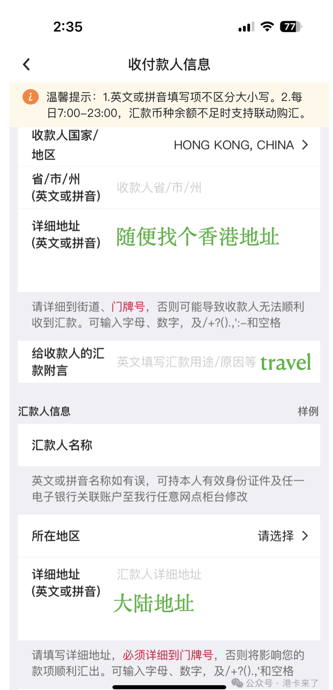

有了香港账户，第一件事就是怎么转账，这是很多人都会遇到的问题。

首先我们要搞清楚一件事，**人民币不能直接汇出到大陆以外的国家或地区**。

那接下来，我们还要知道我国的《外汇管理条例》中的规定，即：

> “每人每年享有 5 万美元的结售汇额度。”

这是法律规定，没有人有特殊待遇。有些人没有这个常识，天真的来问我哪个银行可以汇出多少多少钱。**法律就是法律，别问那么多，照做就行了。**

---

## 第一步：购汇

在跨境汇款给我们自己的香港账户之前，首先要去购汇，把人民币变成你想要的币种，比如常用的：

- 港币（HKD）
- 美元（USD）
- 欧元（EUR）
- 英镑（GBP）
- 加币（CAD）
- 日元（JPY）等

## 第二步：汇款

在内地的银行 App 中找到“跨境汇款”功能，然后去操作汇款。  
我们以**中国银行**为例，在汇款的时候需要填写收付款人信息：

- 如果是自己汇款给自己，收款人当然是我们自己，填自己名字的**拼音**
- 收款人地址是困惑很多人的一个选项，不知道怎么填  
  其实，很简单，我们可以找一个**香港的中国银行分行地址**，或者**香港的酒店地址**等等，都是可以的

> 📷 

---

像**众安银行（ZA Bank）**和**汇立银行（WeLab Bank）**就简单多了：

- 你只要在 **zabank** 或 **welab** 的手机 APP 中找到“**存入**”
- 然后你就可以看到从内地/境外银行转入的信息
- 这些页面中，已经有了我们所需要的所有转账信息，只要复制过来就可以了
