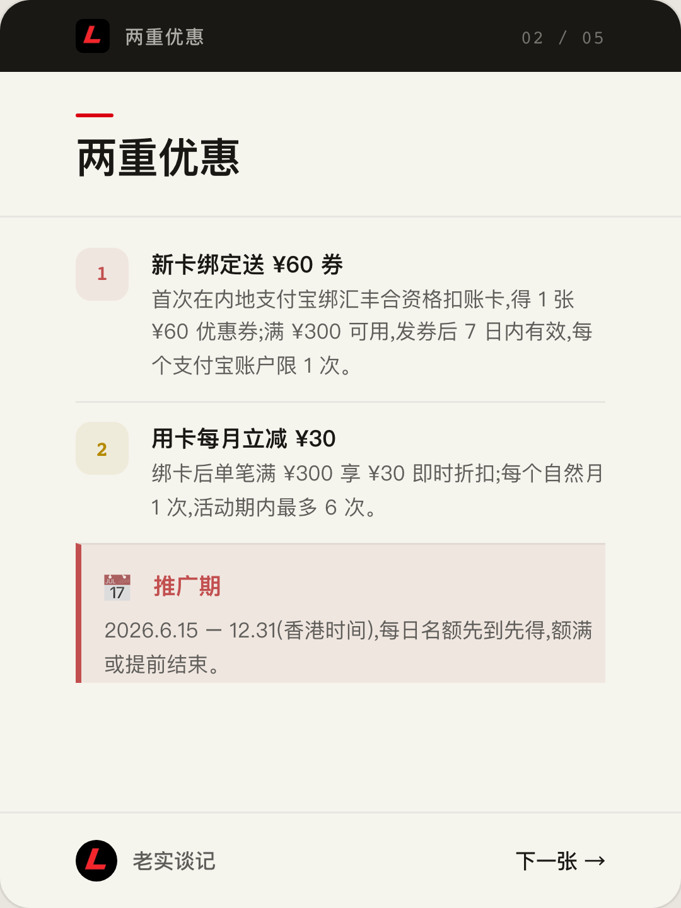
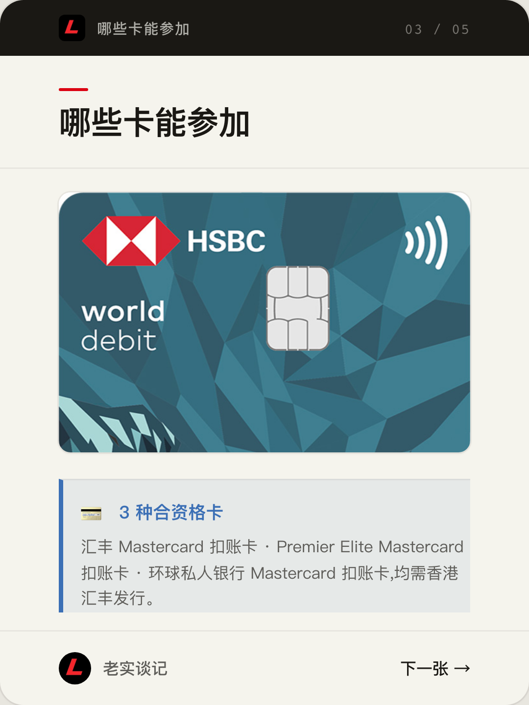
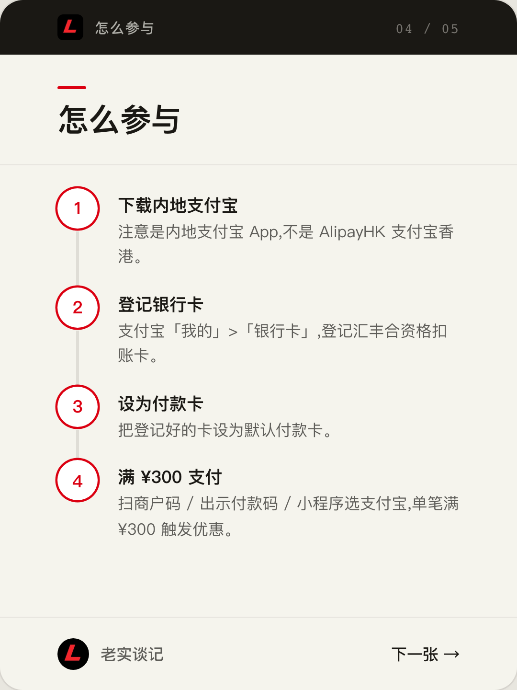
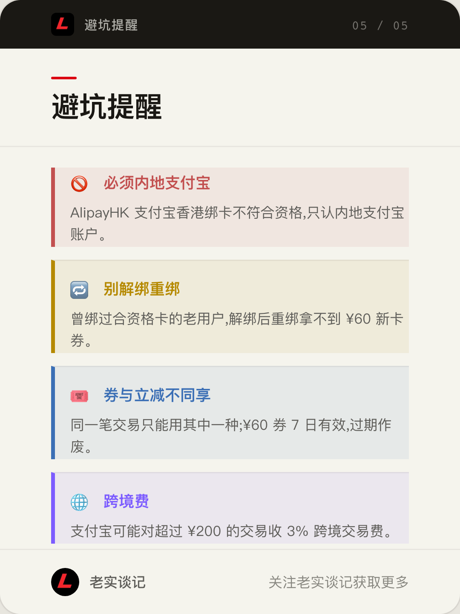

港卡党看过来。汇丰香港的 Mastercard 扣账卡,绑定**内地支付宝**有个推广活动:新卡首绑送券、用卡每月还能立减,推广期内攒下来最高约 ¥240。下面把活动详情、参与方式和容易踩的坑都整理清楚,数据来自汇丰官方条款。

## 优惠详情

**推广期**:2026 年 6 月 15 日 – 12 月 31 日(香港时间),每日设名额、先到先得,额满可能提前结束。

两重优惠:

- **新卡绑定送 ¥60 券**:推广期内,持卡人首次在内地支付宝 App 绑定合资格扣账卡,可获 1 张人民币 60 元优惠券。该券仅适用于用合资格扣账卡支付**人民币 300 元或以上**的交易,自成功绑卡之日起 **7 日内**有效,每个支付宝账户限享 1 次。
- **用卡每月立减 ¥30**:已绑卡的持卡人,使用合资格扣账卡完成**单笔人民币 300 元或以上**的交易,可享人民币 30 元即时折扣。每位持卡人**每个自然月 1 次**,推广期内**最多 6 次**。

## 哪些卡能参加

需是香港上海汇丰银行在香港发行的以下任一张 Mastercard 扣账卡(主卡或附属卡):

- 汇丰 Mastercard 扣账卡
- 汇丰 Premier Elite Mastercard 扣账卡
- 汇丰环球私人银行 Mastercard 扣账卡

## 怎么参与

1. 下载**内地支付宝** App(注意:不是 AlipayHK 支付宝香港)。
2. 点「注册」,前往「我的」>「银行卡」,登记你的合资格扣账卡。
3. 把已登记的卡设为默认付款卡。
4. 用合资格扣账卡完成合资格交易:扫商户二维码、出示付款码,或在小程序/合作商户里选支付宝付款。单笔满 ¥300 即触发优惠。

## 注意事项

- **必须内地支付宝**:AlipayHK 支付宝香港用户、以及通过 AlipayHK 进行的绑卡均不符合资格。
- **别解绑重绑**:曾绑定过合资格扣账卡的现有用户,不能通过解绑后重新绑定来获取新卡 ¥60 券。
- **券与立减不同享**:每笔交易只能享用其中一项;¥60 券 7 日内有效,过期作废。
- **跨境费**:支付宝可能就超过人民币 200 元的交易收取 3% 跨境交易费。
- 每名合资格用户在推广期内只可获 1 份推广优惠组合(以唯一支付宝账户 ID 为限)。

---

以上为活动要点整理,**一切以汇丰官方条款及细则为准**。完整条款见汇丰官网:[Mastercard 扣账卡 × 支付宝推广活动条款及细则](https://www.hsbc.com.hk/content/dam/hsbc/hk/tc/docs/debit-cards/mastercard-debit-card/alipay-campaign-tnc.pdf)。本文仅为经验分享,不构成任何投资、税务或法律建议。
