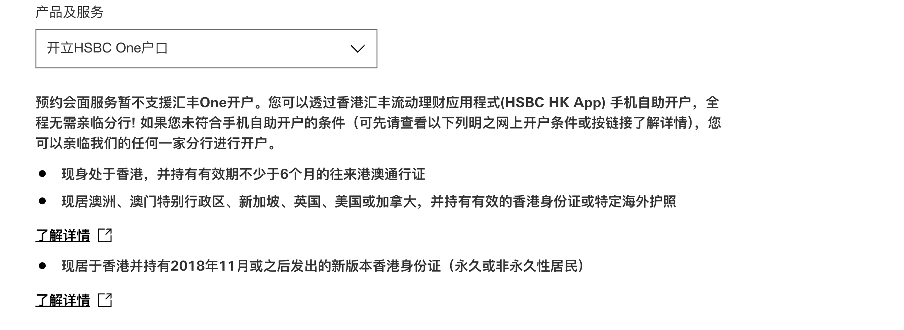
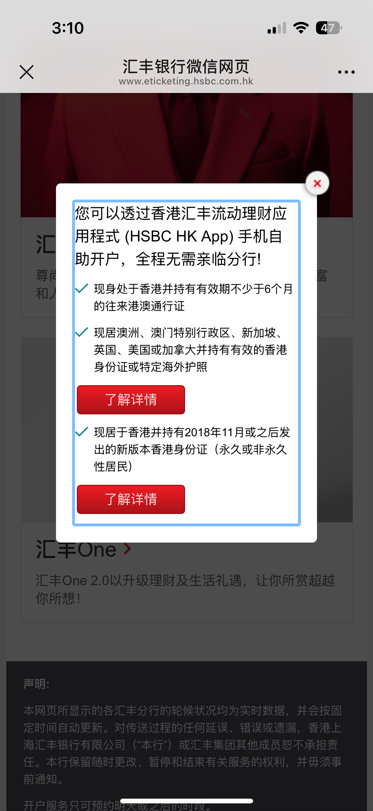

昨天收到香港汇丰银行的小道消息，说从**今天起**将**暂停所有分行的 One 账户开户服务**。

我当时还紧张了一下，因为今天正好有客户预约了开户。早上特地确认了一下，**已预约的客户仍可开户，但无法当场拿到实体卡**。

---

## 实地情况反馈

上周就帮客户预约了**今天上午10点在汇丰总行开户**，客户9:30就到达现场，告诉我：“不能拿实体卡了”。

确实，银行自内部通知暂停One账户开户后，**所有线下分行都不再提供One账户实体卡发放服务，只能通过邮寄方式寄送**。

下午，**香港汇丰终于发布官宣**，确认此事。

---

## 汇丰One账户还能怎么开？

我在官网和公众号两个官方渠道亲测：

- 选择“预约开户”时，只要选择 **汇丰One账户**，系统会弹出提示：

> “**预约会面服务暂不支援汇丰One开户。您可以透过香港汇丰流动理财应用程式(HSBC HK App) 手机自助开户，全程无需亲临分行！**”

公众号也是同样提示。

✅ **结论：线下分行已无法预约开通 One 账户，只能通过 HSBC HK App 自助开户。**

---

## 自助开户的限制

虽然自助开户方便，但也存在限制：

- **开户后三日内禁止取款**，理论上也无法转账  
- 对于一些当日需要完成开户和资金转移的用户（如购买港险者），这将是一个重大限制

---

## 小插曲：关于香港卡的“误解”

很多内地朋友可能不太理解“账户”和“银行卡”的区别，甚至觉得“没拿到卡就没开户成功”。

实际上：

- 香港账户 = 手机App上能看到的账户  
- 香港银行卡 ≠ 借记卡  
  - **提款卡**：在ATM上使用  
  - **扣账卡（Debit Card）**：线下刷卡使用  

📌 事实上，如果你只是用来转账或收款，**香港卡在内地根本不需要实体卡**。除了香港人来内地，大多数人用不上卡去取现。

---

## 目前还能选择哪些银行？

以下是当前仍可开户的银行选项及条件：

### ✅ 中银香港（BOCHK）

- 三大发钞行中**唯一无需最低存款即可线下开户**
- 资料要求：
  - 身份证、通行证、小票、地址证明
  - **投资证明（无则需社保记录 + 银行3个月流水）**

---

### ✅ 渣打银行（Standard Chartered）

- 基础开户要求：
  - **内地50万人民币总资产证明**（任意银行APP截图或股票、保险、基金均可）
- 如不满足，可联系我，我们有**合作分行支持特殊开户**（需收费）

---

### ✅ ZA Bank 虚拟银行

- 支持推荐加急开户，**我的推荐码：`NUGAP7`**
- 实体卡需开户后通过App自助申请并邮寄

---

### ✅ WeLab汇立银行

- 同样可通过推荐加速审核  
- **我的推荐码：`LAOSJI`**

---

### ✅ 恒生银行（Hang Seng）

- 预约开户需：
  - **国内3个月银行流水**
  - **10万元存款证明，且需持续3个月以上**

---

📌 若你计划开香港账户并配合特定用途（如投资、保险或转账），建议提早规划并结合你的身份、用途、资料选择合适的银行渠道。

如有开户相关问题，也欢迎留言或联系我咨询～
