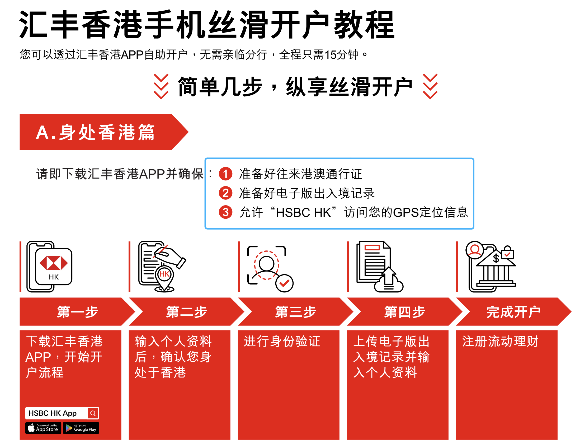
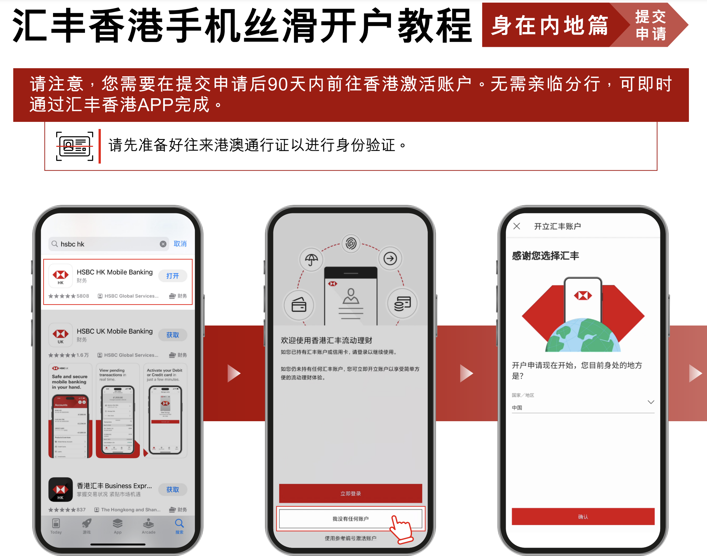
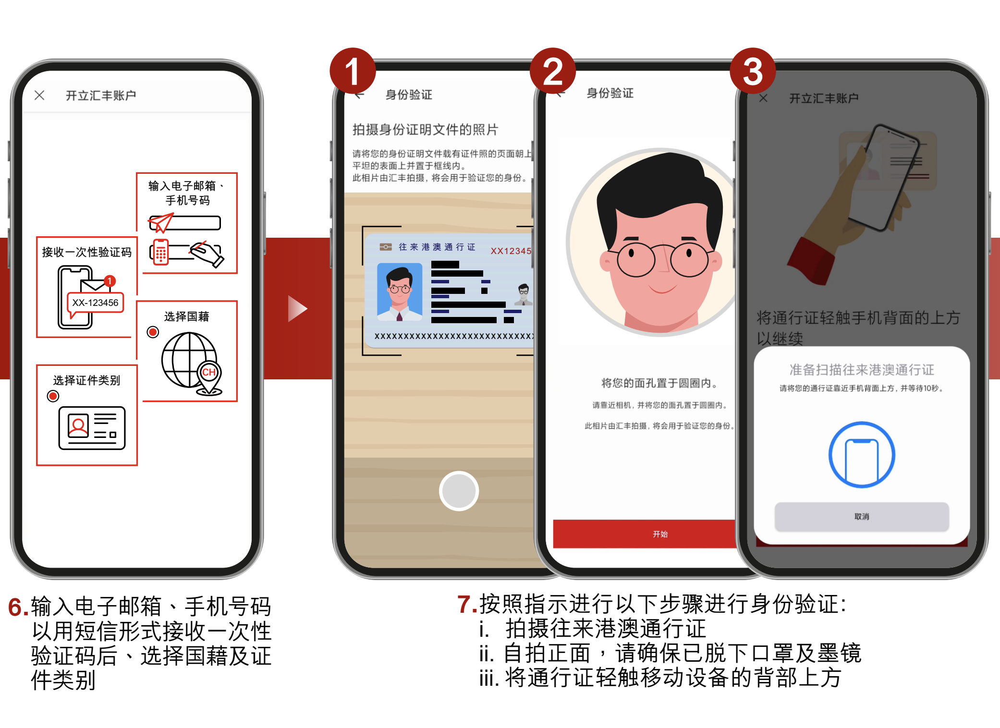
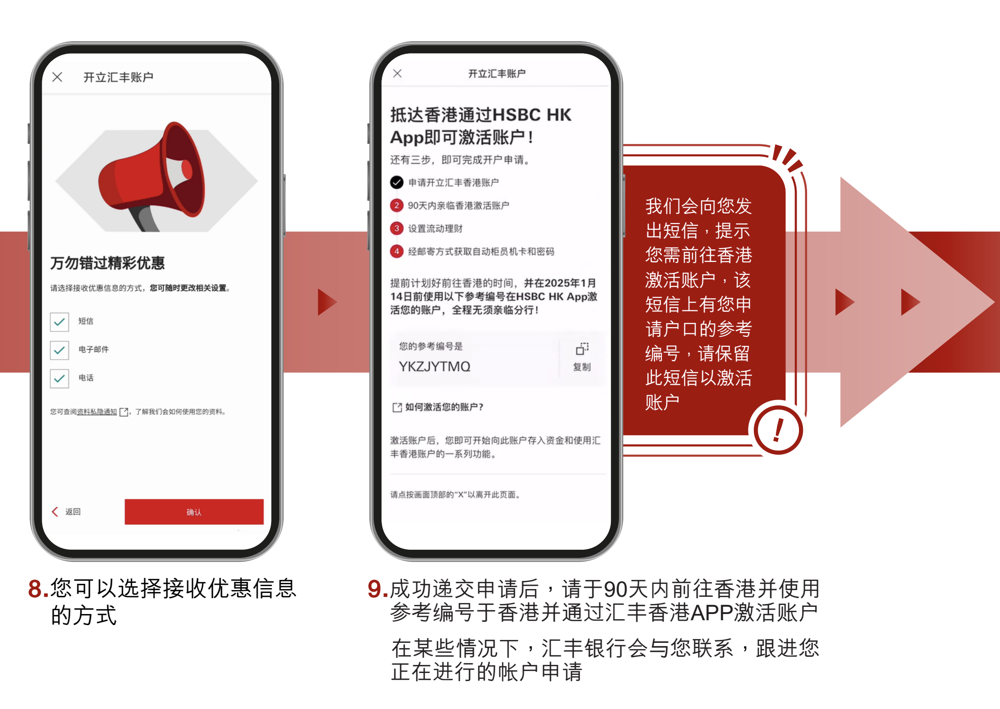
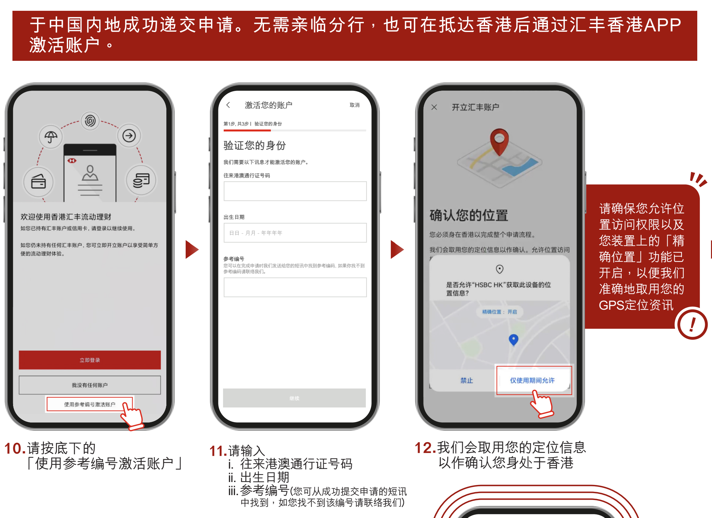
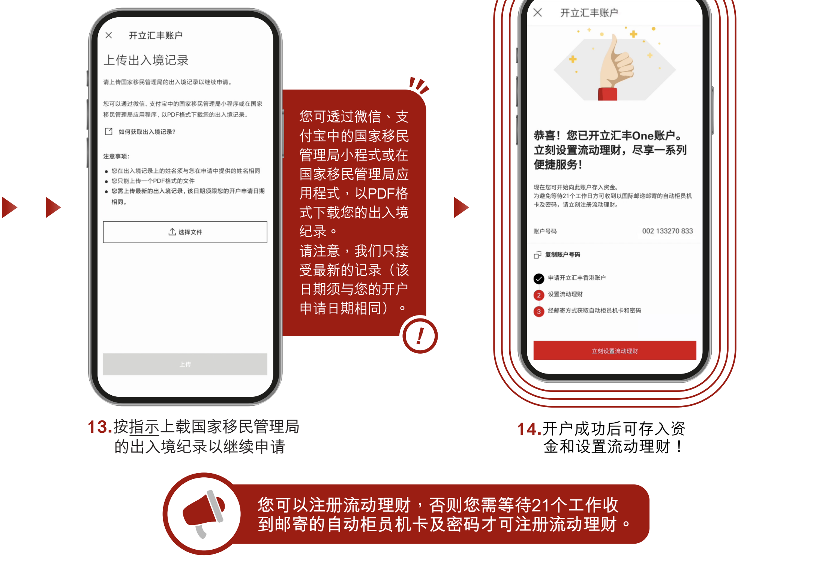
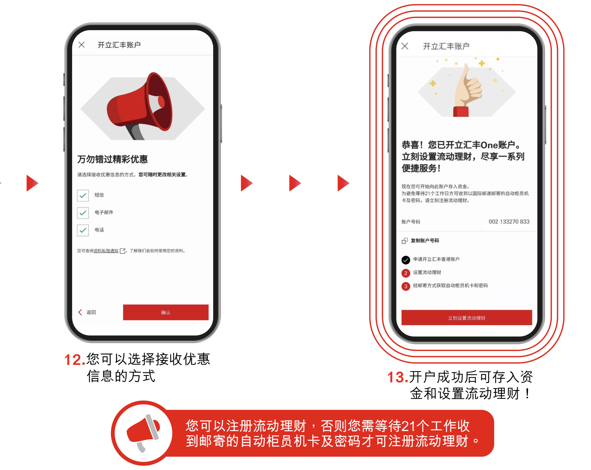
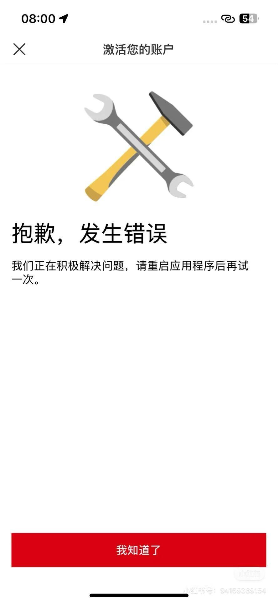

昨天汇丰香港调整了远程开户政策，在内地只能申请卓越理财账户，远程开户还没捂热乎就凉了。我很早就知道汇丰远程开户的功能，在内地你只能提前填资料，到香港才能完成账户激活。这还好意思说是远程开户，可就这竟然还被很多自媒体狠狠宣传了一波。看，凉了吧。不过，现在到香港之后去开户真的越来越方便了，汇丰one账户在你到达香港后，就能在手机上完成开户，这个开户体验都赶上数字银行了。对银行来说，开户耗费的成本太高，创造的价值却是极低的，大部分开完户口，基本上用来做其他用途，但是面对着犹如滔滔江水连绵不绝的内地客户，推出手机开户也是为了抢占更多用户。另外一方面，港府估计也想让更多的人把时间用在旅游观光和消费等方面，而不是来银行排队。无论怎么说，对我们内地用户人是更友好了。我们来分享一下如何到香港之后在手机上申请汇丰银行one账户，以及在内地申请汇丰香港卓越理财premier账户后，到香港之后要做什么？

# 在内地如何申请汇丰HK卓越账户？
再次说明一下，汇丰HK目前在内地只能提交卓越理财申请资料，并不能完成开户。如下图，汇丰one账户已经不能选了，卓越理财的开户要求是开户半年内，全面理财总值（账户总资产）要达到100万港币，否则会收取每月380HD的账户管理费。

# 申请流程

## 第一步：下载汇丰香港APP（HSBC HK）
## 第二步：注册账户
选择身处中国内地

## 第三步：了解开户流程，选择账户类型
账户类型目前在内地只能选择「汇丰卓越理财」，没有达到账户要求的，到香港可以申请one账户，否则你申请了这个one就无法申请了。

## 第四步：填写开户资料
需要输入电子邮箱、手机号以及上传通行证照片做人脸认证。

## 第五步：提交开户资料
提交开户资料之后，需要你在90天内到香港进行账户激活，其实就是为了验证你人是否在香港，通过手机GPS定位和上传出入境记录作为证明。

# 激活账户
在到香港境内之后，打开手机HSBC HK激活账户，验证身份时需要输入你的港澳通行证号码以及出生日期，参考编号找自己申请提交时候收到的手机短信。然后上传出入境记录就可以啦。

> 注意事项：记得授权手机GPS定位。

# 手机申请需要准备什么资料？
- 下载HSBC HK App
- 手机号可以收验证码
- 电子邮箱
- 港澳通信证
- 入境香港后在小程序“移民局12367”下载出入境记录
- 手机授权GPS定位
不要再问香港节点行不行，必须人到香港。相比去线下，手机申请就不会遇到银行客户经理问你开户用途等问题，如果手机申请失败可以再去分行。

# 人在香港怎么手机申请one账户？
如果你已经到香港了，没时间去银行开户，就可以下载汇丰HK手机App在线开户。根据下面的步骤注册提交等着审核就可以，唯一的区别就是，在香港申请会流程会比较丝滑，直接一步到位，提交资料后等审核结果就行了。

目前，有很多用户表示自己没有收到短信，还有就是设置流动理财的时候出错。解决办法就是找个分行，几分钟就搞定啦，不需要提供额外资料，所以大家不必担心。

# 手机申请后怎么申请实体卡？

收到Say hello 邮件之后，在汇丰HK手机APP自己申请，邮寄到国内。这个方式申请实体卡需要漫长的等待，3个月内应该能到。
去线下分行激活申请实体卡，看分行，有的小分行确实当天没有卡，建议大家去中环。

电报群：立即加入  https://t.me/laosjigifts

「福利」：以下都是本人测试过的一些App，新用户注册可领奖励。可查我的历史文章，或自助领取：https://fl.laosji.net/
「常用网址导航」：https://dh.laosji.net/

