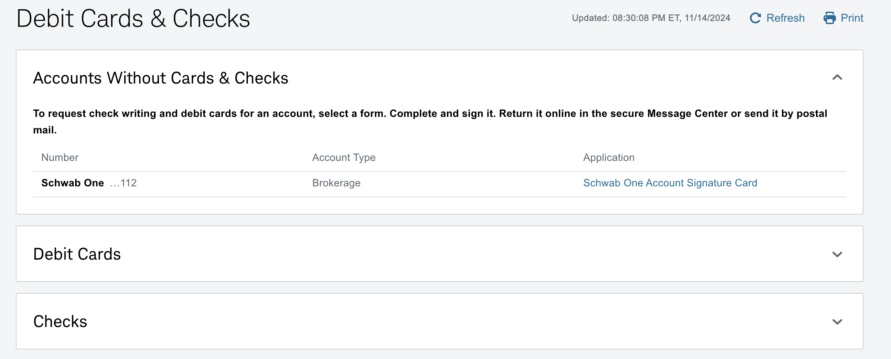
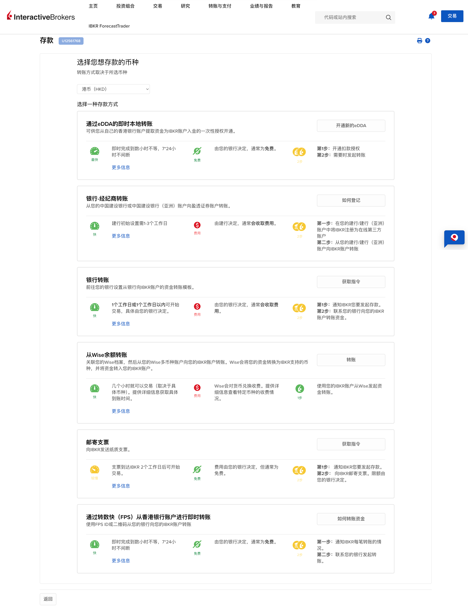
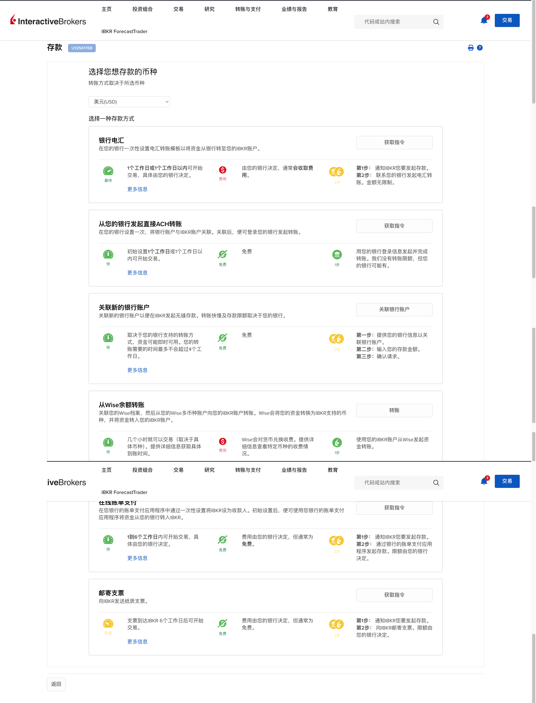
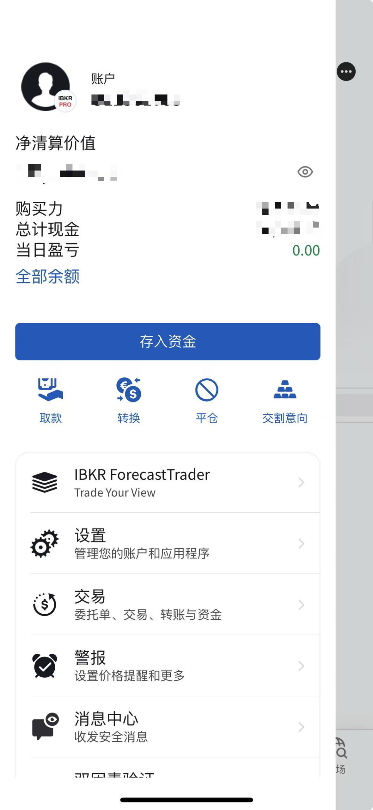
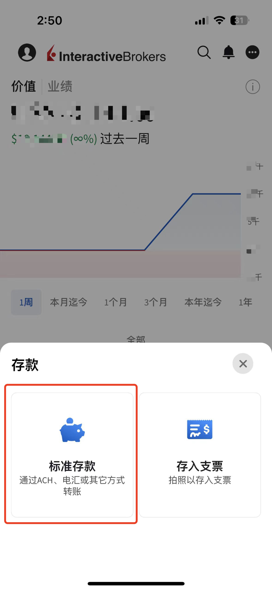
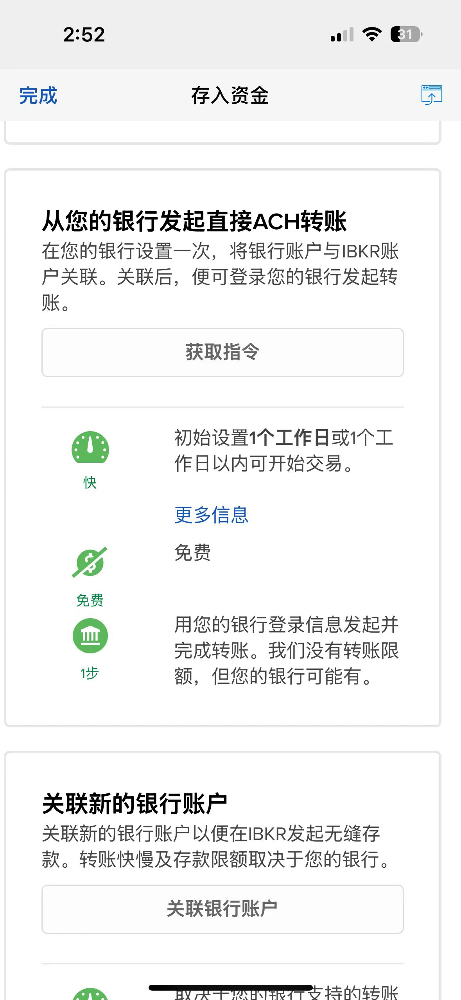
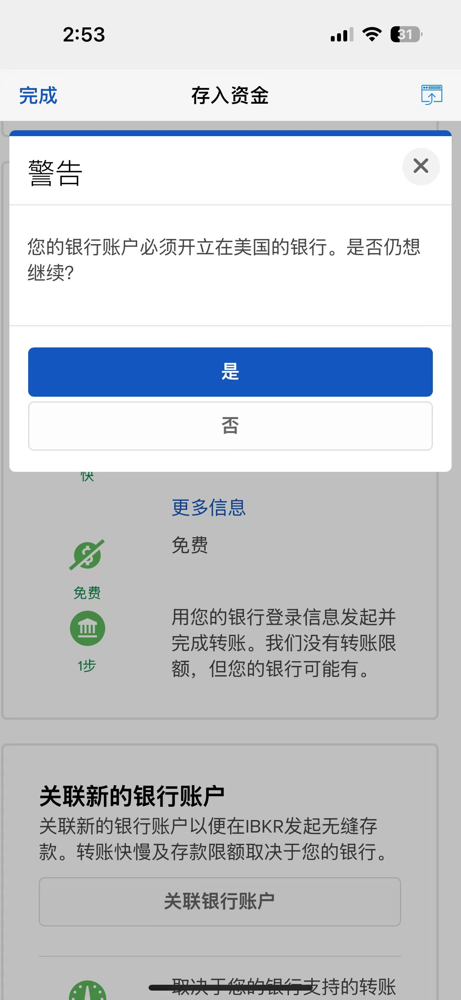
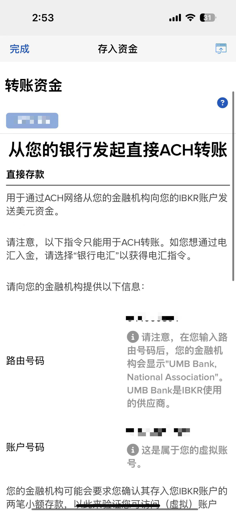
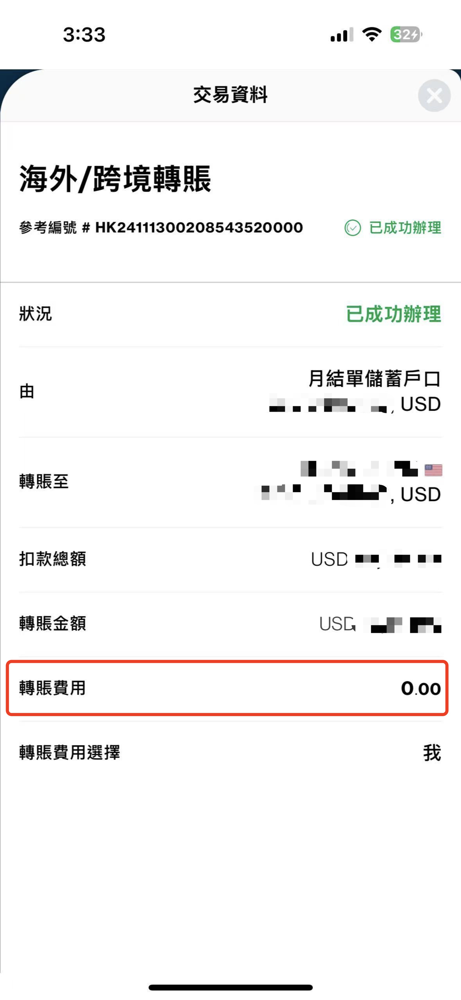
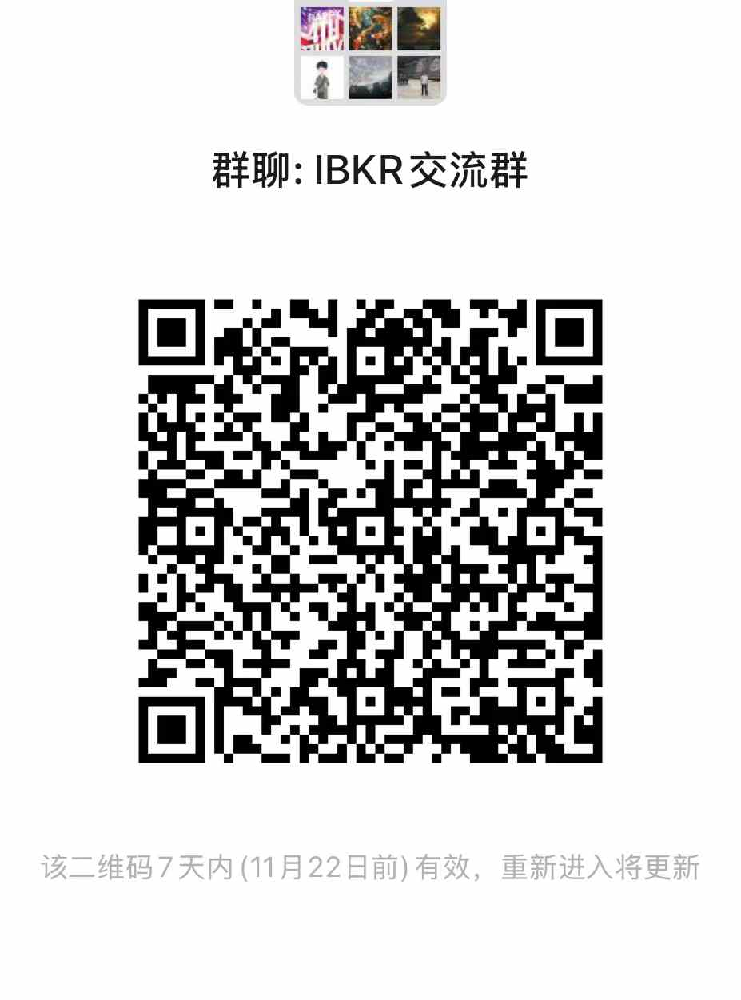

# 港卡USD无损入金IBKR

昨天写了嘉信理财的几种入金方式，我重新启用了一个嘉信理财账户，走了一遍入金流程。这次我发现用美金和英镑入金嘉信速度真的非常快1个工作日就到账了，而用港币入金一般需要2-3个工作日。我第一次用港卡转港币到嘉信理财的香港花旗银行账户，莫名其妙在第三个工作日被退回来了，后来客户查了很久没回复我，不过嘉信理财的客服电话还是很好打的。这次入金英镑在当天晚上（也就是美国的白天）就到账了。并且很惊喜的发现可以申请debit cards和checks，等卡到了再分享全部过程给大家。

在我去开东亚账户的那天我说有一笔在香港渣打的美金理财到期了，准备放到东亚去，然后也入了一部分到盈透，盈透入金港币当然非常方便支持FPS，但是入金美金很多人可能就会担心会不会扣手续费，甚至很多人还不知道可以直接用港卡入金美金，今天就来给大家分享一下“**怎么用港卡中的美元无损入金到盈透（IBKR）**”。

# 入金方式

我们先来看一下盈透的入金方式有哪些？

港币免费的入金方式有：eDDA、FPS、邮寄支票，银行转账和wise转账可能会被收取费用。

美元的免费的入金方式ACH转账，关联银行账户（美卡）、邮寄至票、在线账单支付，银行电汇和wise都会被银行收一定的手续费。

# 如何用港卡无损入金美元？

我们知道了入金方式和是否免费之后，就可以选择合适的入金方式。在这里我们选择使用ACH转账的方式进行入金，这样盈透就会给我们一个**UMB Bank**虚拟账号和路由号码，有个这两个号码我们就可以去转账了。

我知道很多人都只能用手机，所以今天特意用手机给大家截图了。点击“存入资金”，选择标准存款，然后币种选择“USD”，接着选择“**从您的银行发起直接ACH转账**”。这时系统会弹出一个警告，请忽略它，直接点击“是”，然后就拿到了这个**UMB Bank的**虚拟账户。

拿到这个账户信息，我们就可以去转账了。路由号码（routing number），在你的手机银行中输入路由号码和账户号码直接转美金就可以了，这是我的转账记录，转账费用为0。在2个工作日后到账了，看了一下盈透到账也是无损的。

欢迎大家来群里交流使用经验和观点。

