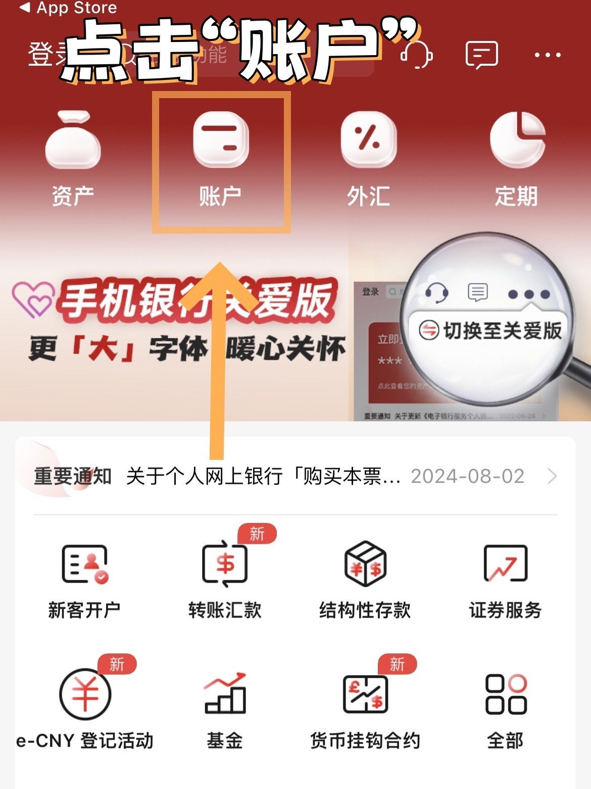
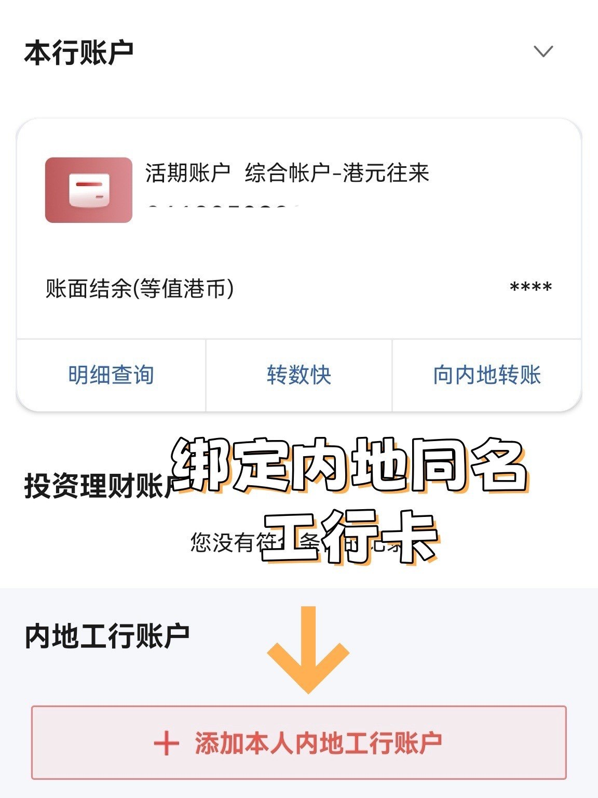
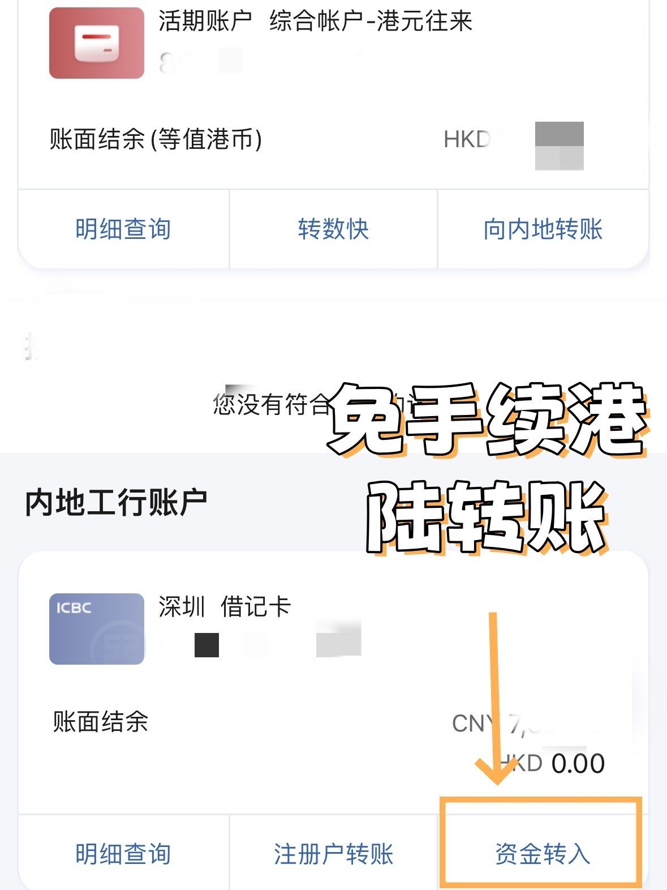

前天有个山东的朋友让我教他用工商银行汇款，今天我先把工行的汇款做了个教程。今天刚好也看到有朋友给我留言问我有没有团开工银亚洲的活动，才想起来要把这个教程分享出来，至于团开的活动大家先加群，留意群通知就行了。

早在今年年初1月份的时候，工银亚洲就推出了身份跨境认证、账户跨境互联的手机银行「e账通」服务。工银亚洲用户可在线上统一管理中国工商银行与工银亚洲账户，实现身份跨境认证、账户跨境互联、资产跨境可查及业务跨境办理。跨越地域界限，实现身份授权、賬戶綁定一个App管理全国账戶！凡持有中国工商银行借記卡及貸記卡，透過「e賬通」服務添加至中国工商銀行(亞洲)手机銀行，随时随地查詢賬戶明細、轉賬还款、分期付款等服务。还有限時獎賞，透过中国工商银行（亚洲）个人手机银行应用程序成功添加其同名的内地工行借记卡、贷记卡或活期账户后，可享“手机银行e账通-向工行集团汇款$0手续费优惠”。完成任何一笔跨境汇入或汇出业务，有机会获得HK$100現金奖赏！

# 「工银亚洲e賬通推廣奖赏」

推广期：2024年7月1日至2024年12月31日（包括首尾两天）

在同一个月內成功完成以下兩項任务可享HK$100現金獎賞*

（a）透過中國工商銀行（亞洲）个人手机銀行App添加同名的中国工商銀行借記卡或貸記卡；

（b）透過中國工商銀行匯入任何一笔款項至中国工商銀行（亞洲）同名個人賬戶（不限交易金額）；或透過中國工商銀行（亞洲）個人手机App汇出任何一笔款項至中國工商銀行同名個人賬戶（不限交易金額）。

## 注意事项

- 每月首400名同時完成（a）及（b）的客戶可获贈HK$100現金獎賞。名額有限，先到先得，送完即止。推廣期内，每名客戶只可获得現金奖賞一次。
- 须至少添加一个内地工行同名账户，如若客户删除其名下所有内地工行同名账户，将不再享有优惠
- 以港币、美元、人民币、新加坡元、英镑、瑞士法郎、日元、加元、澳元、欧元、新西兰元实时汇出款项至中国内地工行或其他海外工行收款网点可享$0手续费优惠，不包括代理银行收费（如有）

# 汇款教程

由于汇款现在是非常敏感的话题，为了避免不必要的麻烦，所以这部分只能付费阅读。之前非常多的朋友来咨询我，基本上只看了标题就来问了，我之所以分享是希望让看到的朋友可以自己独立完成，的确回复不过来大家的消息，所以，如果你想知道怎么操作就付费自己学一下吧，毕竟免费的东西我知道没有人会珍惜。

## 第一步：添加内地工行账户

打开「工银亚洲」APP，在首点击“全部-我的账户—添加内地工银账户”，或者在“账户——我的账户”添加是一样的。

## 第二步：内地工银身份认证

点击“添加内地工行账户”之后，会自动切换到内地工银，输入登录密码完成身份认证，点击“同意”

## 第三步：账户互认授权

需要输入手机验证码和身份证号就行本人授权，就可以添加内地工银账户了。

## 第四步：添加账户

从页面的银行卡列表中选择账户，进行添加。

## 第五步：港陆转账

添加内地工银账户成功后，在你的香港工银账户下会显示一个向内地转账的按钮，同时在你的内地工银账户下会显示一个资金转入按钮。现在就能直接进行快捷转账了，免输入账号。

