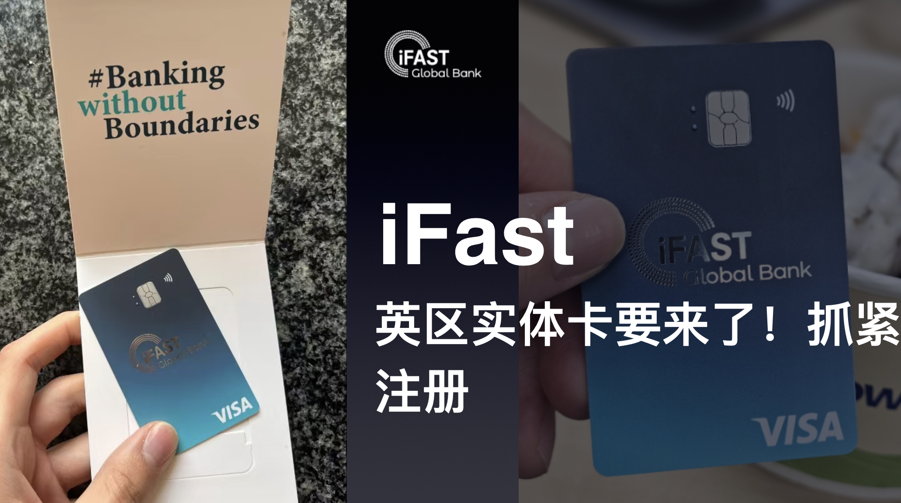

使用大陆身份证就能在线开户。因为开户非常简单，很多朋友会担心这个银行安不安全，我上周也去了ifast新加坡总部为大家实地探访了一下，下面就和大家展开聊聊。顺便说一下，ifast在中国香港、上海、深圳都有办公室，如果你有资产配置的需求，可以帮你预约去他们公司了解，ifast最强的产品是基金。新加坡的办公室外面就是新加坡地标建筑滨海湾金沙酒店，我在他们办公室拍了几张照片放在文章结尾给大家看看。

# **ifast global bank到底安不安全呢？**

首先ifast global bank是属于ifast集团旗下的一家英国全牌照的数码银行，简称IGB，你在IGB账户中的存款收到FSCS的存款保障，最高赔付85000英镑。IGB的前身是英国银行BFC Bank，在2022年被ifast集团收购，而ifast集团早在2014年就在新加坡交易所主板上市了。

ifast集团是一家全球数码银行和财富管理平台公司，平台最强的能力是基金产品，ifast为很多平台都提供了基金产品2B服务。除了挂牌基金还有信托基金、企业债、新加坡政府债、股票及保险产品。在我看来这是一个一站式的投资平台，可以帮你解决境外银行账户，以及投资平台有丰富的产品可以选择，另外，还配备有投资顾问团队为你提供咨询服务。说到这里大家应该心里都有数了吧，我也是在去了ifast集团总部之后，才了解到这么多的信息。

# iGB账户能干什么？

- 资金在英国、香港和新加坡三地之间进行免手续费流转，通过IGM账户进行平台内流转，然后提现到你所在地区的银行卡，完全没有手续费。
- 激活wise，免手续费转账到英区wise账户。
- 最实用的功能就是用来入金IGM，开启你的全球资产配置之旅。
- 存款：得益于他们没有实体银行的低成本模式，平台提供了高于市场平均水平的存款利息。并且所有用户一视同仁，没有三六九等之分的特殊优惠利率。
- 无损入金盈透/嘉信理财，Treading212

# 开户需要什么资料？

- 大陆身份证或者护照
- 大陆手机号
- 电子邮箱
- 地址证明，如果身份证就是你的实际住址则不用提供

最后进行视频验证就快可以开户。

# 最低存款要求

0元

# 激活

虽然说没有最低存款要求，但是和大部分银行一样在使用之前需要同名账户存入一笔任意金额的资金进行激活。不然，你的账户功能将会收到限制。

可以使用兴业银行寰宇人生账户进行转账激活，免手续费。

英区的wise也可以免手续费转账iGB账户。

# 实体卡

iGB的VISA实体卡即将在英国地区推出，目前内部员工在测试中，要了几张照片给大家过过眼瘾，很遗憾的是英国英外的其他地区用户暂时无缘。

[阅读原文](https://mp.weixin.qq.com/s/WFLdUGyCpvP12OEJhXsWLQ)