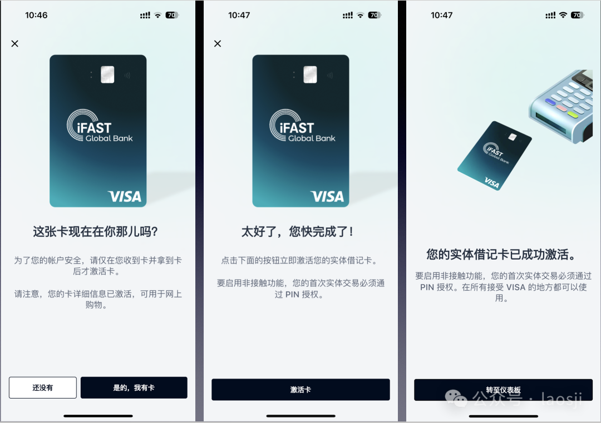

上周收到了 iFastGB 的实体卡，收到这张实体卡之后，还不能直接使用，需要在 APP 上激活才行。今天来和大家分享一下我的 iFastGB 实体卡激活过程。

在登录 iFastGB 手机 APP 之后，在「我的账户」页面点击「查看借记卡」，可以看到页面底部有一个“你的借记卡已在路上，立即激活”的提示，点进去。这时候系统会提示「这张卡现在在你那儿吗？」如果收到卡了就选择「是，我有卡」。如果还没有收到卡，就先别着急激活，不然被别人收到就可以刷了。

激活成功之后，就可以使用你的实体卡了。注意这是一张 Visa 借记卡，仅限在支持 Visa 的商户使用。现在 2% 的刷卡返现活动也马上就要结束了，不过也没关系。由于我的账户收到了提供英国居留证件的通知，目前处于被审查阶段，实体卡刚激活付款功能就被冻结了。和 support 团队沟通过了，再过几天就会有结果，现在还不能转账和正常使用，只能等着解冻。

---

昨天发了收到实体卡的文章之后，就有朋友告诉我同样也收到了提供居留证明的通知。如果你不能提供证明，趁早把余额转走，然后在邮件回复，告知 iFastGB 你不能提供证明，让他们给你关户。关户之后，再用自己真实的地址重新注册一个账户，能用就成，没有风险的账户就是最好的账户。

还有人问我这个卡怎么申请，如果同样不能提供真实的英国居留证明，老老实实用大陆地址注册，省得麻烦。这年头要卡能有什么用，我只是为了消耗 Tipstrans 账户的邀请奖励才申请转运回来的，因为 Tipstrans 的奖励不能变现，只能在平台用掉。

---

现在要卡实在太多了，也太好申请了。最近给大家分享过的 **雪崩卡（Avalanche Card）** 和 **Binpay 卡**，都非常好申请。今天试了一下雪崩卡，充提 USDT 竟然没有手续费，消费人民币也才 1% 多的 FX Fees，这已经非常划算了。

关于数字货币，我之前确实不太看好，但是现在态度完全改变。最近很多国家政府都提议发行稳定币，数字货币最大的好处就是转账快，把现在国际银行的清算系统完全打破了，而且费用还低。国际汇款不用再等好几天，实时到账，费用低到离谱。用了真的觉得爽！

---

香港在 8 月 1 日正式实施稳定币法案，这玩意以后如果真的能用稳定币来支付，那真是数字货币的未来。现在的电子支付完全有可能在几十年后变成和现金纸币一样的境遇。我们曾经以为先进的东西，最终也会被新技术淘汰，到时候我们也不得不学习用数字货币，就跟现在大爷大妈学手机支付一样。

---

每一代人有每一代人的「鸡蛋要领」，我们终将被时代淘汰，也终将从这个世界上消失。

---

就这样吧，周末想去看的电影还没去看。有人看 F1 了吗？欢迎在评论区聊聊～
