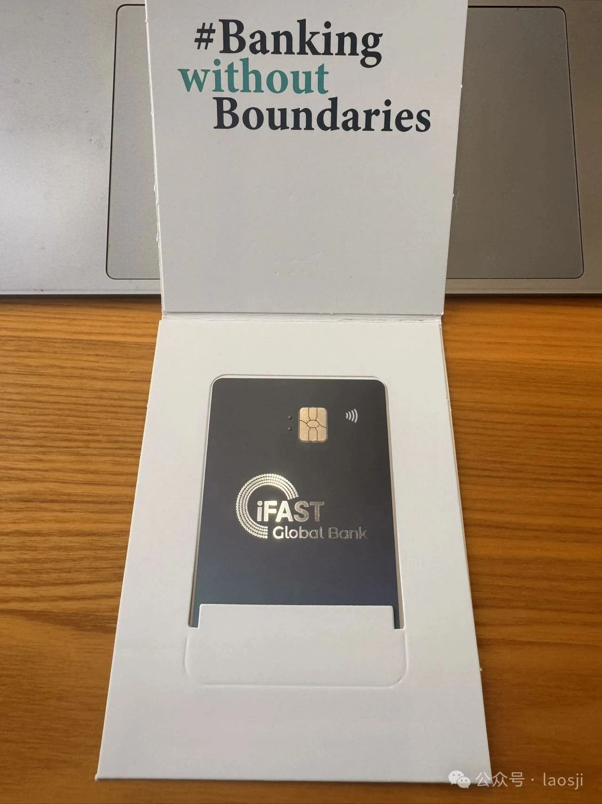
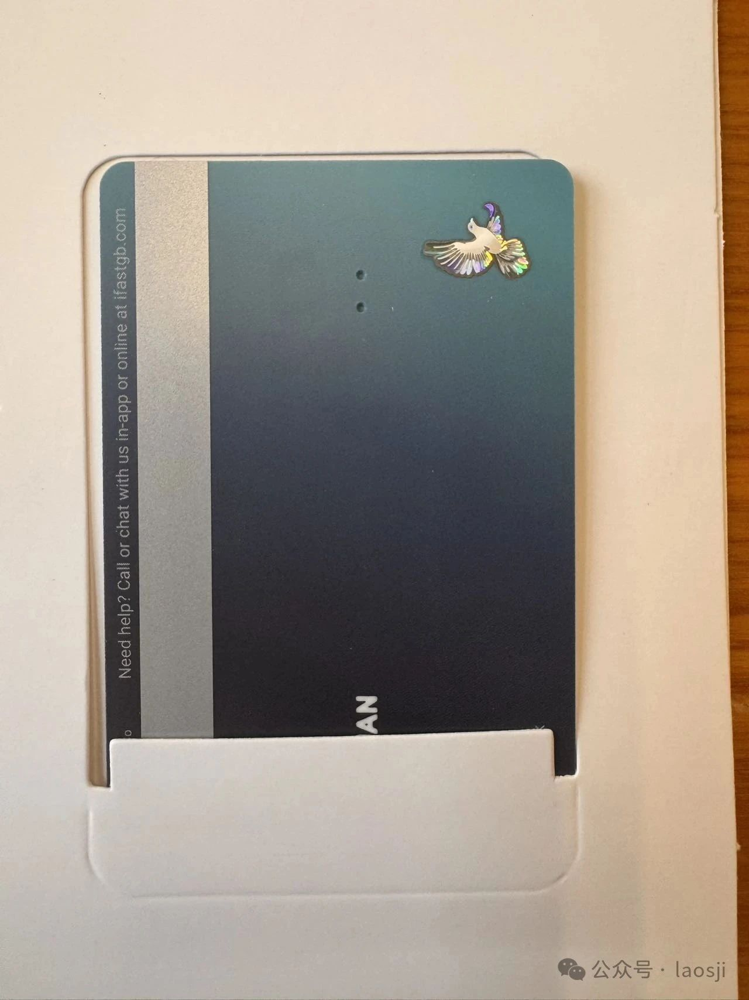

上个月收到 iFast Global Bank 要我提供居留证明的通知后，我就立刻申请了 **iFastGB 的实体卡**，毕竟是免费的，不要白不要。

申请之后，大约 **5 天左右就到我的英国地址**，然后我把它转运回来，总共用了半个月，花费 **60.51 USD**。我选的是 **联邦快递**，国际物流的快递费确实贵，建议可以找英国的转运公司，把收到的信件先寄到转运公司，再通过转运公司寄回来，这样应该会便宜一丢丢。

这是一张 **Visa 卡**，背面印有我的名字，还有一个 bulingbuling 的展翅飞翔的鹰，质感不错，拿在手里有点小爽。

---

对了，很多人都想知道我被 IGB 要居留证明的后续情况，我也和 iFastGB 官方解释过，目前账户已经 **正常使用**，可以继续操作，没有被限制。

---

如果大家也打算申请，可以提前准备好英国地址或者找一个靠谱的转运方案，提前算好时间和成本。

---

✅ 有什么问题可以在评论区留言，也欢迎在后台私信我，AI 会帮我自动回复历史文章里的相关内容，比我自己手动回快多了！
