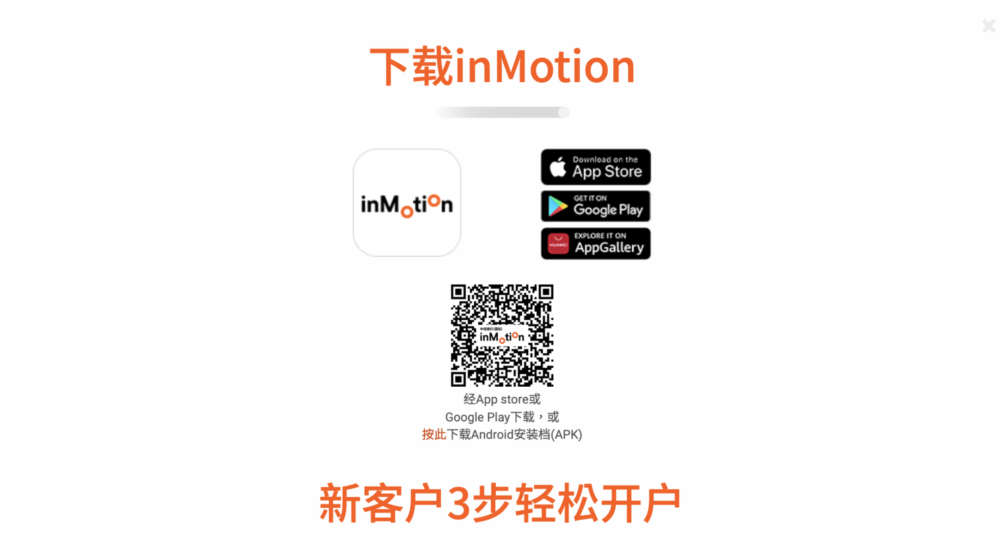

大家新年快乐，前些天在新加坡跨年休息了几天，微信消息真的回不过来，想安静的休息几天太难了，明年，不对今年要把生活和工作的边界再划分清楚一些。我一直都收到各位朋友关于对香港信用卡的评论和私信，看来不少人都想要香港的信用卡，确实签帐返现比较多，用来消费比较划算。但是，现在内地用户能申请到的香港信用卡少之又少，信银国际现在是仅存的比较容易申请到的信用卡，不像是渣打需要提供各种证明。那今天来和大家分享一下如何申请香港信银国际的信用卡，首先我们要开立一个信银国际的储蓄账户。

# 为什么选择信银国际？

- 可申请香港信用卡，在汇丰Pulse和Red暂停内地用户申请之后，信银国际是目前唯一内地用户比较容易申请的信用卡。
- 签帐返现，Motion信用卡全新用户由2025年1月3日至2025年7月2日，可享受**10%现金回赠**，签账期内最高可获享**HK$1,000现金回赠**！
- 可在线申请开户，无需前往分行。

# 开户流程

1. 下载inMotion动感银行，点击「立即开户」及选择「中华人民共和国居民身份证开户」
2. 输入手机号码及电邮，并扫描中华人民共和国居民身份证及进行自拍
3. 扫描往来港澳通行证及填妥往来香港签注信息
4. 填妥个人信息即完成开户

# 准备资料

1. 身处香港境内
2. 电子邮箱
3. 可接收短信的手机号（内地手机开通国际漫游）
4. 内地身份证
5. 港澳通行证
6. 出入境记录（移民局12367小程序中下载）
7. 若居住地址与通信地址不一致，需要提供地址证明

准备好以上资料就可以打开“**inMotion**”APP在线开户了。

# 开户步骤

1. 打开“**inMotion**”APP，一打开会有几个使用协议直接滑到底，点同意，然后在首页点“立即开户”，身份选择“中华人民共和国居民身份证开户”。
## 填开户信息，

手机号、电子邮箱、身份证正反面、人脸识别、通行证正反面，身份信息和证件有效期按照证件上面的填就好了。

## 设置用户名和密码

设置自己的账号用户名和密码

1. 居住地址和职业信息
2. 税务居住地
选择不是美国公民

3. 开户原因和资金来源
4. 语言设置：可选择简体中文
5. 上传出入境香港的记录文件
6. 确认开户信息并提交
7. 开户成功

# 如何申请信用卡？

## 在线申请

有了信银国际的储蓄账户之后，需要搬砖5-10W，10W比较稳一点，做个3个月定存然后就有信用卡的申请入口了，在线申请后需要一个月左右的审核。

## 线下申请

预约去线下分行提交开户资料，储蓄账户必须要有🧱，审核时间同样是一个月。


