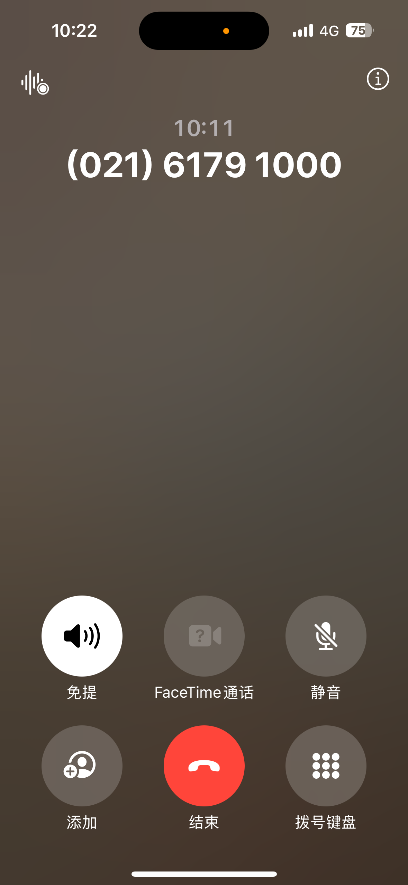
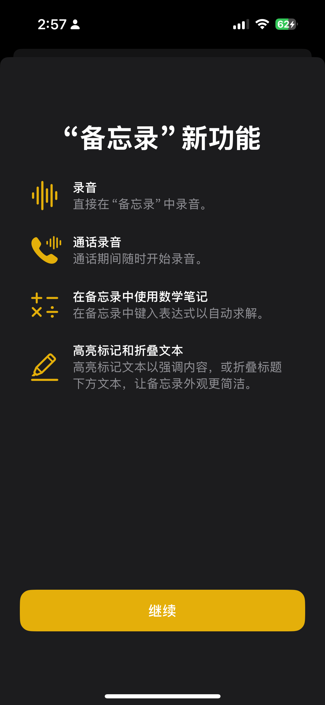
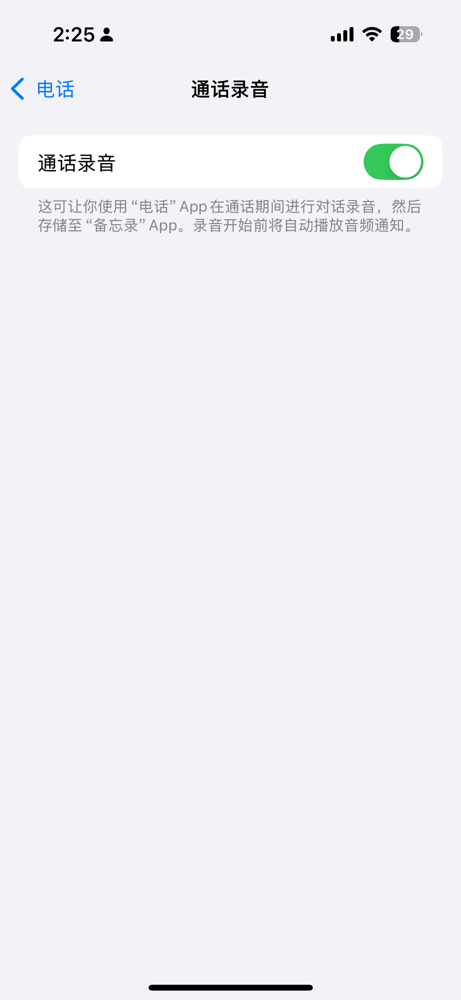
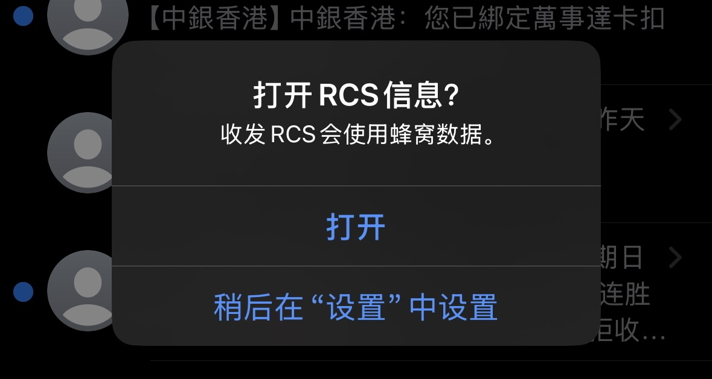
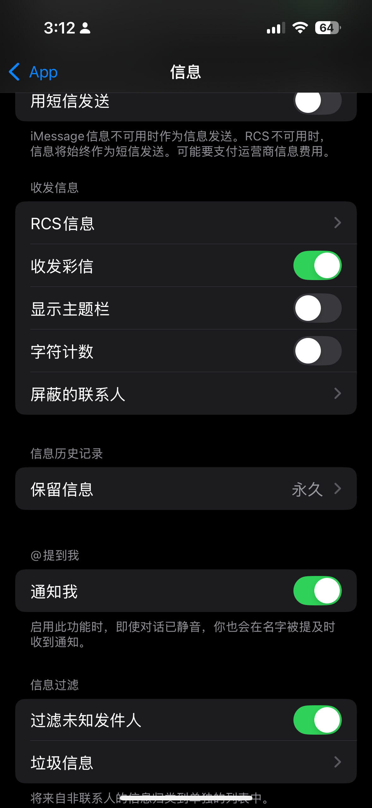
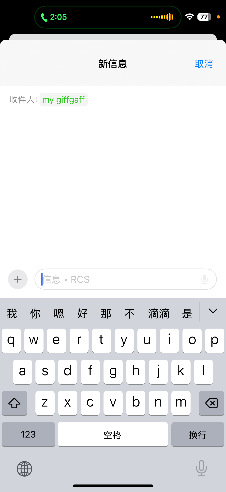
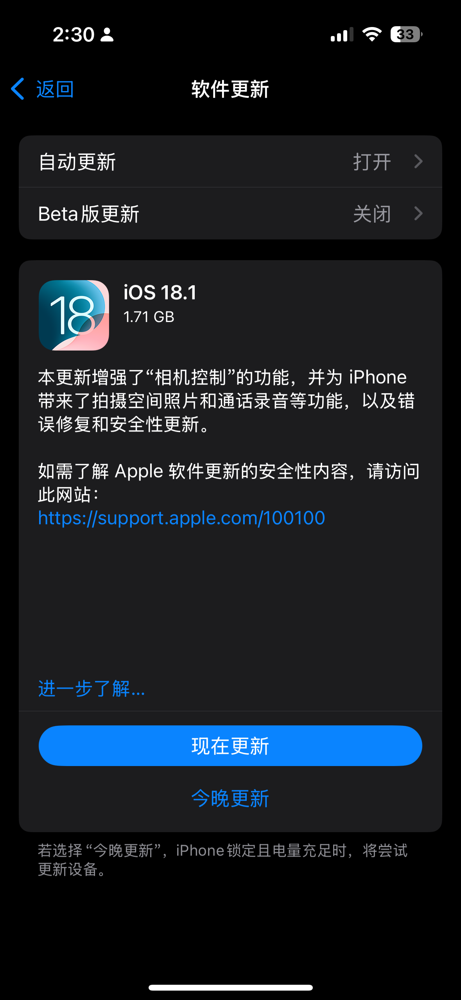
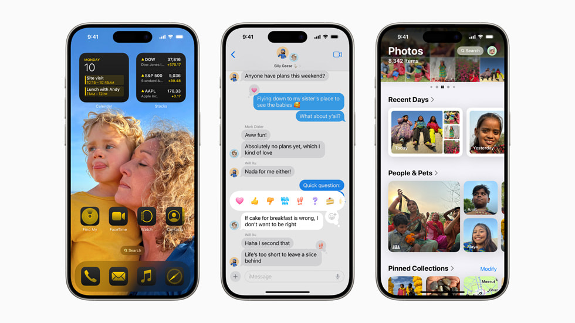
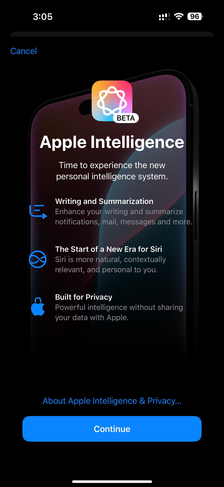
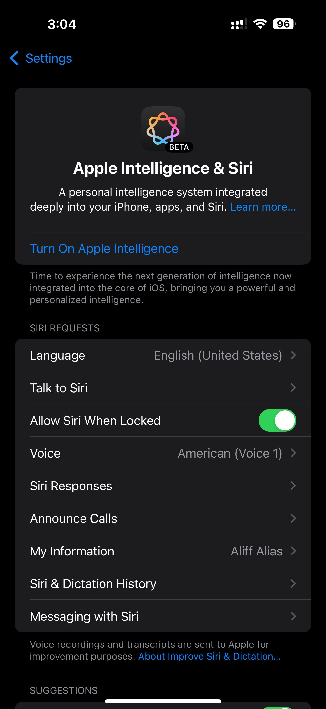

美国10月28日凌晨，苹果发布了iOS18.1、iPadOS 18.1和macOS Sequoia 15.1正式版更新，备受关注的Apple Intelligence（苹果智能）功能正式上线。同时，还推出了配备了M4芯片的新款iMac。正好在昨天晚上失眠，第一时间升级了iOS18.1，尝试了一下大家比较关心的几个功能。

- 通话录音，录音会保存在备忘录
- RCS信息，运营商收费，不用试了
- 空间模式，拍摄空间照片和视频
- 苹果智能，抱歉国行体验不了

# 通话录音

升级iOS18.1之后，这个功能默认是打开。打电话的时候，通话页面左上角会显示语音备忘录的图标，录音开始前会播放通知，通话过程中也可以关闭录音。结束录音之后，可以在备忘录中找到。

如果你不想使用此功能，可以在“设置—通话-通话录音”中关闭。

# RCS信息

世界上只有2个手机厂商，一个是苹果，另一个是其他手机厂商。苹果手机用户可能都知道，在苹果手机之间使用iMessage发送信息只需要使用蜂窝网路或者无线局域网，无需使用运营商的短信服务，这样也就不会产生短信费用。通过Message 信息，你可以发送文本、高分辨率照片和视频、文稿、链接、[点回、文本效果、实况贴纸、信息效果等](https://support.apple.com/104970)。

如果你没有使用 iMessage 信息，可以使用 RCS。RCS 短信可以发送到非 Apple 设备，以及打开了“短信转发”的另一台 iPhone 或其他 Apple 设备。借助 RCS，你可以发送文本、高分辨率照片和视频、链接等。RCS 也支持送达回执、已读回执和键入指示器。在设备上，RCS 信息以绿色文本气泡显示。传统的短信只能传输文本和链接，发送视频和图片就需要使用彩信服务。除了苹果，全球智能手机制造商和运营商都采用了 RCS，RCS服务是由Google设计并采用的一种通信协议，也可以实现类似iMessage的功能。在Google和其他厂商的施压之下，苹果终于和RCS交朋友了。iOS18.1就已经上线了RCS信息功能，但是，在国内运营商要收费，广电、移动、联通、电信，不出意外现在都是按照0.1元/条。就算是苹果和其他手机厂商交朋友了，但是运营商又跳出来了，短信这个只用来收垃圾短信和验证码的服务，免费都没有人用，现在改名叫“5G信息”，居然要收费。手机厂商们努力了这么久，真是被国内的运营坑惨了。

## 如何开通RCS？

要使用 RCS，你需要升级 iOS 18 .1并从支持 iPhone 上 RCS 的运营商那里订购短信服务套餐。

要打开或关闭 RCS，请前往“设置”>“App”>“信息”>“RCS Messaging”（RCS 信息）。

升级iOS18.1，打开短信应用，就会出现一个“打开RCS信息”的提示。在使用RCS之前，你还要确保你的运营商开通5G信息服务后，才能使用。同时，确保你的接收设备（安卓）也打开了RC功能。发送RCS信息时，在信息输入框会显示RCS提示，如果发送的是短信就会提示短信。另外，发送成功之后，在绿色文本气泡上方也会显示消息类型是RCS还是短信。

收费的RCS，真是毫无用处、一无是处。

# 空间模式

空间照片能够创建更加立体、沉浸式的3D图像，用户可通过Apple Vision Pro头显回看这些空间照片。升级iOS18.1之后，想要拍摄空间照片，打开相机应用，选择空间模式，并将iPhone旋转至横屏模式，再选择录制空间视频或拍摄空间照片。仅支持iPhone 15 Pro 和 iPhone 15 Pro Max 以上机型录制空间视频。

# 苹果智能

很抱歉国行不支持，给大家看看图片吧。港版是可以用Apple intelligence的。我觉得最好的用功能就是照片编辑可以一键消除照片中不想要的背景。

