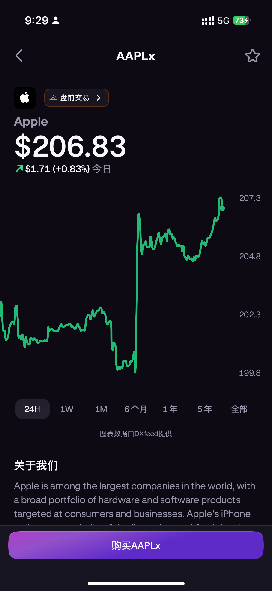

是的，Musk 和 Trump 又吵起来了。

表面上原因是 Trump 推出的 **“大而美”法案**，这项法案涉及大规模税收和国内政策，预计将增加 2.4 万亿美元的国债，并取消部分政府支持的医疗保险，引发马斯克强烈反对。这也与他此前在 DOGE（Department of Government Efficiency，政府效率部）期间推动的削减联邦开支目标相悖。

今日（7 月 1 日），Trump 在 Truth Social 发帖，称 Musk “可能获得历史上最多的补贴”，如果取消特斯拉和 SpaceX 的政府合同与补贴，马斯克可能需要“关闭公司，回南非”。Trump 还建议由 DOGE 审查马斯克公司获得的资助，强调此举可节省数十亿美元。同时，他暗示马斯克对法案的批评，是因为法案取消了电动车补贴（如每辆车最高 7500 美元的税收抵免），影响特斯拉盈利。

马斯克则强硬回复：“取消吧，就现在。”  
> "I am literally saying CUT IT ALL. Now."

此言一出，特斯拉盘前大跌 6%。这也引发了外界猜测，马斯克是否对造车失去了兴趣？

就在 6 月 26 日，特斯拉高级执行官、长期担任马斯克亲信的 Omead Afshar 宣布离职，马斯克亲自接管欧洲和美国销售业务。

---

## 美参议院否决 Trump AI 监管禁令

美国参议院今日在 vote-a-rama 期间，以 **99:1** 的票数，几乎全票否决了特朗普“大而美”法案中关于禁止各州对人工智能（AI）进行监管的 10 年禁令条款。这也是科技与政治博弈中又一次重大事件。

---

## 关税影响，降息不急

美联储主席 Jerome Powell 重申，关税影响预计将在未来几个月的通胀数据中显现，但不确定因素依然存在。  
> “通胀的时机、幅度和持续时间存在高度不确定性。”

他表示，政策制定者已为“高于或低于预期，早于或晚于预期”的各种可能性做好心理准备。

---

## Kraken 美股代币化交易功能上线

Kraken 的美股交易功能 **xStocks** 正式上线，这是一种新的交易模式：代币化股票（Tokenized Stocks）。

目前首批上线的股票包括 60 家知名美国公司，如英伟达、特斯拉、苹果、Coinbase、英特尔、甲骨文、微软、思科、摩根大通、伯克希尔哈撒韦等。

 
与传统券商不同，Kraken 支持 **7 天 24 小时** 随时交易，且免佣金，交易体验更像加密货币。不过，目前只能挂市价单，波动性相对较大，我也第一时间体验了一下，感觉整体功能还比较简单，但非常适合灵活的短线操作。

---

如果你也关注科技、金融、宏观政策，美股代币化玩法，绝对值得长期跟进。🚀
