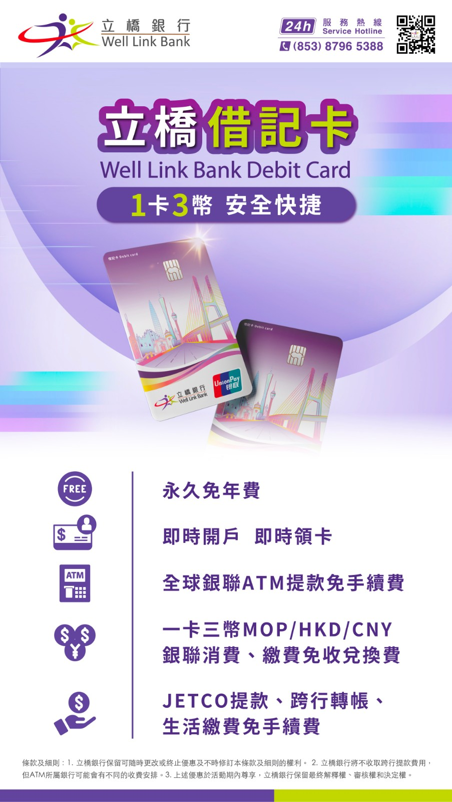
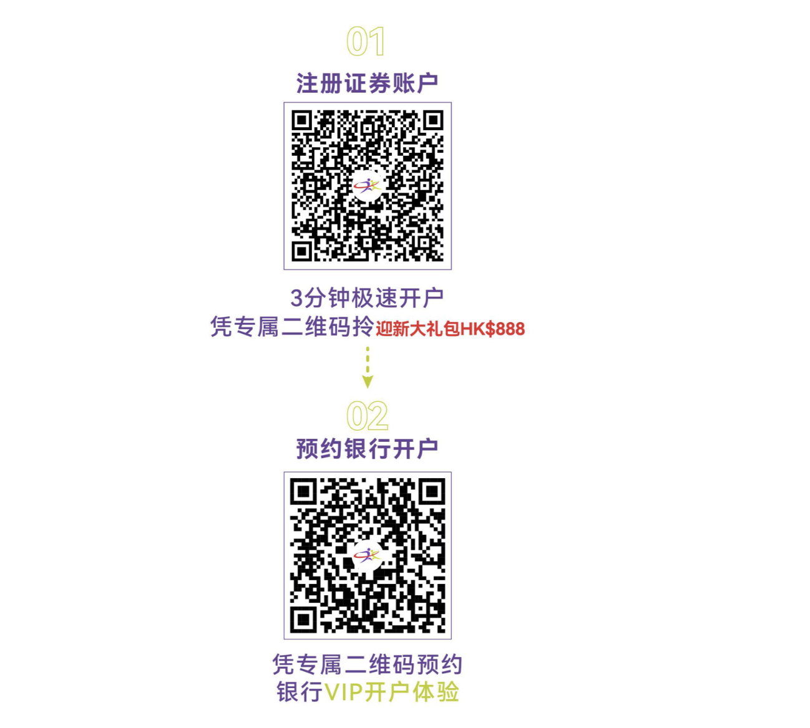
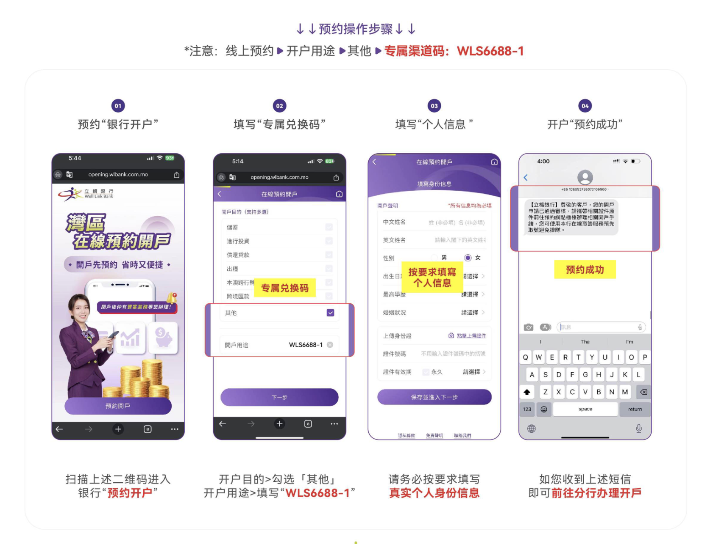
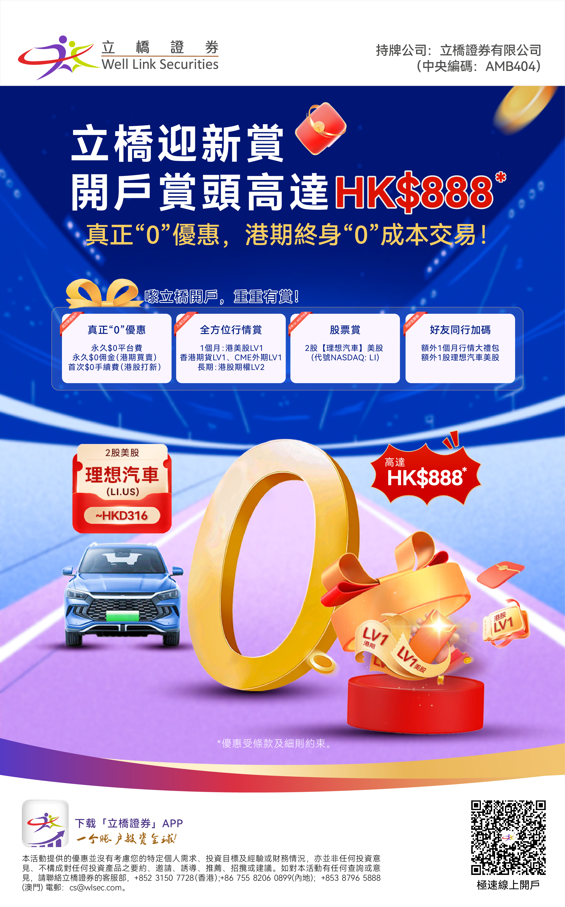

大家好，香港银行开户大家都毕业了吗？香港开户做了太久了，我们换个地方再继续。之前，一直有人来问我澳门银行开户的事宜，今天就给大家带来澳门立桥银行的开户攻略，并且可以免费预约，专车接送深圳或者广州发车往返包车。感兴趣的朋友，可以加我微信预约。

# 立桥银行简介

**立桥银行股份有限公司**（[葡文](https://zh.wikipedia.org/wiki/%E8%91%A1%E6%96%87)：Banco Well Link, S.A；[英文](https://zh.wikipedia.org/wiki/%E8%8B%B1%E6%96%87)：Well Link Bank；简称**立桥银行**)是澳门的一家全牌照商业银行。始创于1996年，是葡萄牙圣灵银行在澳门开设**必利胜银行**（Banco Espírito Santo do Oriente, SA）从事批发银行业务，是其在远东的唯一分支。2014年,因圣灵银行出现危机而宣布破产，葡萄牙政府设立“新银行”（Novobanco）接管大部分业务，必利胜银行也因此改称**新银行亚洲**。2017年4月获香港立桥金融集团收购而更改为现名。目前在澳门有7家分行，是澳门唯一一家全年营业的银行。

# 澳门立桥银行优势：

- **全年无休**
    - 澳门唯一周六、周日也可开户的银行；
- **免管理费**
    - 免管理费、免年费；
- **自由调拨**
    - 无管制，资金自由调拨；
- **跨行免费**
    - 跨行转账免费，转账额度高；
- **取款免费**
    - 全球银联ATM取现金免手续费

# 开户福利

- 免费大巴接送，深圳或广州出发，全程专车接送。（到达澳门后开完户，也可选择自由行，蹭车的走开）
- 可一次申请银行卡和信用卡，信用卡审批额度为银行账户资产的10%。

- 可免存量证明开通立桥证券，无平台费终身免佣金。

# 开户步骤

## 第一步注册立桥证券账户

专属链接：https://h.wlsec.com:6003/webstatic/sign/index.html#/register?channelId=EO0SJua%2FGSP9adQxdXBBdQ%3D%3D&customerSourceId=4xBYZ66VGEkCBgE6uGyiXg%3D%3D&aeCode=HHwfH8dTlcImS%2BveqlB41g%3D%3D&lang=zh_HK

## 第二步预约银行开户

- 注意:线上预约▶开户用途▶其他>专属渠道码:**WLS6688-1**
    
    

## 第三步去澳门开户

可以跟随我们的免费大巴，也可以在预约时间自己前往。一次可以开通立桥银行的银行账户和信用卡。准备好现金人民币、港币都是可以的。

## 第四步激活证券账户，领取开户福利

入金10000港币，激活立桥证券账户。入金20000万等值港币，30天内交易一次（可买入短期美债ETF完成套利），60天之后可使用2股理想汽车美股股票。注意，证券账户必修要激活，激活之后可以再取出来，但是如果只想开银行账户的朋友，不想入金激活证券账户的朋友，就不用上车了。

如上图所示，要快速开通澳门立桥银行账户，首先要注册香港“立桥证券”账户，因为这个福利是立桥集团内部才有的，所以必须要先成为立桥证券用户。然后再预约银行开户，如果你打算在澳门立桥银行或香港立桥证券中作相对比较大额的投资，可以单独预约VIP专人接待服务，专车接送往返澳门总行。目前所有用户只要注册了立桥证券的用户，都可以享受从深圳或者广州出发往返澳门的免费大巴接送服务。我们最近的一次团开活动是10月16日，欢迎大家跟我们的免费大巴去澳门。

在这里必须要说明一下，如果你自己去walk in或者自己预约去澳门立桥银行开户，最低要求存款是1万澳门币，很多时候都会要求有澳门的保单才能开户。所以，立桥证券作为立桥集团内部子公司，为大家用户争取到了低门槛内部专属的开户服务，大家且行且珍惜吧。

香港立桥证券為香港證監會持牌法團，持有第 1 類（“證券交易”），第 2 類（“期貨合約交易”），第
4 類（“就證券提供意見”），第 5 類（“就期貨合約提供意見”）牌照，中央編號為：ACH191。另外，最重要的一点是香港立桥证券免平台费，港股交易佣金低至0.28%，美股佣金低至0.0099/股。

注册链接：

https://h.wlsec.com:6003/webstatic/sign/index.html#/register?channelId=EO0SJua%2FGSP9adQxdXBBdQ%3D%3D&customerSourceId=4xBYZ66VGEkCBgE6uGyiXg%3D%3D&aeCode=HHwfH8dTlcImS%2BveqlB41g%3D%3D&lang=zh_HK

# 开户准备资料

- 身份证
- 通行证/护照
- 入境记录小白条
- 1000港币现金或者澳门元,人民币都可以
- 立桥证券注册
- 通过本渠道二维码预约