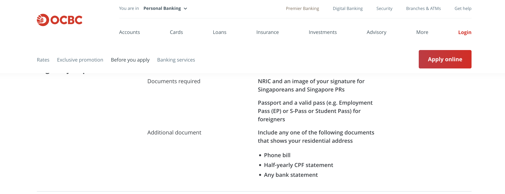
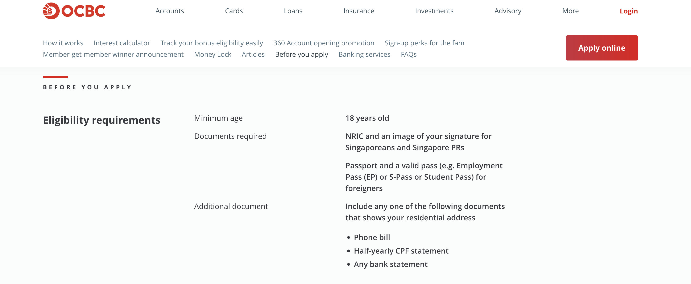
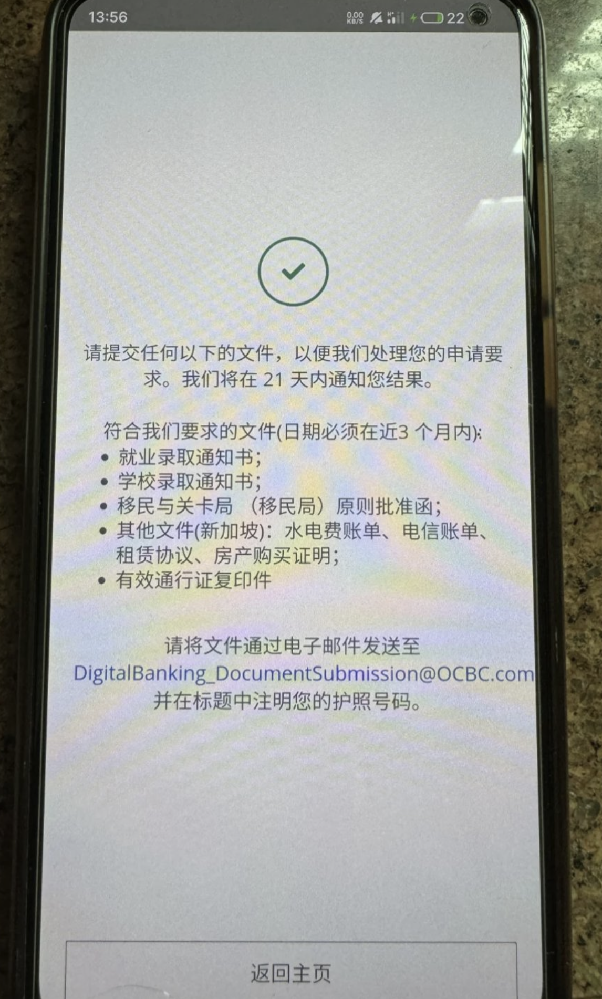

根据OCBC（新加坡华侨银行）最新消息，大陆居民仅使用护照注册的申请方式彻底暂停，但已有用户不受影响。

我们在OCBC官网也看了一下，SSA账户和360账户的申请资格已经更新，非新加坡永久居民，申请账户需要提供额外附加文件。如下

如果你之前已经注册成功，可以继续使用（注册后尚未激活的朋友抓紧激活）。根据现在最新规定，非新加坡居民申请则需要提供以下五种文件。

符合要求的文件(日期必须在近3 个月内):

就业录取通知书;
学校录取通知书:
移民与关卡局(移民局)原则批准函;
其他文件(新加坡):水电费账单、电信账单、租赁协议、房产购买证明!
有效通行证复印件
下图是网友提供的现在最新申请提示。

在国内能开哪些新加坡账户？

「星展银行」见证开户攻略：在国内如何拿到新加坡和香港星展银行银行卡？台湾｜香港｜加拿大也支持远程见证开户！

工银亚洲「港↔️陆」互转$0手续费”，还可领取100港币现金，活动12月31日截止。