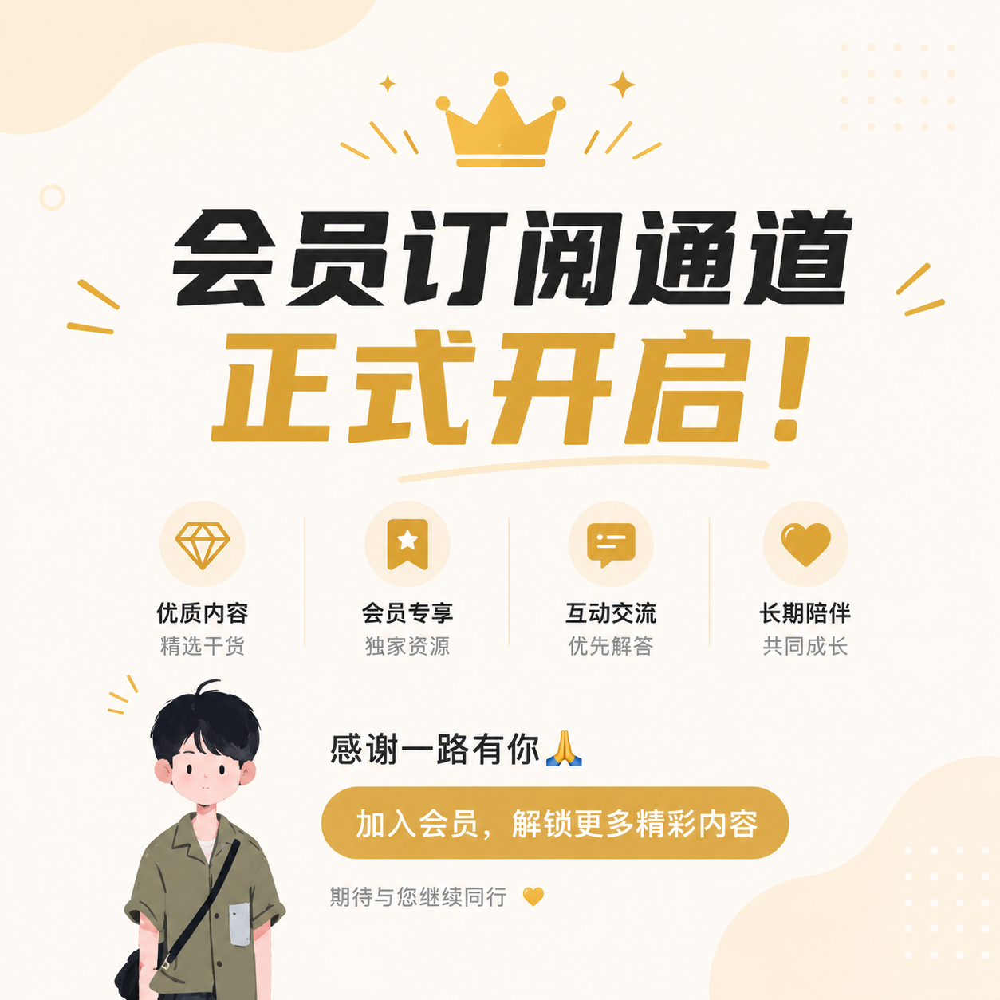

今天是一个很有爱的日子，所以我们一起来释放点爱。“老朋友会员”订阅通道正式开启。

由于各种原因，平台上发布内容有很大的局限，你可能经常会发现某个文章链接打不开。相信大家也深有体会，经常有朋友跟我反馈，某个文章被删了。我以前是让大家用 X 和电报，但实际上发现大部分朋友还是无法转移过来。所以，我就自建了一个新平台，为了让大家第一时间获取更完整、更自由的资讯，我们特别开设了邮件订阅通道，把那些平台无法展示的内容，也直接送到你手中。

这个新平台是专门为老朋友准备的付费内容，这样就能够把被平台删掉的和不让发的内容传递给大家。另外，还能弥补平台发布次数限制的问题。

## 老朋友会员订阅给大家看什么？

1. 我们的基本盘是分享个人/企业的跨境出海指南，比如各种账户的开户教程。帮助大家打破信息差，走出信息茧房，打通出海路径。
2. 美股市场的观点，包括宏观经济、财报、IPO 打新、投资机会、帮你理解趋势背后的逻辑等等。
3. 最新的科技资讯以及使用教程，比如怎么订阅 ChatGPT 和 Claude 等等。

## 为什么选择会员模式？

因为我相信，**付费的朋友会更用心地阅读和实践每一份分享，也会让这些内容真正被珍惜和发挥价值**。这不仅是对我们的支持，更是对自己时间和精力的投资。

所以，我们采用会员订阅模式：**一年仅需 199 元**，你将获得全年稳定、优质的资讯服务和独家干货。

另外，使用邮件，我们的沟通会更有价值更有效率。现在即时通讯的社交平台，让很多人都丧失了深度思考能力。我经常会收到一些不聪明的问题。所以，也鼓励大家通过邮件这个更严肃更传统的工具，能提出带有自己思考有深度的问题和见解，让互动更加高效，也让每一次讨论都更有价值和收获。

## 付款方式

付款方式有我微信的朋友可以直接转账，没有微信的朋友可以使用微信/支付宝扫码付款，付款后截图邮件发送到 `laosji.net@gmail.com`。

海外的朋友可以直接使用 Stripe 订阅，这是我的订阅官网：

https://letters.laosji.net

相信各位看到这里的朋友，都能感受到我已经准备了一些时间了。如果你看到收费有点犹豫不决，那我帮你做决定，不要订阅，用这个钱去干你最想干的事（无论是什么），毕竟现在挣钱也挺难的。

如果你想要投机赚钱的朋友也不要订阅，我们想要遇见更多价值观比较健康的朋友。我就不上价值了，看我公众号对你有过真正帮助的朋友，我想就不用多说了。199 元一年啊，就看能不能坚持写一年也值了吧。

大家在订阅的时候不要使用网易和新浪邮箱，可能会出现收不到邮件的情况。QQ 邮箱会进入垃圾箱，订阅成功后，大家会收到一封欢迎邮件，收到邮件后记得加到通讯录中，便于以后查看内容更新。

感谢老朋友们，希望我们可以再次相遇，有爱的一起交流更多。
