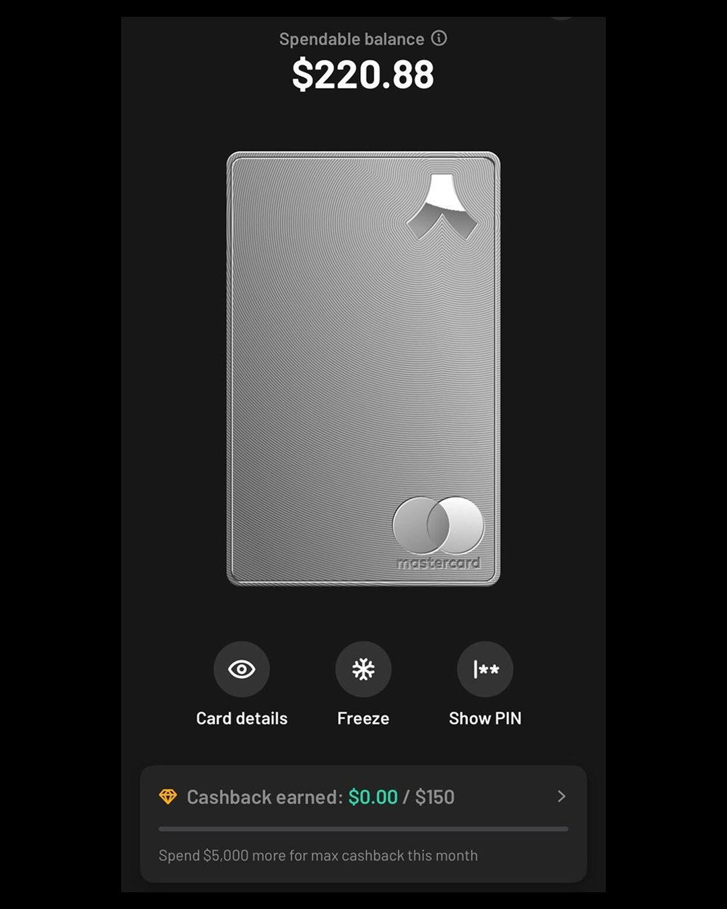

最近我变成了U卡的高频重度使用者，之前为大家分享过BinPay、Crydit 、Xapo Bank、bybit、雪崩卡等等，每天消费都在用。境外的资产完全可以通过U卡来满足自己的日常消费、旅行及增值等。为什么提到增值呢，因为USDT在很多Defi平台的收益基本都在4%以上，比USD还高。但是，U卡主要还是看安全、手续费这两个因素吧。

## Ready Card简介

Ready原名 Argent，这是一家专注于加密货币与去中心化金融（DeFi）的科技公司，总部位于英国伦敦。旗下拥有知名的钱包应用Ready Wallet（以前称为 Argent X），Ready是一个银行的链上替代方案。专为希望持有、消费并赚取自己喜爱代币奖励的普通用户打造。这个可以将数字货币和现实生活连接起来的消费平台，不仅有消费返现，而且转入数字货币还支持跨链，跨链转入真的很方便。

## 优点

- 消费时直接将USDT/USDC兑换成美金，无需手动兑换。
- 每笔交易都有返现，金属卡第一个月内消费1500USD，可拿10%的返现。之后3%。塑料卡每笔交易可拿到0.5%的返现。
- 消费外币使用万事达卡官方汇率，无需担心汇损。
- 无任何手续费、交易费、充值费，现在还免Gas费。（跨链充值第三方桥会收费）
- 不久还将提供个人IBAN和虚拟卡，不想掏邮费的朋友可以等虚拟卡。

## Ready实体卡

这个Mastercard借记卡，也被称为人人卡，因为Ready的logo看起来是一个人字。

### 实体卡对比一览

| 项目             | Ready Metal 卡（16g 金属）                | Ready Lite 卡（基础塑料）             |
|------------------|-------------------------------------------|----------------------------------------|
| 年费/卡片费用     | 一次性支付 120 USDC（计划引入月付）       | 免费申请，需支付 $6.99 快递费          |
| 外汇/转换/充值费 | 无（1 USDC = 1 USD，无额外处理费）        | 无                                     |
| ATM 提现额度     | 每月前 $800 免费，超出部分收取 2%         | 每月前 $200 免费，超出部分收取 2%     |
| 消费返现         | 首月消费 $1500 可享 10%，之后 3%         | 每笔交易返现 0.5%                      |
| 材质             | 金属（16 克）                             | 塑料                                   |

### 消费限额（两种卡相同）

| 限额类型 | 数额（USD） |
|----------|--------------|
| 单笔     | 5,000        |
| 每日     | 10,000       |
| 每月     | 30,000       |

## 注册准备资料

- 邮箱、手机号、身份证件（驾照/护照/身份证）

## 注册步骤

1. 在 iOS 或 Android 上下载安装 **Ready** 应用
2. 使用邮箱注册，手机号可以跳过，但是在实名认证的时候必须输入手机号。建议在注册的时候就输手机号，实名认证的时候发现+86手机号收不到验证码。
3. 实名认证，申请卡片之前需要提交实名认证。上传证件和人脸识别，提交后半小时内通过了。
4. KYC信息填写 ，职业、收入来源、每月支出、用途。
5. 充值并订购实体卡。

## 充值

Ready本身就是一个多链钱包，支持的链非常多，而且可以跨链转，这个真的很方便了。

大家可以看看以前分享过的BinPay、Crydit 、Xapo Bank、bybit、雪崩卡，一起对比一下。
