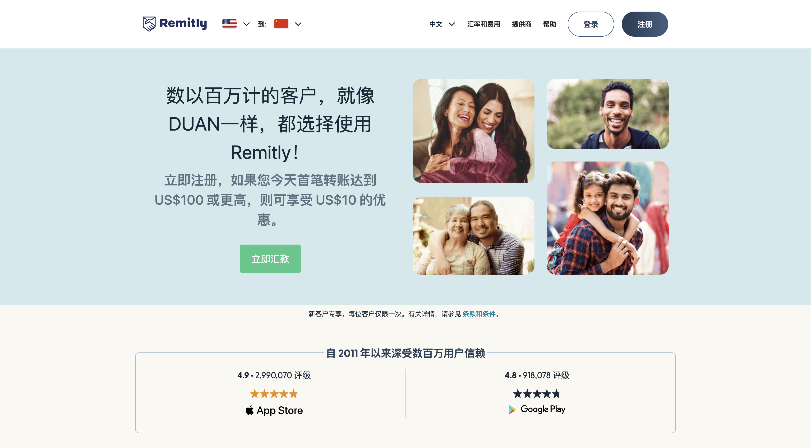
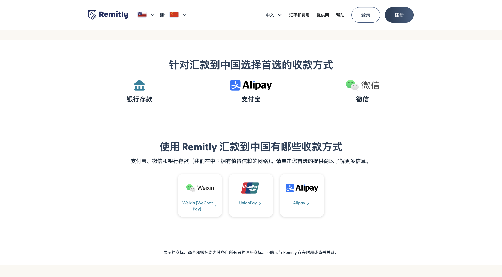

这是一个 **£15 英镑**（约等于 **140 元人民币**）的羊毛，只要你有英国的 iFast、HSBC 或者 Wise 等账户，使用 **[Remitly](https://remit.ly/3dp90ahv)** 从英国汇款至任意英国之外的账户，新用户首笔汇款不仅**免手续费**，而且还能 **立减 £15 英镑**。

如果是汇 **美元**，新用户首笔转账达到 **US$100 或更高**，则可享受 **US$10 的优惠**。但个人感觉汇英镑更划算一些。

## 使用方式简述

如图，可直接在网页端完成操作：

1. 打开官网 👉 [https://remit.ly/3dp90ahv](https://remit.ly/3dp90ahv)
2. 右上角设置：**从 UK 汇到 CN**
3. 出现 “-15” 的立减提示后，继续操作即可
4. 首次汇款金额不低于 £100，即可享受减免 £15 的优惠

## 支持的收款方式

Remitly 汇款到中国非常友好，支持：

- 支付宝
- 微信
- 银联

## 关于 Remitly 公司背景

**Remitly Global, Inc.**（纳斯达克代码：`RELY`）是一家总部位于美国西雅图的在线汇款公司：

- 成立时间：2011 年（原名 BeamIt，2012 年更名为 Remitly）
- 上市时间：2021 年 9 月，传统 IPO 上市
- 员工数量：截至 2023 年约 2,700 名员工
- 服务覆盖：170 多个国家/地区
- 支持币种：约 100 种货币兑换与跨境汇款

Remitly 致力于帮助全球移民及其家庭更方便、低成本、安全地进行汇款。

> 愿景：**“通过可信赖的金融服务跨越国界，改变生活”**  
> 核心文化：客户为中心、主人翁意识、深度洞察问题、持续成长型文化

## 优势总结 ✅

- ✅ **按时送达保证**：若未按承诺送达，**退还手续费**
- ✅ **汇率优、手续费低**，**无隐藏费用**
- ✅ **实时追踪**：可在 App 中查看汇款进度和到账提醒

---

快使用我的推荐链接注册 Remitly 吧！

👉 [https://remit.ly/ne2x48mr](https://remit.ly/ne2x48mr)

首次进行汇款且金额不低于 **£100** 时，即可享受 **减免 £15 的优惠**！
