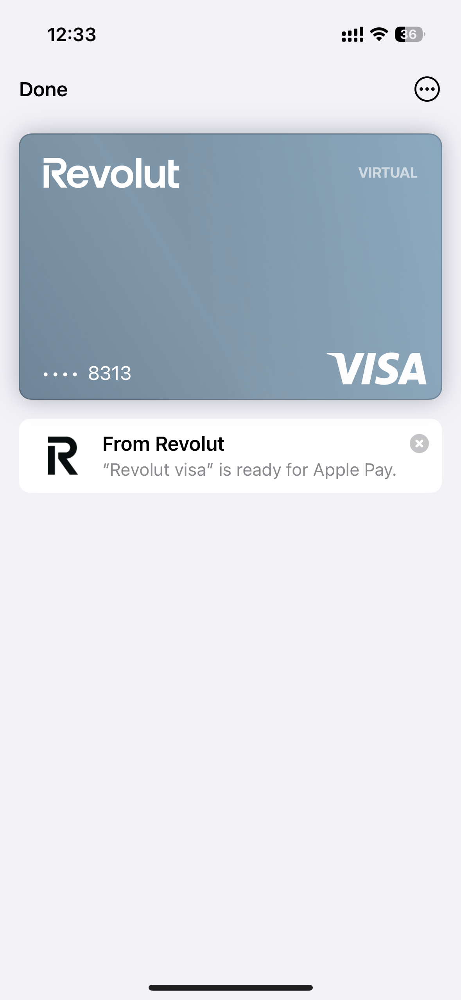

今天又被平台删文章了，感觉这几天的阅读量也崩了。无意义就无意义吧，我就当写给自己看，这样的想法是不是太放飞自我了。

Musk现在就彻底放飞了，宣布成立“美国党”（American party）。确实，美国需要一个第三党，几何数学早就告诉我们了，三角形有稳定性，两党必乱嘛。你想起和尚挑水喝的故事了吗？从前总有座山···，Tesla的股票，反正我没买了。

据报道，周一Trump政府将公布最新的关税政策，这次还没谈好的，真的要来真的了。

---

今天注册了一下美区的Revolut，万没想到，秒开了。直接添加Apple Pay，确实意外了。其实，这是我第二次注册了，在一个月之前就注册过一次，但是需要让我提供签证。这次我好像找到了原因，跟地址有关。上次我用的是商业地址，因此，平台要求提供额外的签证。这次我使用了一个私人住宅地址，如上所说，秒开了。

Revolut是英国的一家金融科技公司，在行业内也算是鼎鼎大名了，也不用多介绍。它和Wise的定位也还不太一样，Wise的定位是全球汇款平台，而Revolut则是一个综合的财富管理平台。说实话感觉现在这一波金融科技公司是有点要干掉传统银行的趋势，年轻人更喜欢在手机上使用这些金融平台。

---

## Revolut 有什么用？（灵魂拷问）

- 可以帮你建立美国信用，只要存入 $200-$2000 作为担保，就可以申请 Revolut 的担保信用卡。这个应该是最大的作用，适合没有信用历史的人。
- 多一个美国银行账户，可以在 APP 中使用 Stocks 和 Crypto 功能。
- 可以无限生成虚拟卡，安全性高；你在网上支付的时候，可以使用一次性的帐号，避免泄漏账户信息。有购买 AWS 和 Google Cloud 的朋友，一般绑定银行卡或信用卡都战战兢兢的，很担心某天被刷爆了，但是有了这个一次性的帐号，就能安心的尽情使用了。
- 国际汇款手续费非常低，根据账户等级豁免一定的外币兑换费用，金卡用户可全面免除。和 Wise 的汇率收费都有点区别，可以对比选择更友好的平台。
- 美元存款利率 3.5%，算不上绝对优势。
- 合作商家消费有返现，不过绝大部分在本地。
- 有实体卡可以在 ATM 取现，全球超过 55,000 个合作 ATM 完全免费提现。
- 标准账户无管理费，无最低存款要求，可添加 5 个子账户。

---

## 注册资料

- 手机号，大陆应该可以，但建议用美国手机号。我用的是 GV。
- ITIN，必须准备。如果没有的话，我们有服务。
- 美国地址，必须是家庭住宅地址，商业地址会要求提供 B2 签证。咱已经试过了，就别再踩坑了。
- 护照。
- 科学上网。

有人问我没有美国信用可以开吗？当然，在美国 0 信用也可以申请，前提是准备 ITIN/SSN，申请的时候在 SSN 页面输入 ITIN 即可。现在新注册有 50 刀的奖励，这是我的邀请，有需要的疯狂点吧。

👉 [注册链接](https://revolut.com/referral/?referral-code=chaod!JUN2-25-AR-US-H1-REFBLOCK-AE&geo-redirect)

准备好这些资料就可以注册了，直接下载 Revolut 应用程序，注意 APP Store 要切换到美区。安装好之后直接注册，改填啥的地方按照要求填啥，没啥难度。

---

注册成功之后，从券商出了点美元到 Revolut，电汇是真慢，本来今天还可以体验它们的 Credit Card。现在就只能等到账之后，再来和大家分享吧。不过，我们今天可以确定的一件事情就是 Revolut 也可以帮助用户建立美国信用。

---

## 账户等级

一共有 3 个等级：

- **标准账户**：免费，实体卡 $3.99，使用频率不高，而且规模不大，完全够用。
- **Premium**：$9.99，免费实体卡 + 无限虚拟卡 + 一次性卡，适合规模适中，跨境使用有一定量的用户。
- **Metal**：$16.99，免费金属实体卡 + 无限虚拟卡 + 一次性卡，大佬自己看吧。

---

> 如果你也准备或者正打算开美区 Revolut，可以参考一下这篇体验，或者留言和我一起讨论！
